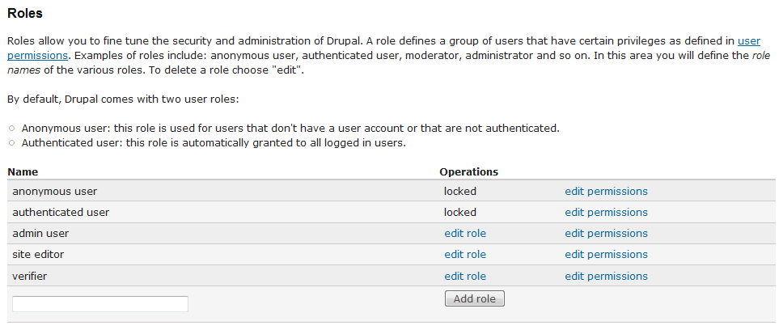
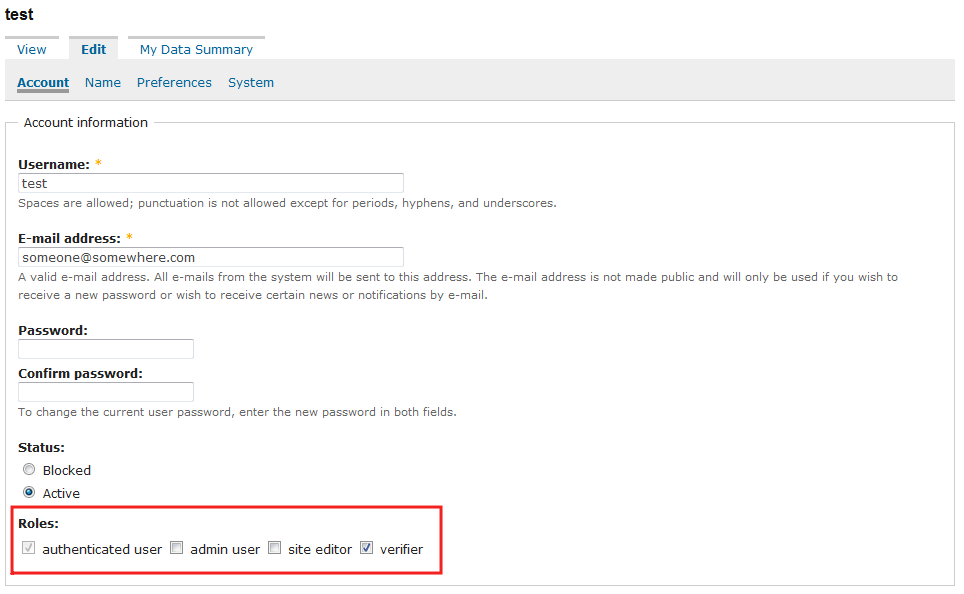
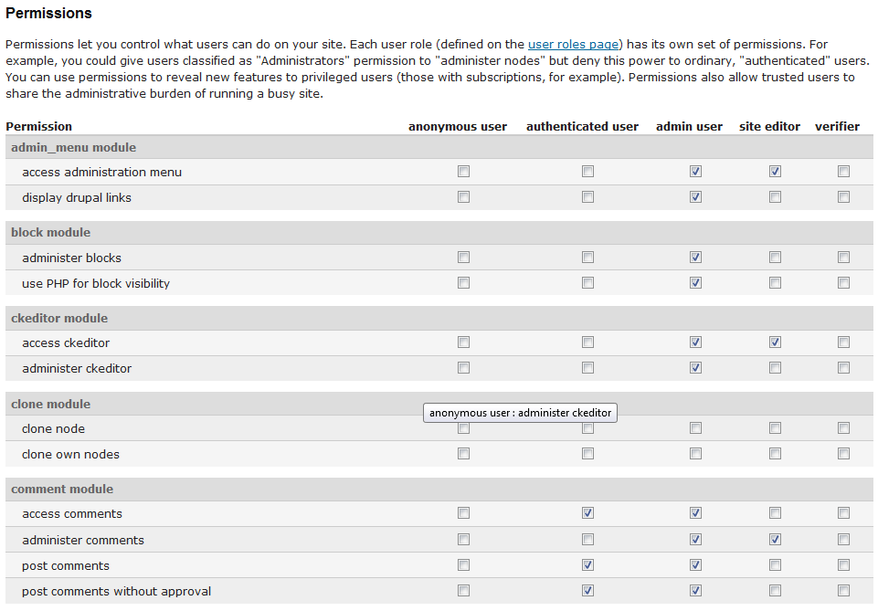
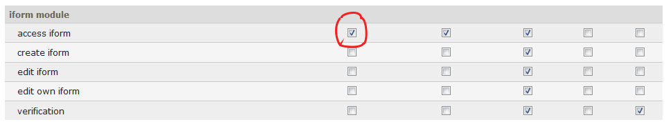
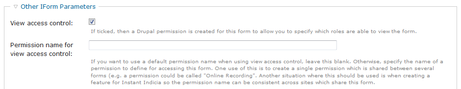
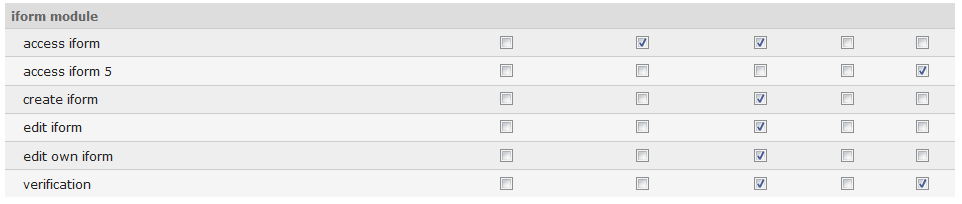

Drupal Site Permissions
=======================

Principles
----------

When using :doc:`../../site-building/iform/index` to provide integration between Drupal 
and Indicia forms & reports, you will be dependent on the Drupal login mechanisms and
permissions infrastructure to control access to the various facilities.

Drupal permissions are controlled by role membership, so site users belong to roles and
roles define the things that they are permitted to do. In Drupal, visitors to your site
can either be anonymous, or logged in. Anonymous users belong to a "fixed" role called
**anonymous user** and logged in users belong to a "fixed" role called **authenticated
user**. These roles cannot be changed, but you can configure the permissions that are
available for these roles so for example, you might configure Drupal so that a block
appears on the home page suggesting that they register or login, which is only visible
to members of the anonymous user role. You could also add a record submission form
which is only visible to members of the authenticated user role. Therefore the messages
and facilities available on the site are appropriate to the current context.

Configuring permissions
-----------------------

You can add roles to the Drupal site yourself. Obviously you must have sufficient
permissions to do this, such as when logged in with the site admin account. Select **User
management > Roles** from the menu to view or add to the list of roles. There are also
links to **edit role** (i.e. change the role name) and **edit permissions** - there will
be more on this topic in a moment. 

  
Note that Instant Indicia creates some generally useful roles for you such as **site
editor** and **verifier**. Adding a user to a role is simply a matter of editing their
user account (as long as you have the correct permissions to do this of course). Select
**User management > Users** from the admin menu then find the appropriate user and click
the **edit** link. This includes various settings for the user account; the one we want to
focus on at the moment is the list of roles that the user belongs to. Note that the user
can of course belong to several roles – they could be a site editor and a record verifier
at the same time for example.

  
Just click the **Save** button to apply any changes to the user’s roles.

The next task is to decide which of the many possible tasks can be performed by each
role. You can either do this on a role by role bases using the **edit permissions** links
from the list of roles we saw earlier, or for all roles at once using the **User
management > Permissions** menu item. This shows you a large grid with roles across the
top and each individual permission as a row.

  
It's simply a matter of finding the permissions that you are interested in and checking or
unchecking them for each role, then pressing **Save**. The permissions are organised by
module and many of them may not be familiar, so just make sure you only change the
settings for the permissions which you understand the purpose of. 

Indicia permissions specifics
-----------------------------

So far everything mentioned relates to Drupal 6 in general and is not specific to Indicia.
If you look through the permissions grid you will see that there is a section for the
**iform module** as well as the **iform_ajaxproxy** module. By default the configuration
is such that you must be logged in to access the iform module’s content, meaning you
cannot do any data entry into Indicia without logging in. If you want to enable data input
for casual visitors then you must tick the **access iform** permission for the **anonymous
user** role and save the permissions:

  
You may of course want more fine-grained control over permissions than this, e.g. if you
want anonymous users to be able to submit ad-hoc records, logged in users to submit lists
of records and a report to be available only to members of an expert role. In this case,
you will need to edit the Indicia pages you have created on the site to enable a setting
that allows control of permissions on a page by page basis rather than for all Indicia
pages in one go. On the edit page, find the section called **Other IForm Parameters** and
expand it. The simplest option is to tick the **View access control** box and save the
configuration.

  
Now, if you visit the Permissions page as before you will find a new permission has been
created specifically for this page (it uses the page’s unique identifier, known as a Node
ID in Drupal):

  
So, in the example above we have created an Indicia page which is ID 5, that only
verifiers are able to see.

This approach gives full control, but can be a little bit unwieldy when configuring
permissions across large numbers of pages. Indicia also allows you to define a permission
name in the settings (the option is immediately beneath the View access control checkbox).
If you define several pages which all share the same permission name then only one
permission will be created and you can control access to all these pages in one go. So, as
an example you might specify the permission "data entry" for an ad-hoc input form, a
record list input form, a specific form for plant entry, plus a My Dot Map to show people
their records after submission. Then you can grant access to all these pages in one go
using the single row created on the permissions grid for "data entry" in the IForm module
section.  
