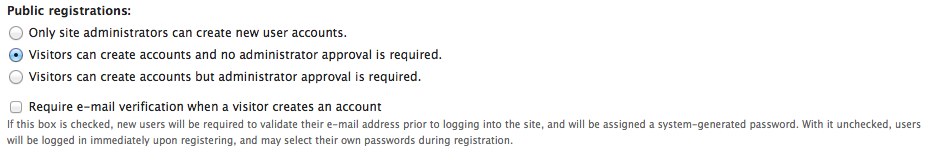

Preventing unwanted spam
========================

It's an unfortunate fact of this day and age that any system which is easy for a real user
to register, log on to and post information to will also be easy for unwanted spammers to 
do the same, unless we proactively take steps to stop them. This page provides information
for those administering a Drupal website for Indicia regarding the prevention of spam.
There are 3 things we need to consider in our prevention of spam:

* Unwanted user registrations
* Unwanted content additions
* Unwanted record submissions

Unwanted user registrations
---------------------------

We'll tackle this issue first, because once you are in control of the users of your site
it will make tackling the other forms of spam that much simpler. Let's take a look through
some of the options available.

Drupal's user settings
^^^^^^^^^^^^^^^^^^^^^^

Drupal's user settings (**User management > User settings** on the admin menu) has 
several options for configuring user settings.

  
Buy default, note that visitors can create accounts and no administrator approval is 
required, plus they don't need to verify their email address. For a public facing site
it makes little or no sense not to tick the **Require e-mail verification when a visitor 
creates an account** box, which means that when a user registers, their account only
becomes useable after they respond to an email sent to their email address, proving they
are the owner of the email address. This also helps to prevent accidental entry of 
incorrect emails and does not hugely increase the complexity of the registration process
so is well worth doing. 

.. tip::

  For your site to be able to send out emails correctly, the web server needs to be 
  configured appropriately. You can also set the email address the website uses to send
  emails, at **Site configuration > Site information** on the admin menu. Make sure that 
  the email address you use is from the same domain as the website, because using a 
  different domain is likely to cause emails to be blocked by spam checkers so they will
  not reach the recipient. For example, if your website is ``http:\\www.example.com``
  then a suitable email address might be ``info@example.com``.
  
If you want users to be able to register on the site and immediately submit records,
then the set of 3 radio buttons above the email verification checkbox need to be left at
the default setting. However if you are operating a controlled access website where you
know the list of recorders and can pre-register them, then ticking the first option
**Only site administrators can create new user accounts** does completely prevent spam
user registrations since the user registration pages are simply not reachable to new
users. A slightly less draconian option is the third one, **Visitors can create accounts
but administrator approval is required**, though this of course incurs the overhead of
checking through registrations and also means that new users cannot access the site
until approved, which might be considered frustrating.

Spam prevention modules
^^^^^^^^^^^^^^^^^^^^^^^

If the options for administrator registration or approval are not appropriate for your 
site, then unfortunately this means that Drupal's inbuilt options will not be able to 
prevent spam user registrations. You can of course check through the registrations and 
remove them, but this is labour intensive and it may well be too late if the spammer has
already posted a forum post or a comment on a page, for example. This is where being part
of the huge Drupal ecosystem has its benefits - there are literally thousands of other
websites facing the same problems with the same technologies and hundreds of developers
keen to solve them. Fortunately some of these solutions have been wrapped as easily 
installable Drupal modules which you can easily install.

Captcha and reCaptcha
"""""""""""""""""""""

The Drupal `Captcha <http://drupal.org/captcha>`_ and `reCaptcha <http://drupal.org/recaptcha>`_
modules both implement a challenge-response extension to the Drupal registration page. By
displaying a graphical image of a code which is intentionally difficult for machine to 
read and asking the user to type this code into a box, the idea is that non-human 
submissions can be prevented. Unfortunately obscuring the code enough to prevent 
machine reading can often make the code hard for a human to read.

.. tip::

  In our experience, the Captcha approach to preventing spam registration will not
  prevent all unwanted registrations and will also put off some users, so we would not
  recommend it as a first option to try.
  
Spamicide
"""""""""

The Drupal `Spamicide <http://drupal.org/spamicide>`_ module takes a different approach
to the challenge response modules mentioned above. Rather than ask the user registering
to do something which proves they are human, the Spamicide module does the reverse - it
tricks the automated registrations performed by spambots into doing something which
proves they are not human. Spam registrations will normally fill every single field on a
web form before submitting the form. So, Spamicide adds a hidden input control to the
form which a spambot will inadvertently fill in, thus announcing itself as non-human.

Login Toboggan
""""""""""""""

Although not specifically an anti-spam solution, `Login Toboggan
<http://drupal.org/logintoboggan>`_ does have a number of useful facilities for
improving and managing the login process, including the facility to automatically remove
user registration attempts where the user has not completed the registration after a
configurable time period. This can save the manual task of removing unused user
registrations created by spambots that did not provide a valid email address.

Unwanted content additions
--------------------------

Your site may not be set up to allow any form of editing by registered users, since you 
are likely to control access to things like the facility to add, edit and delete pages
using Drupal's role based permissions system. However, if your site does allow user 
submitted content, which includes the ability to comment on a page as well as to post on a
forum, then you need to consider how to prevent user registrations from posting spam 
before you have had a chance to ban them. In planning your site its worth considering the
following points:

* Do I need to allow people to post this type of content immediately after registration, 
  or can they wait till an administrator has approved them (perhaps by granting them a 
  Drupal role)?
* If they do need to be able to post content such as forum posts immediately after
  registration, then you could consider one of the above modules for preventing spam
  usage of the forms for posting content as well as the forms for user registration.
  
Unwanted record submissions
---------------------------

Although theoretically possible, in our experience spambots do not understand enough about
the record submission process to actually submit records so this is unlikely to be a 
problem. For example, they don't know how to correctly format a grid reference or click
to set a point on the map. If you do find this to be a problem then we recommend you 
post a message on `the forum <http://forums.nbn.org.uk/viewforum.php?id=25>`_ so that we 
can look at integrating a solution into the Indicia toolkit.