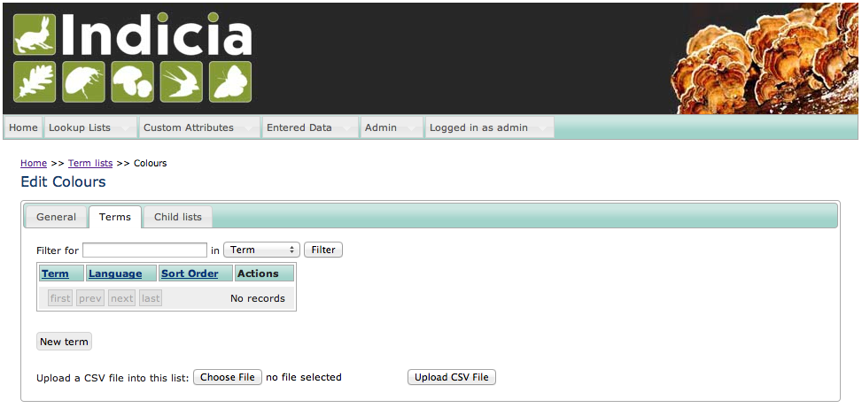
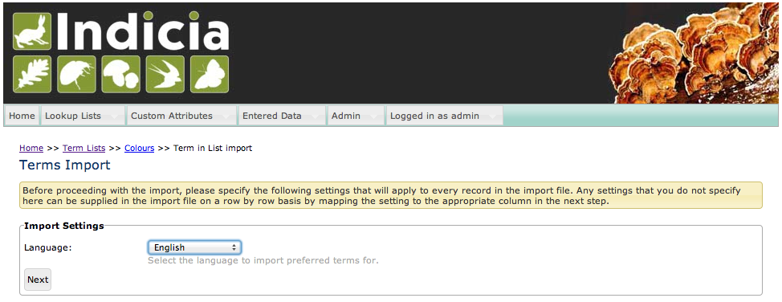
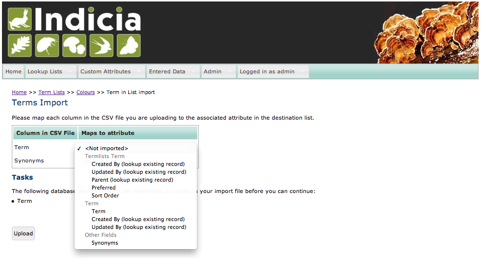

**************
Importing Data
**************

Indicia provides a general purpose importing tool which supports importing
data of any type from CSV (comma separated values) files. The import tool is 
available for addition to any Indicia enabled Drupal site using a prebuilt form
(under the **Miscellaneous** form category, select the **Importer** form) or 
via the warehouse user interface using the upload functionality offered at the 
bottom of each data grid. It's the same tool in both cases.

The best way to think of the import tool is to imagine the following steps:

#. First, select some default values that will apply to every single record.
#. Next, provide a mapping from the columns in your import CSV file to the 
   attributes in the database. 
#. The importer will now work through the CSV file and *posts each record to the
   same back-end process used when you enter data via the warehouse user 
   interface*. For example, if you are importing a term into a termlist then
   you will need to format your synonyms in the import data in exactly the same
   way you would if you were typing them into the user interface.
#. Any record that fails a validation check is saved into a second errors CSV
   file on the server. At the end of the import, the invalid records are made
   available for download, so the user can correct the errors and re-import 
   them.

Because the import is handled chunk by chunk, the only limits to the size of
file you can upload are defined by the PHP upload limit settings of the server.
If you need to upload larger files than this limit they will need to be split
up into several smaller files.

Import Steps
============

For this example, we're going to import some colour terms into a termlist as defined by
the following table:

====== =========
Term   Synonyms
====== =========
Blue	
Red	
Green	
Yellow	
Purple Mauve|eng
====== =========

The import will be into the warehouse, though the steps are exactly the same if you import
data using a client website configured with the Importer prebuilt form. Note that I've
defined mauve as a synonym for purple (not being too technical at this point!) using the
same formatting as we would use for defining term synonyms when inputting them into the
warehouse's user interface directly (as described on the data entry form itself). I've
entered the data into a spreadsheet then saved the file as a *colours.csv* file. I've also
created an empty termlist on the warehouse called Colours.

The **Terms** tab of the termlist's details has an **Upload CSV File** button at the 
bottom:

  
Next, I select the *colours.csv* file prepared earlier. Once selected, I click the
**Upload CSV File** which takes me to the **Import Settings** step of the import.

  
This step of the import process allows you to select default values for certain fields
which will be applied to every imported record. For example in this case we are selecting
to import all terms against the English language; we could include a language column in
the import file with the language for each term instead, then not set a language at this
step. The fields you can set a default are of course different for each type of data you
might import.
  
The following step of the import process involves mapping columns in your import file to
the available database fields. Fields available will depend on the database table you are
importing into, but will include custom attributes as well as relevant associated tables.
For example, we are importing into the ``termlists_terms`` table and the associated
``terms`` table. If importing ``occurrences`` data then we would also be able to map
columns to fields in the ``samples`` table, ``occurrence_images`` table and any custom
attributes available for these tables. The mapping step shows you a grid of the columns in
your import file and the database attributes they map to. The drop down in the **Maps to
attribute** column lets you pick from any of the available destination database fields.
Note that the page shows you a list of tasks if there are any problems which prevent
further progress, such as not mapping a mandatory field, or mapping the same field twice.

  
Once all the columns are correctly mapped, clicking the Upload button kicks off the import
process. This shows a progress bar during the import of larger files. Don't forget that
you are importing onto a web server so the import process can't "hog" the entire machine
unlike an import process running on your desktop. This means there is a limit to the
optimisation that can be achieved in the code, therefore the import is not blisteringly
quick. It does just chug on through the file without any intervention though.

Once you have completed the import, you will either receive a message that the import was
successful, or that there were some errors. In the latter case you can download a file 
containing just a copy of the problem records with an additional column for the error
message - so you can work through the errors then re-upload the error file to complete
the import.
  
Remembered mappings
===================

A significant part of the effort required to import a CSV file is the correct mapping
of columns in the import file to database attributes. Version 0.9 and later of
Indicia's import code supports remembering of the mappings from a previous import so
that, for example, if the user maps a "Place" import column to the Sample Location Name
database attribute, future imports of the same import file template will remember the
mapping so not require user input. In order for this to work when using the import from
within Drupal, you need a field attached to the user account to store the remembered
mappings in.

Drupal 6
^^^^^^^^

In Drupal 6, the Drupal Profile module must be enabled and a Profile field must be
created to support the capturing of the remembered mappings. To do this:

#. Visit the *Site building > Modules* page in your Drupal installation and 
   check that the *Profile* module is enabled. Enable it if not.
#. Select the *User management > Profiles* menu item. Click *multi-line 
   textfield* in the *Add new field* section.
#. Set the following options:

   * Category=System
   * Title=Import field mappings
   * Form name=profile_import_field_mappings
   * Visibility=Hidden profile field

#. Now save the profile field.

Note that although this profile field will appear under the user's Drupal 
account (accessed via My Account if you are using Instant Indicia) on the System
tab, it will only appear for administrative users since the content is not
intended to be human-readable.
  
Drupal 7
^^^^^^^^

In Drupal 7 we use the user fields approach (part of core) rather than Profile. So, you need to:

#. Select **Configuration** on the **admin toolbar**, then select **Account settings**.
#. Select the **Manage fields** tab in the top right.
#. In the Add new field row, specify "Import Field Mappings" and make sure the field name is 
   ``field_import_field_mappings``. Field type should be set to **Long text**. Save the field 
   and save the field settings in their default state. The Easy Login module will automatically
   hide this field from the user profile pages for you.

Additional tips
===============

#. When importing species, provide a column and map this to the Other Fields > Codes
   field. This can contain a list of codes to attach to the taxon, such as Bradley
   Fletcher numbers, GBIF numbers etc. The types of code must be first configured in the
   Taxon Code Types termlist. Provide the codes on separate lines, with the type followed
   by a | then the code itself. E.g. ::

     Bradley Fletcher|123
     GBIF|456
  
#. Importing photos obviously can't be achieved using a CSV file upload. However, if you
   are able to copy the images to the warehouse upload folder, you can then import a
   column with the image file name to link the image to the record.
