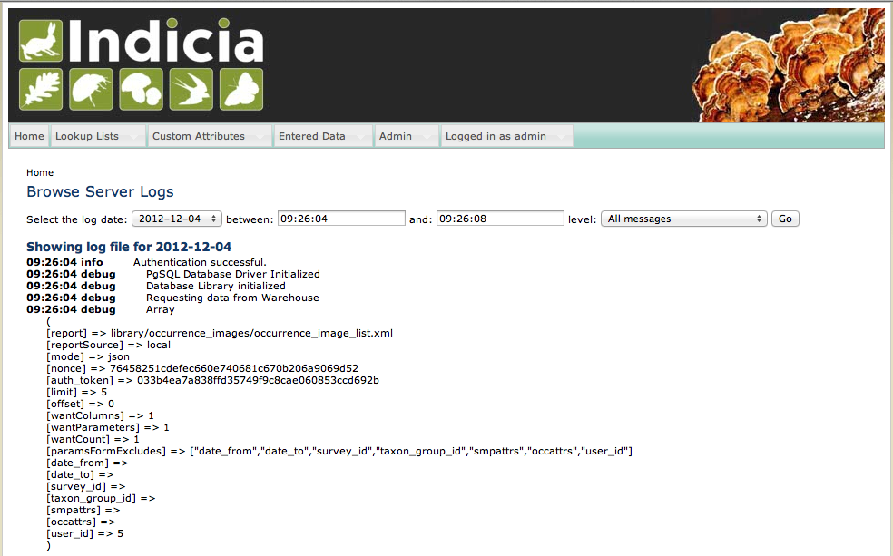

Log Browser Module
------------------

This module enables a new menu item in the warehouse, **Admin > Browse Server Logs** which
provides access to the logs generated on the warehouse by the Kohana framework. Logs can
be filtered by message severity and date range and are accessible by anyone with admin
access to the warehouse or at least one of the registered websites.

  
Installation notes
^^^^^^^^^^^^^^^^^^

After installation you should search for files containing the word *menu* in the 
application/cache folder on the warehouse and delete them, otherwise the caching system
will prevent the new menu item from appearing for a while.