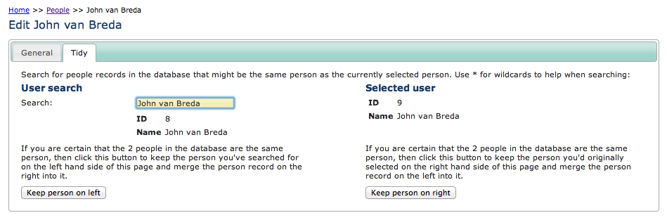

People Tidier Module
--------------------

When using :doc:`../../../site-building/instant-indicia/features/easy-login` across several
client websites linked to a single warehouse instance, it is possible that a recorder will
provide a different email for logins on each of the client websites. The result of this 
is that the recorder will get more than one user record created on the warehouse and this
also means that it is not possible to do a "My Records" style of report to pull in all 
their records from multiple client websites. The People Tidier module provides a 
way to clean up this situation in the data. It adds a **Tidy** tab to the edit page for 
a person record in the warehouse.

  
This tab allows you to search for the duplicate person record on the warehouse, then 
you can choose which person record to keep. The other person record and associated user
are discarded and their records are reallocated to the person you chose to keep. 

.. warning::

  Before using this module you will need to ask the recorder to correct their email 
  address otherwise the same situation will reoccur. Don't forget that this module
  changes the database and the changes cannot be undone without reverting to backup!

Installation notes
^^^^^^^^^^^^^^^^^^

After installation you should search for files starting with the word *tabs-* in the
application/cache folder on the warehouse and delete them, otherwise the caching system
will prevent the new tab from appearing for a while.