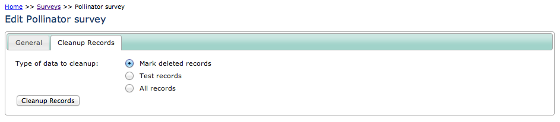

Survey Cleanup
--------------

The Survey Cleanup module adds a new tab to the details view of a survey on the warehouse
which allows cleanup of unwanted records associated with the survey. This is ideal for 
development and testing scenarios where you need to revert to an empty survey without
recreating all the attributes but it can also be used to purge mark deleted records.

  
The Survey Cleanup module can remove:

* All deleted records (see tip below).
* All test records (records where the **record_status** was set to 'T').
* All records.

.. tip::

  Indicia does not actually delete the database record when a record is deleted from the
  warehouse, instead the record is *mark deleted*. This means that the original copy is
  left in the database and a **deleted** boolean field is set to true to indicate that the
  record is no longer in use. 
  
Note that the Survey Cleanup module has only been designed to remove the records for a 
fairly typically structured survey. If a survey uses extension tables added via a 
warehouse module then these tables will not be cleaned up, so PostgreSQL's foreign key
checks will prevent the occurrence records from being removed.

Remember that when you install this module you will need to remove files matching the
pattern ``application/cache/tabs-*`` from the warehouse to ensure that the change is 
picked up immediately.