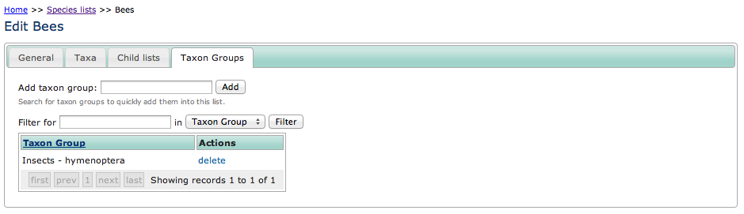

Taxon Groups to Taxon Lists Link Module
---------------------------------------

This optional module allows a list of taxon groups to be managed for a taxon list. The
main purpose of this is to be able to control the groups which are being imported
into a list by any automated synchronisation tools, such as the 
:doc:`nbn-species-dict-sync`.

This module adds a tab to the edit view of a taxon list allowing the associated groups
to be managed.

Database notes
^^^^^^^^^^^^^^

This module adds the following to the database:

* A table called **taxon_groups_taxon_lists** which joins between groups and lists.

Installation notes
^^^^^^^^^^^^^^^^^^

After installation you should first log in to your warehouse and visit the page
``index.php/home/upgrade`` to install the new database table. Then, search for files
\starting with the word *tabs-* in the application/cache folder on the warehouse and
delete them, otherwise the caching system will prevent the new tab from appearing for a
while.