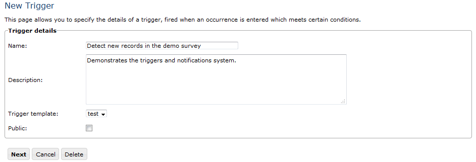
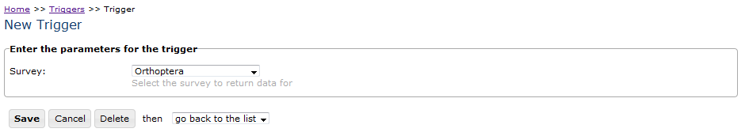
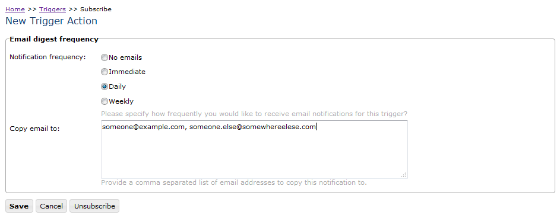

Triggers and Actions
====================

This module provides a facility to generate email notifications based on certain 
conditions relating to incoming records, for example when an invasive species is recorded.
The triggers and actions functionality in the warehouse involves the following concepts:

* **Trigger Templates** are definitions of queries against the database  which are run
  periodically in order to detect changes. For example a trigger template might identify
  a new record of a certain species, a comment on a record, or a new user registering on
  the warehouse. The queries contain parameters, so a template can define a query that
  detects new records of a species without defining which species to detect.

* **Triggers** are definitions of the exact search that will be performed to identify
  information that must be sent out as an alert. They define the trigger template that
  will be used as well as the parameters required when runing the query.

* **Subscriptions** are definitions of who want to know about the information generated
  by a trigger and how often they want to receive updates.

* **Notifications** are the bits of information sent out to subscribers as a result of
  triggers firing with associated subscriptions. Notifications can be sent out via an
  email or an email digest, or they can simply be added to the notifications table in the
  database in which case they will need to be provided with access to view this table's
  content, e.g. using a report grid.

Trigger templates
-----------------

Normally you will select from an existing trigger template (see the next section) rather
than create new ones, as defining trigger templates is an advanced task. To create a new
trigger template, a file must be created in the *reports/trigger_templates* folder on the
warehouse. The file format is the same as a report defined on the warehouse, see
:doc:`../../developing/reporting/index` for further information. The only stipulations 
are:

* that the trigger template report file must have an input parameter called **date**. This
  parameter is filled in with the date of the last time the trigger was used each time it
  is run, allowing the query to filter for changes since the last time. 
* that the trigger template report outputs a column called **website_id**, allowing 
  authorisation to be applied to only expose appropriate information to the requesting
  client website.
  
See the ``reports/trigger_templates/test.xml`` template file for an example.

Creating Triggers
-----------------

Anyone with a login on the Warehouse can define a trigger. The triggers are available from
the **Admin -> Triggers & Notifications** menu item. Triggers can either be *public* or
they can be only available to the user who created them. The list shown includes all
triggers that are marked as public or that were created by the logged in user. To create a
trigger:

#. Click New trigger to access the Trigger details screen. 
#. Enter the name of your trigger, for example "Detect new records in the demo survey" and a description. 
#. Select  the trigger template from the drop down to define the query that will be run
   when the trigger is tested. The template called test is provided for you to try and
   simply detects any new records in a selected survey. Leave the public checkbox
   unchecked for now, but this can be used to declare a trigger which multiple users can
   subscribe to. For now this test trigger will be for us only.
   

Click the **Next** button. Depending on the trigger template you selected, the next page
will ask you for any other input parameters required. In the case of the test template, it
will ask you to select the survey which you want to detect new records in. Select the
demonstration survey and click **Save**.

  
Subscribing to the trigger
--------------------------

The triggers you have rights to subscribe to are listed on the Triggers page. Click
subscribe in the Task column next to the trigger you want to subscribe to. You can now
specify the email digest frequency from the options **No emails**, **Immediate**,
**Daily**, **Weekly**. A subscription can also contain a list of other email recipients
the notification email should be cc'ed to. This allows notification emails to go to
people who are not warehouse users themselves. The **no emails** option defines that
notifications are stored in the ``notifications`` database table and are not emailed
out. In this case they can be viewed either from the home page of the warehouse or by
adding a report_grid control to an Indicia powered website which lists notifications
for the current user ID.

Click **Save** when done.

Running the triggers
--------------------

If you are using a warehouse supplied by another organisation then please ask the
administrator of the warehouse to confirm that scheduled tasks are running on the
warehouse.

If you are using a warehouse for which you are the administrator, then instructions on
setting them up can be found at :doc:`scheduled-tasks`.