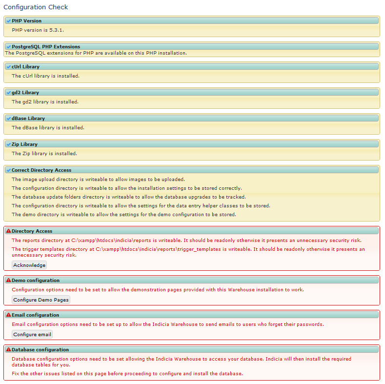
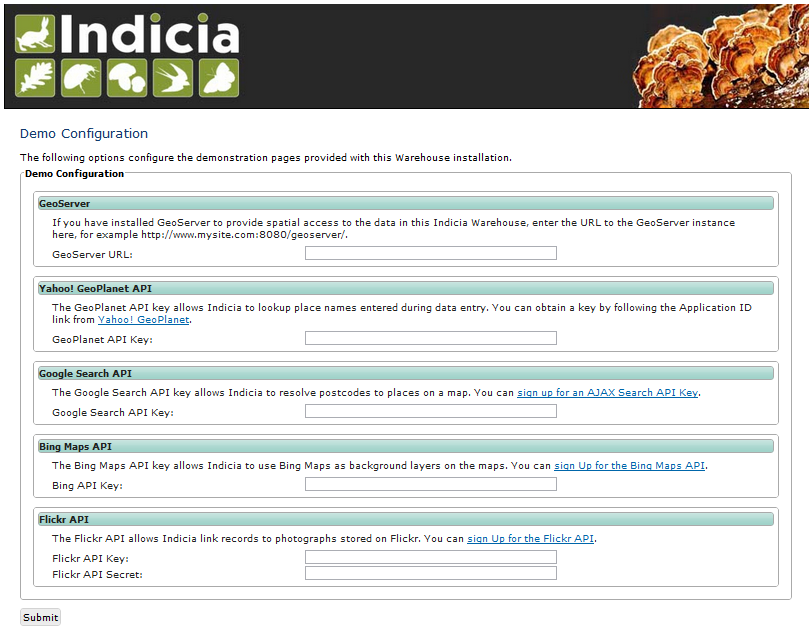
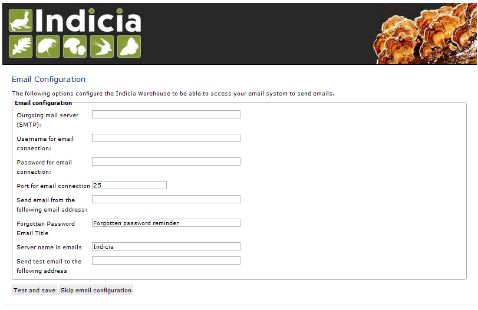
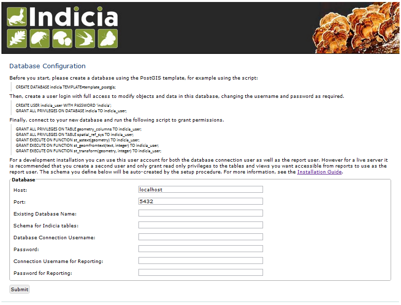
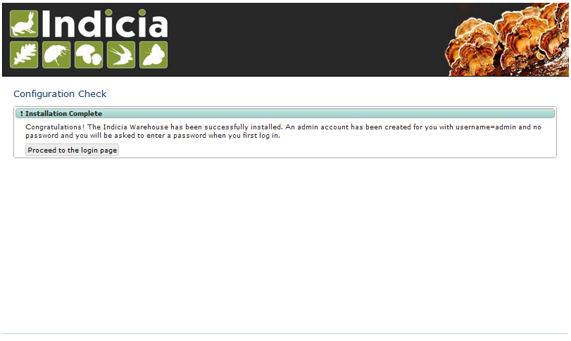

********************************
Installing the Indicia warehouse
********************************

This guide is a quick summary of the steps required to install the Indicia 
Warehouse. You don't have to install the Warehouse to use Indicia if you are 
happy to use a Warehouse provided by another organisation. Note that installing 
the Warehouse involves setting up a web server since Indicia is a web, rather 
than a desktop, application. Therefore installation is a little more involved 
than the typical desktop application.

Note that if you are installing Indicia onto a hosted shared server, the chances
are you will not have the full privileges required to setup the PostGIS database
and PHP settings (if required). It may be helpful to ask your web host to 
perform the steps :ref:`install-postgres` and to check that the **pgsql** and
**cURL** extensions are enabled for PHP as described in the section 
:ref:`install-php`.

Here is a 
`screencast of this installation process on a Mac <http://www.youtube.com/watch?v=wSfRJK9q2gs>`_.
The steps are similar for Windows.

.. _install-postgres:

Install PostgreSQL and PostGIS
==============================

First, install the PostgreSQL database server and the PostGIS extension for your 
operating system. For downloads and more information see 
http://www.postgresql.org/ and http://postgis.refractions.net/. You should 
install version 8.4 or later of PostgreSQL, preferably 9.x, though if installing
on Windows it is worth reviewing the `Windows installation notes 
<http://postgis.refractions.net/download/windows/>`_ before selecting a version. 
For example, at the current point in time version 9.1 is the latest version 
which supports installation of PostGIS using the Application Stack Builder, so 
opting for this version rather than 9.2 will make things simpler later. PostGIS > 2.0.0 is required.

If you are installing PostgreSQL on a Linux server then you may find the 
following links extremely useful:

* `An almost idiot's guide to installing PostgreSQL 9.0 with Yum <http://www.postgresonline.com/journal/archives/203-postgresql90-yum.html>`_
* `An almost idiot's guide to installing PostGIS 1.5 on PostgreSQL 9.0 via Yum <http://www.postgresonline.com/journal/archives/204-postgis15-install-yum.html>`_

Next, create a PostGIS database on your server. You don't need to put any 
content in the database yet. There are several possible ways of doing this, but 
the easiest is to run pgAdmin III which is supplied in the PostgreSQL 
installation. In the tree on the left, there is a node called Servers, and 
underneath that is your server. Double click this and enter your password if it 
asks you. Now, expand the Databases node, select "postgres", then click the icon 
in the toolbar that looks like a document titled SQL with a pencil. Now, in the 
editor that appears, enter the following SQL script and click the green run 
button in the toolbar, which creates a PostGIS database called indicia.::

  CREATE DATABASE indicia TEMPLATE=template_postgis;

A word of warning. After choosing the 'Server' from the left hand pane within 
pgAdmin, a list of existing databases will be displayed for that server, 
including the 'template_postgis'. One of these databases will be opened by 
default - unfortunately for a blank installation this will be the 
'template_postgis' database as there are no others. In order for the above 
statement to work, this must not be active (i.e. it must have a red cross over 
its icon) - pgAdmin will complain that another user (in this case itself) has 
the template database open. In this case, the problem may be circumvented by 
creating a blank database with no template (e.g. called 'X'), shutting down 
pgAdmin, and then restarting it. On reopening the relevant server, the dummy 
database should be active, and the 'template_postgis' one not. The above 
statement should now be able to be run without issue. The dummy database may 
then be deleted.

You can use the postgres super-user account to run Indicia if you like, which is
the easiest but least secure method. Please do **NOT** use the super-user account 
for anything other than development purposes. Assuming you want to create your 
own user to run Indicia, run the following script to create the user and add it 
to the database, changing the username, password and database name as required: ::

  CREATE USER indicia_user WITH PASSWORD 'indicia';
  GRANT ALL PRIVILEGES ON DATABASE indicia TO indicia_user;

Now, connect your query tool to the new indicia database by using the drop down 
in the toolbar then selecting <new connection>, and run the following script 
which allows the Indicia user just enough rights to access the PostGIS 
functionality: ::

  GRANT ALL PRIVILEGES ON TABLE geometry_columns TO indicia_user;
  GRANT ALL PRIVILEGES ON TABLE spatial_ref_sys TO indicia_user;
  GRANT EXECUTE ON FUNCTION st_astext(geometry) TO indicia_user;
  GRANT EXECUTE ON FUNCTION st_geomfromtext(text, integer) TO indicia_user;
  GRANT EXECUTE ON FUNCTION st_transform(geometry, integer) TO indicia_user;

.. _install-php:

Install PHP and a web server
============================

If you are installing on Windows, then you will typically want to use IIS (Internet
Information Services) or Apache as your web server software. For other operating systems
we recommend the Apache web server. This tutorial is written on the assumption that you
are using Apache, though the steps will mostly be the same (except with different folder
locations) for IIS.

There are many tutorials on the web on how to install PHP and a webserver such as Apache.
PHP version 5.3 to 5.5 are supported. The following guide explains installation of PHP,
Apache and MySQL on Windows:
http://www.php-mysql-tutorial.com/install-apache-php-mysql.php. MySQL is not required by
the Indicia Warehouse. Rather than install each component individually, you might like to
consider installing a *stack*, that is a single installation which packages all the things
you need for the web server. Here are a few examples for your consideration:

**Windows**

* `WampServer <http://www.wampserver.com/en/>`_

**Mac**

* `MAMP <http://www.mamp.info/en/index.html>`_

**Any operating system**

* `XAMPP <http://www.apachefriends.org/en/xampp.html>`_

Whichever you choose, please make sure you install a version which includes PHP 5.3.x,
5.4.x or 5.5.x to ensure a supported version.

After installation, all installations of a PHP web server will have 2 things you are going
to need to find before going on:

#. Your website's *root* folder. This is the folder on your hard disk which will be 
mapped to a base URL in your browser such as ``http://localhost``. You will place files in 
here to create content on your websites. For XAMPP you need to look for a folder called
**htdocs**, which by default is inside your XAMPP installation folder. For WampServer look
for a folder called **www**.
#. Your **php.ini** file, the configuration settings file for your PHP environment. 

After installing PHP, edit your php.ini file and uncomment the following two 
lines by removing the semi-colon at the start. This enables the pgsql module 
required for PHP to access the PostgreSQL database, and the cURL module which 
the demonstration site pages use to access the web services. After you've 
changed and saved the file, restart your Apache web server. ::

  extension=php_curl.dll
  extension=php_pgsql.dll

Once you have done this, it's a good idea to check that the cURL and pgsql 
libraries have been installed successfully for PHP. You can do this by creating 
a file called phpinfo.php in the root html directory of your webserver, and 
editing it with a text editor. If you installed XAMPP, then you will find this 
folder under XAMPP/htdocs. Enter the following text into the file and save it:

.. code-block:: php

  <?php
  echo phpinfo(); 
  ?>

Now go to a web browser, and enter the root of your webserver followed by 
phpinfo.php (for example http://localhost/phpinfo.php). The page you see should detail 
your PHP configuration, and if you look down the page you should see that the 
cURL and pgsql libraries are loaded.

.. tip::

  If you have installed PHP 5.2.6 and the pgsql library won't load, this may 
  be because of a bug in this release of PHP making it incompatible with the 
  version of PostgreSQL you have installed. To fix this, you will need to replace 
  the file php_pgsql.dll in your PHP installation with the version from the 
  PHP 5.2.5 download, and also replace the file libpq.dll from your PostgreSQL 
  install folder with the one from this download. Another problem can occur when 
  loading the pgsql libraries for PHP on a Windows Apache server, because of the 
  paths not being correct. For more information on this issue see 
  http://stackoverflow.com/questions/551734/php-not-loading-php-pgsql-dll-on-windows.*
  
Get the Warehouse code
======================
First, create yourself a folder inside your web server's root folder, for example
htdocs\indicia. Now, download the `Indicia warehouse code <http://code.google.com/p/indicia/downloads/list>`_
and unzip it. Inside the zip file you will find a file called Indicia. Copy the contents
of this folder into the folder you have just created on your webserver. Please note, if
you are re-installing the Indicia Warehouse for whatever reason, always remove the
contents of the previous installation from the folder completely before copying over the
new files, otherwise the configuration files created during installation will be still
present and you won't be able to reinstall from scratch.

If you are running on a hosted server, it may be easiest to download and unzip the code
into a local folder then use an FTP tool to upload it into a folder created on your web
server account.

Run the Setup
=============

The Setup procedure will automatically start if you access the index.php file in the root
of the website. So, just enter this into your web browser, for example
http://localhost/indicia/index.php, and load the page. 

.. tip::

  The setup procedure copies the domain in the url that you enter and stores it in two places, 
  as $config['site_domain'] in application/config/config.php and as $base_url in 
  client_helpers/helper_config.php. If you initially access index.php via http://localhost and
  subsequently want your warehouse to work from a different url then you will need to edit these
  two files.

The Indicia Setup Check page should be displayed which, with any luck, will show something 
similar to the following:

  
Each of the tasks that the Indicia Warehouse has identified still needs your attention are
listed on this page in a warning box. Assuming that you have enabled the cUrl and
PostgreSQL PHP extensions earlier in this guide and that an appropriate version of PHP is
installed (at least 5.2), then the things you will need to attend to are as follows:

Directory Access
----------------

If your server is a production server then you should ensure that each folder has the
required permissions, and no more. This section of the setup check gives you some pointers
to the permission problems that currently exist, listing the folders that it has tested
which have correct permissions as well as the ones which don't. In our case, the reports
and trigger templates folders are writeable but should be readonly. Once you have
corrected them you can refresh the page to check that it has worked.

If you are installing a server for development or private purposes then it is safe to
ignore the fact that the reports and trigger templates folders are writeable. Click the
Acknowledge button and confirm that you are happy to ignore this on the next screen to
allow you to proceed with the installation.

Demo configuration
------------------

Click the Configure Demo Pages button, then you will be presented with the Demo
Configuration page:

  
This page allows you to provide a link to a `GeoServer <http://geoserver.org/>`_
installation on your server which can provide access to the spatial data in your
Warehouse. If you don't have one, don't worry as this is only required for some
distribution mapping functionality and can be added later.

In addition, this page allows you to specify API keys for various web services used by the
Indicia demo pages. If you don't specify them now, they can be entered later by editing
the file ``client_helpers/helper_config.php``. Also note that these settings are only for
the demo pages on the warehouse, so it is safe to save this page with blank settings if
you are not going to use the demo pages.

Email Configuration
-------------------

Click the Configure email button, then you will be presented with the Email Configuration 
page:

  
On this page, you need to provide the information Indicia needs to connect to a mail
server in order to send forgotten password reminder emails. If you are running a
development server or don't need this functionality, you can click the Skip email
configuration button. Here are some notes on the setup options:

**Outgoing mail server** is the address you use to send mail out to from this account.
This would be the smtp address given by your email provider, e.g. smtp.domain.com.

**Username for email connection** is the username used by your email application to
connect to your email account.

**Password for email connection** is the password used by your email application to
connect to your email account.

You should normall be able to leave the other settings as they are, though you can
configure the port if using a non-standard port, as well as the title used and server name
given in forgotten password emails. Note that if you want to change these settings at a
later date, they are stored in the Warehouse's email configuration file in
application/config/email.php.

Database Configuration
----------------------

Click the Configure database button, then you will be presented with the Database 
Configuration page:

  
Specify the name of the database you have created, plus the username and password of the
user you created earlier. Additionally, there is an option to enter a second username and
password for the user that reports will be run with. For ultimate security this should be
a separate user account with access to select from appropriate tables only, though for a
test installation it is fine to use the same username and password as the main user. You
will also be asked to enter a schema name - typically you can enter "indicia" as the
schema name but if you need to run more than one Indicia warehouse on a single PostgreSQL
database you can use another name.

.. tip::

  If using a separate user account for the report user, then this account will not own the
  objects created in Indicia's database so by default will have no access rights to see them.
  At the very least, you will need to run the following script, replacing ``indicia_report_user``
  with the correct username.
  
  .. code-block:: sql
  
    GRANT USAGE ON SCHEMA indicia TO indicia_report_user;
    
  In addition you could expose all tables to the report user via the following script.
  
  .. code-block:: sql
  
    ALTER DEFAULT PRIVILEGES IN SCHEMA indicia
    GRANT SELECT ON TABLES TO indicia_report_user;
    GRANT SELECT ON ALL TABLES IN SCHEMA indicia TO indicia_report_user;
    
  Bear in mind though that this approach does expose data in all tables to the reporting 
  engine, whereas granting select rights on individual tables gives you a lot more control
  but with the risk that some reports may not run until you've exposed the correct
  permissions.

The Host and Port can be left at their default settings if PostgreSQL is running on the
local machine on the default port.

Once done, just click the Submit button. It will take a few seconds to return to the Setup
Check page now because the database itself is being installed and prepared for use.

Once you have done all the setup tasks required, you will see the following:

  
If everything has worked, clicking the button on the message will take you to the login
page for the Indicia Warehouse Module. The initial login username is admin, with no
password, but after logging in you will be immediately taken to the page that requests you
to change your password and setup other details of the admin login.

Finally, after setting up the login account you will be redirected to the Home page, where
you will see a message indicating that you need to upgrade the database to the latest
version. Click the upgrade button to complete the installation process.

That's it!

Next Steps
==========

Security
--------

To secure your Indicia installation, you need to prevent directory access to each of the
folders. In addition you should block all access to the application\cache folder since
this is where requested authentication details from data entry pages are stored. To do
this on Apache, assuming that .htaccess is supported on your server and mod_rewrite is
installed, rename the file example.htaccess in the root of the indicia installation folder
to just .htaccess.

Optimisation 
------------
  
If you are able to set the default search path for your indicia user that
accesses the database, then it is possible to implement a performance improvement. To do
this, run the following script replacing indicia_user with your username:

.. code-block:: sql

  ALTER USER indicia_user SET search_path = indicia, public, pg_catalog; 

Now, open the indicia.php file in the application/config folder using a text editor. Find
the entry called apply_schema and set it to false. You can create the entry if it is not
already present:

.. code-block:: php

  <?php
  ...
  $config['apply_schema']=false;
  ...
  ?>
