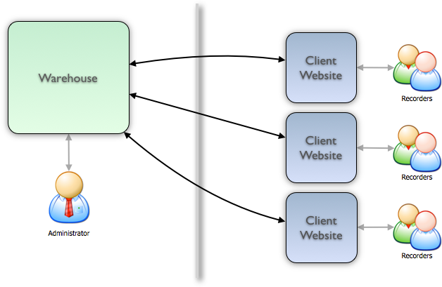

*********************
Architecture Overview
*********************

If you need a brief introduction to the technical architecture of Indicia, then 
read on. 

A website built using Indicia consists of 2 main components:

* The warehouse
* The client website

The warehouse consists of the database itself and administration tools as well 
as a set of web-services which allow the client website to communicate with it. 
The client website is the part which hosts the online recording, reporting and 
other pages which the end-user sees. Indicia uses a *distributed architecture*,
meaning that the client website and the warehouse can be on separate machines
connected only via the internet. The division into two components serves to 
keep the administration interfaces and the end-user interfaces completely 
separate. Also, a fully featured online recording solution makes heavy demands 
on the server technology, in particular to allow it to properly support spatial 
data. Therefore this separation allows a single warehouse to be shared between 
multiple client websites. As long as partner can be found able to host a 
website, this means that the server technology required to run online recording 
on a client website is minimal and indeed, most cheap web hosting services will 
support Indicia based online recording. 

Warehouse architecture
======================

The following diagram illustrates the basic architecture of the warehouse.

.. image:: ../images/diagrams/warehouse-architecture.png
  :alt: Overview of the warehouse architectural components
  :width: 100%
  
There are quite a few acronyms and other bits of jargon but don't worry, we'll 
work through each of these in turn.

PostgreSQL
----------

PostgreSQL is a relational database management system. In essence, a relational 
database is a collection of tables of data, each of which may relate to rows 
(records) in other tables in the database by the use of unique identifiers. 
PostgreSQL is just one of many pieces of software that are designed to manage 
relational databases, letting you store and extract the data in powerful and 
flexible ways. Each makes claim and counter-claim regarding which is the 
fastest, which can hold the most data and so forth. Our choice of PostgreSQL is 
based on:

* It has a free and open source community edition which we use for Indicia
* It is at least similar in performance, flexibility and power to the other, 
  proprietary commercial offerings
* When combined with PostGIS, it has better support for spatial data than most 
  alternatives, that is, data which have geographic information attached to 
  them. The most commonly used database for website development, MySQL, is 
  rather poor in its support for spatial querying in comparison. We'll find out 
  more information about PostGIS in a moment.
* It is actively being developed and continually improving.

PostGIS
-------

PostGIS adds support for geographical information to PostgreSQL. A database that
supports geographic data is often called "spatially enabled". Not only can 
PostgreSQL + PostGIS store map data directly in the database, but PostGIS adds
a whole plethora of functions for transforming between different 
cartographic projections, measuring, manipulating and otherwise interpreting
the geographic objects it stores. For example, PostGIS can:

* convert the boundary of a place from a latitude and longitude map projection
  to British National Grid projection,
* find all the records within 200m of a river,
* let you report on the data in a user-drawn polygon which can optionally be 
  buffered.

Warehouse MVC code
------------------

.. warning::

  Jargon alert!

  The code for the warehouse is written in PHP and uses a framework called 
  `Kohana <http://kohanaframework.org/>`_. Kohana is one of a number of 
  frameworks that use the `Model View Controller <http://en.wikipedia.org/wiki/Model–view–controller>`_ 
  (MVC) design pattern available for PHP. By using a framework rather than 
  starting from scratch we get a collection of useful code for accessing the 
  database, building the user interface and business logic. As an MVC framework, 
  Kohana also provides a standard way to organise code classes into logically
  separate roles:

  * Models - classes which interact with the database. Each model class normally
    represents a single object in the database and provides methods to insert,
    delete and modify records as well as properties to inspect field values from
    the database.
  * Views - code which provides the user interface. In our case these are PHP
    files which output HTML. 
  * Controllers - classes which manage the business logic and interactions 
    between models and views.

Kohana's framework allows for additional modules which can extend existing
functionality and provide new functionality. 

Indicia's warehouse code adds lots of useful code to Kohana including
helper classes for handling different grid reference notations, managing vague
dates and a host of other online-recording tasks. In addition the extensibility
of Kohana is augmented to provide a simple way to add new data tables, screens,
and tabs to the existing warehouse user interface.

.. note: 

  This ability to extend the data model was used by the Wildfowl and Wetlands
  Trust to develop a module which provides support for recording individuals, 
  flocks, family relationships and identifying marks such as rings in birds.

Warehouse UI
------------

The warehouse user interface code consists of a series of Kohana views. Each 
view is a simple PHP file which outputs the HTML required for the view. For the 
most part, the warehouse code uses the same client helper library API for the
user interface code as client websites. For example, the grids you can see in 
the warehouse when browsing data are the same ``report_helper::report_grid``
component used to add grids to client websites. However, because Indicia's 
warehouse was originally developed in parallel to the client helper library, 
some of the earlier views utilise the HTML helper provided by Kohana to generate
the HTML output. These are being converted to use the client helper library API
to keep the code consistent, but this is a lower priority than many other tasks.

Likewise, the import facilities available on the warehouse are use the exact
same ``import_helper`` class as the one provided in the client helper library
API to build import facilities for client websites.

Web services
------------

As you can see from the earlier diagram, the web services are key to the 
interactions between the client website and the warehouse. Web services use the
same protocols that we use everyday for browsing the internet but instead of 
providing a user interface (website), web services provide a programmatic 
interface. In a typical web transaction, a *user* sends a request to a specified
*web address*. The *server* responds with the *web page*. A typical web service
transaction might involve the *user* being a piece of code on the 
client website. The *user* sends a request to a specified *web address*. The
*server* responds with some *data*. The code then processes that data before 
rendering the web page as appropriate.

The web services in Indicia are comprehensive in comparison with some systems
where the web services were added as an afterthought, because the Indicia
architecture means that every single interaction with the data on the warehouse
must go through the web services. Every record, every report and every map you 
see on websites like `iRecord <http://www.brc.ac.uk/irecord>`_ is obtained
via the web services. Indicia's web services provide the following facilities:

* Data services

  * Read individual database records
  * Read lists of database records according to provided sort and filter criteria.
    This supports pagination in grids by allowing **limit** and **offset** 
    parameters
  * Write to records for edits and deletes

* Reporting Services

  * Read the output of reports, also with support for pagination in grids by 
    allowing **limit** and **offset** parameters

* Other web services

  * Authenticate a client website
  * Spatial reference operations including transformations from map coordinates to
    and from any spatial reference notation.
  * Bulk import records
  * Apply verification rules to proposed records

The data access via Indicia's web services requires secure authentication and 
applies authorisation so that each client website cannot see data that belongs
to other websites by default.

Extension modules
-----------------

The Kohana framework provides useful support for extensibility via the concept
of modules, which allow the provision of additional models, views and 
controllers as well as the overriding of existing code from the main 
application. Indicia's warehouse extends this idea by allowing modules to hook
into various bits of core functionality. For example, Indicia allows a module
to provide additional items to add to the main menu or new tabs for an existing
page. Indicia's module framework can even be used to extend the data model with 
completely new entities and attributes and to support accessing these via the
web services. Therefore any extensions to the data model which are not likely
to be useful to the majority of online recording surveys should be implemented
via modules, helping to keep the core of Indicia lightweight and efficient.

Example modules which extend the data module include:

* **taxon_designations** for supporting designations information for species.
* **individuals_and_associations** for supporting records of individual 
  organisms and the associations with others, e.g. ringed birds or family 
  groups.

GeoServer
---------

`GeoServer <http://geoserver.org>`_ is an open source software server that 
allows users to share geospatial data. GeoServer publishes data using open 
standards and therefore provides an ideal platform for publishing Indicia's
PostGIS spatial database over the web. Data can be published directly as map
images or layers for overlay onto web mapping applications and GIS applications,
or a variety of text based spatial formats.

GeoServer is a separate optional installation which should site alongside the 
warehouse on the same server. Although Indicia is capable of drawing maps 
without GeoServer, any attempt to map more than a few thousand points on a 
single map is likely to hit performance problems both in the browser's 
JavaScript engine (which is responsible for adding points to the map) and 
because of the size of the download file. On option that GeoServer provides
is a Web Mapping Service (WMS) which renders the map layer image on the server
and sends the image to the client. This results in drastically improved 
performance when rendering maps with large numbers of records.