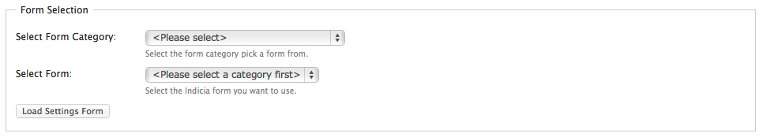
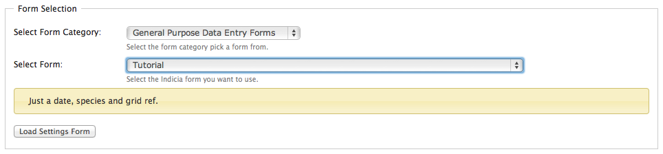
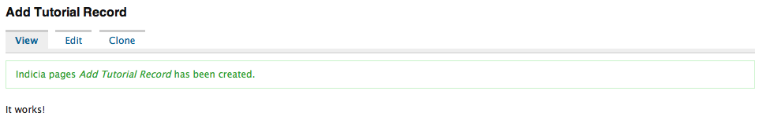

Adding an IForm node
--------------------

Now, go to your Drupal site and log in as administrator. On the admin menu,
select **Content > Add content > Indicia pages** (Content management > Create 
content > Indicia forms in Drupal 6) to access the
page used to add and configure an Indicia form. Set the following options:

* Set *Page title* to "Add tutorial record".
* Expand the *Menu settings* section and set the *Menu link title* to *Add
  tutorial record*. This simply adds the form to the site's main menu and makes
  it easier to find again if we navigate away.

Scroll down the page a bit and find the *Form selection* section. This is where
all the Indicia configuration will take place - the other settings on the page
are just standard Drupal page settings.

Set the **Select Form Category** drop down to the category you gave your form,
probably "General Purpose Data Entry Forms", then select the "Tutorial" form in 
the **Select Form** drop down. You should see that the description you gave
your form has appeared on the screen, useful to let website builders know
exactly what they are getting before they go through the rigmarole of setting
up all the configuration required. 

Click the **Load Settings Form** button. This sends a request to the web-server
to get the parameters required for configuring this type of form. As we did not
return any parameters in the ``get_parameters`` method, the ones you see here
are just a few default ones to do with things like permissions. You can leave
the default settings and just click the Save button at the bottom of the page.
Hopefully, you will see the title of the page, Drupal's View, Edit tabs, a 
message informing you that the form has been saved and with a bit of luck, 
the message you returned from the ``get_form`` method:

.. tip::

  In this screenshot, I've got the `Node Clone <http://drupal.org/project/node_clone>`_
  module installed. This is a really handy module for copying form definitions 
  to create new, similar forms.
