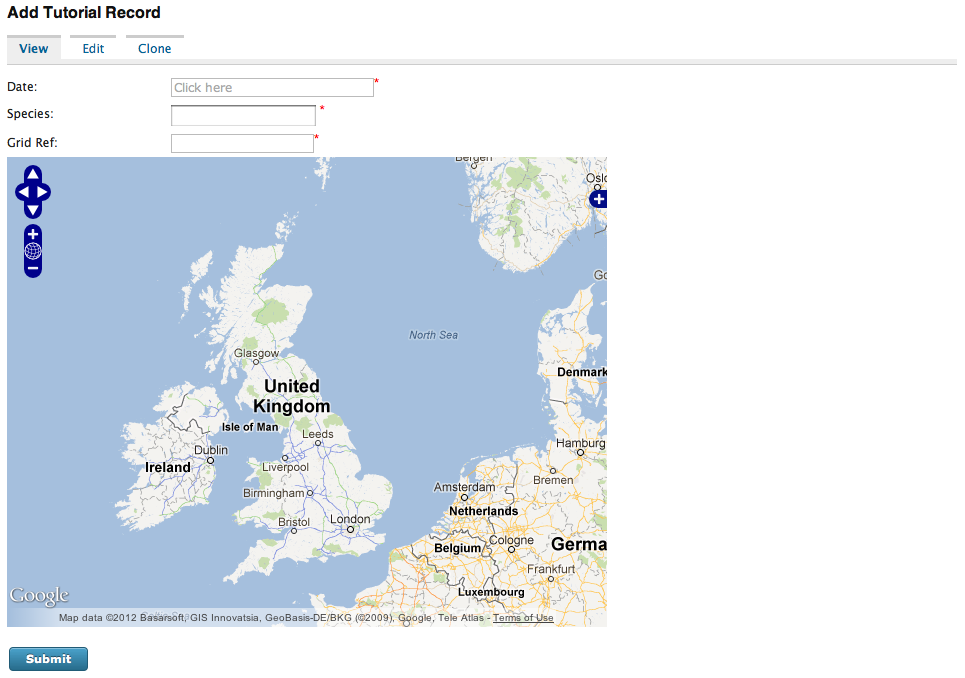

Adding our data entry code
--------------------------

We are now ready to start adding some real data entry code to our form's PHP 
file. The code is mostly very similar to the code we'd write for a standalone
PHP file but instead of echoing the HTML out, we must return the HTML from the
``get_form`` method of our prebuilt_form's class. We can also ignore any code
relating to sending the form submission to the warehouse as well as the line 
which calls ``dump_javascript`` since the Drupal IForm module will handle both 
of these for us. There is also no need to load the data_entry_helper.php file
as it will already be loaded by the module. So, we can start with the following 
code from the tutorial on building a basic form using PHP - in this example
the website and survey's IDs are set to 1 so you might like to change them to 
match your own setup:

.. code-block:: php

  <form id="entry-form" method="POST">
    <input type="hidden" name="website_id" value="1"/>
    <input type="hidden" name="survey_id" value="1"/>
  <?php   
    $auth = data_entry_helper::get_read_write_auth(1, 'password');
    data_entry_helper::enable_validation('entry_form');
    echo $auth['write'];
    echo data_entry_helper::date_picker(array(
      'fieldname'=>'sample:date',
      'label'=>'Date'
    ));
    echo data_entry_helper::autocomplete(array(
      'label'=>'Species',
      'fieldname'=>'occurrence:taxa_taxon_list_id',
      'table'=>'taxa_taxon_list',
      'captionField'=>'taxon',
      'valueField'=>'id',
      'extraParams'=>$auth['read'] + array('taxon_list_id' => '1')
    ));
    echo data_entry_helper::sref_and_system(array(
      'label' => 'Grid Ref',
      'fieldname' => 'sample:entered_sref',
      'systems' => array('osgb'=>'British National Grid')
    ));
    echo data_entry_helper::map_panel(array(
      'presetLayers' => array('google_streets','google_satellite')
    ));
    data_entry_helper::link_default_stylesheet();
    echo data_entry_helper::dump_javascript();
  ?>
    <input type="submit" />
  </form>

This translates to:

.. code-block:: php

  <?php
  public static function get_form($args, $node, $response=null) {
    $r = '<form id="entry-form" method="POST">'.
        '<input type="hidden" name="website_id" value="1"/>'.
        '<input type="hidden" name="survey_id" value="1"/>';
    $auth = data_entry_helper::get_read_write_auth(1, 'password');
    data_entry_helper::enable_validation('entry_form');
    $r .= $auth['write'];
    $r .= data_entry_helper::date_picker(array(
      'fieldname'=>'sample:date',
      'label'=>'Date'
    ));
    $r .= data_entry_helper::autocomplete(array(
      'label'=>'Species',
      'fieldname'=>'occurrence:taxa_taxon_list_id',
      'table'=>'taxa_taxon_list',
      'captionField'=>'taxon',
      'valueField'=>'id',
      'extraParams'=>$auth['read'] + array('taxon_list_id' => '1')
    ));
    $r .= data_entry_helper::sref_and_system(array(
      'label' => 'Grid Ref',
      'fieldname' => 'sample:entered_sref',
      'systems' => array('osgb'=>'British National Grid')
    ));
    $r .= data_entry_helper::map_panel(array(
      'presetLayers' => array('google_streets','google_satellite')
    ));
    data_entry_helper::link_default_stylesheet();
    $r .= '<input type="submit" />'.
        '</form>';
    return $r;
  }
  ?>

If you follow this through you should see that the translation between standard 
PHP code using the Indicia client helpers and a prebuilt form's code is pretty 
simple. So, update your prebuilt form's tutorial.php file and save it, then
reload the Drupal page containing your form.

