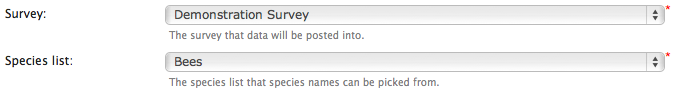

Parameterising the prebuilt form
--------------------------------

Whilst our form is moderately useful, it is restricted to one specific website
configuration and one specific survey. In fact it is not really reusable at all
as it stands. Let's take a look at how to link the form up to the website 
configured under **Site configuration > IForm > Settings** on the menu. We'll
also take a look parameterising the survey ID and species list ID the form uses.

Warehouse connection
^^^^^^^^^^^^^^^^^^^^

The first thing to know is that the IForm module has a function called 
``iform_get_connection_details`` which retrieves the information required to 
connect to the warehouse from the configuration. So, at the very top of the 
``get_form`` method, insert the following line of code:

.. code-block:: php

  <?php
  ...
  $connection = iform_get_connection_details($node);
  ...
  ?>

Then, change the line of code which sets the ``$auth`` variable to the 
following:

.. code-block:: php

  <?php
  ...
  $auth = data_entry_helper::get_read_write_auth($connection['website_id'], $connection['password']);
  ...
  ?>

Now, the configuration will be taken from **Site configuration > IForm > 
Settings** so save your tutorial.php then check that the website ID and password
on the configuration page are correct. Reload your data entry page and you can
test that the configuration is correct because the species search box should
still work - if the website ID or password were wrong you would not be able to
look up a species name.

Survey and species list
^^^^^^^^^^^^^^^^^^^^^^^

We are going to add a configuration setting for selecting the survey and the 
species list which this form is linked to. To do this, we need to add 
the configuration settings to the array returned by our ``get_parameters`` 
method. Each configuration parameter is represented by an associative array
with values for **title**, **caption**, **description** and **type**. The title
is the name given to this parameter when referred to in code, the caption is the
display label and the type represents the type of the input control, which maps
to a control defined by a method in the data_entry_helper class. Update your 
``get_parameters`` method to the following, then save your file and load the 
edit page for your form within Drupal.

.. code-block:: php 

  <?php
  public static function get_parameters() {   
    return array(
      array(
        'name'=>'survey_id',
        'caption'=>'Survey',
        'description'=>'The survey that data will be posted into.',
        'type'=>'text_input'
      ), array(
        'name'=>'taxon_list_id',
        'caption'=>'Species list',
        'description'=>'The species list that species names can be picked from.',
        'type'=>'text_input'
      )
    );
  }
  ?>

.. tip::
  
  The text_input is a reference to data_entry_helper::text_input, a handy 
  control for a simple text input box.

You will find on the **Other IForm Parameters** section of the edit page, there 
are now 2 controls for inputting the survey and species list. Input the ID of
your survey and taxon_list from your form and save the page. As it stands, 
although the configuration options are available to the form code, we've not
actually used them yet. Let's take a look at how the parameters are passed to
our form code. At the top of the ``get_form`` method, insert the following line
of code:

.. code-block:: php

  <?php
  ...
  drupal_set_message(print_r($args, true));
  ...
  ?>

You should see something like the following::

  Array ( [language] => en [website_id] => 1 [password] => password [view_access_control] => 0 [permission_name] => [survey_id] => 1 [taxon_list_id] => 1 [redirect_on_success] => [message_after_save] => 1 [additional_css] => )

In amongst this block of information you can see that the survey_id and 
taxon_list_id parameter values we've set for the form are available as 
``$args['survey_id']`` and ``$args['taxon_list_id']``.

.. tip::

  The ``drupal_set_message`` function is a handy way to add a piece of text to 
  the top of any Drupal page, whether for your user to read, or a temporary
  debug message as in this case.

Now, search through your ``get_form`` method for the references to the survey_id
and taxon_list_id and replace the hard coded values with the values from the 
``$args`` array. You can also remove the debug message from the top of the 
method. For reference, the my version of this method now looks like:

.. code-block:: php

  <?php
  public static function get_form($args, $node, $response=null) {
    $connection = iform_get_connection_details($node);
    $r = '<form id="entry-form" method="POST">'.
        '<input type="hidden" name="website_id" value="1"/>'.
        '<input type="hidden" name="survey_id" value="'.$args['survey_id'].'"/>';
    $auth = data_entry_helper::get_read_write_auth($connection['website_id'], $connection['password']);
    data_entry_helper::enable_validation('entry_form');
    $r .= $auth['write'];
    $r .= data_entry_helper::date_picker(array(
      'fieldname'=>'sample:date',
      'label'=>'Date'
    ));
    $r .= data_entry_helper::autocomplete(array(
      'label'=>'Species',
      'fieldname'=>'occurrence:taxa_taxon_list_id',
      'table'=>'taxa_taxon_list',
      'captionField'=>'taxon',
      'valueField'=>'id',
      'extraParams'=>$auth['read'] + array('taxon_list_id' => $args['taxon_list_id'])
    ));
    $r .= data_entry_helper::sref_and_system(array(
      'label' => 'Grid Ref',
      'fieldname' => 'sample:entered_sref',
      'systems' => array('osgb'=>'British National Grid')
    ));
    $r .= data_entry_helper::map_panel(array(
      'presetLayers' => array('google_streets','google_satellite')
    ));
    data_entry_helper::link_default_stylesheet();
    $r .= '<input type="submit" />'.
        '</form>';
    return $r;
  }
  ?>

One last thing before we finish on the topic of parameterising our form. The
parameters must currently be input as IDs which requires the user to go to the
warehouse and find the IDs out in order to setup the form, not very user 
friendly. It would be much easier if we could replace these with drop down
selection boxes. As you might have guessed, this is possible since we can
replace the **text_input** parameter type with the **select** parameter type.
We must also specify the **table**, **valueField** and **captionField** options
required for a select box to be define where the population data comes from.
So, our ``get_parameters`` method becomes:

.. code-block:: php
 
  <?php
  public static function get_parameters() {   
    return array(
      array(
        'name'=>'survey_id',
        'caption'=>'Survey',
        'description'=>'The survey that data will be posted into.',
        'type'=>'select',
        'table'=>'survey',
        'captionField'=>'title',
        'valueField'=>'id'
      ), array(
        'name'=>'taxon_list_id',
        'caption'=>'Species list',
        'description'=>'The species list that species names can be picked from.',
        'type'=>'select',
        'table'=>'taxon_list',
        'captionField'=>'title',
        'valueField'=>'id'
      )
    );
  }
  ?>

The edit page for the form now has a much simpler to use drop down select box
for each of the parameters:

Note that these are both required parameters as indicated by the red asterisks;
if we wanted them to be optional we would specify ``'require'=false`` in the 
options passed to the parameters.

.. tip 

  When building more complex forms with lots of configuration parameters it can
  be useful to group them into categories. You can do this by setting the name
  of the category in the **group** option for each parameter's configuration.