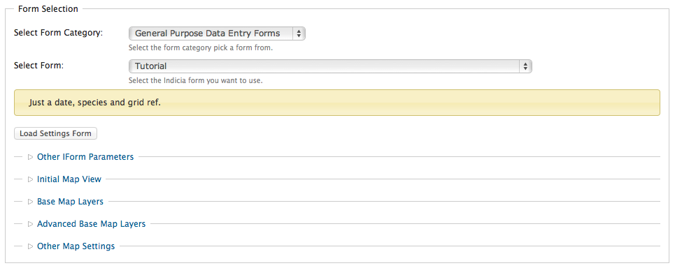

Shortcuts for form building
---------------------------

Because quite a few forms have a lot in common with each other, the prebuilt
form library includes some handy PHP files containing shared code. In most cases
the examples include arrays of standard parameters you can include in your 
form's parameters, along with standard code for building form output using these
parameters. We're going to take a look at how this technique can be used to 
add standard configuration parameters for the map on our form. 

First, you will need to add the **includes/map.php** file to your tutorial.php
file, by adding the following near the top of the PHP (I normally like to put
this code immediately beneath the first comment which describes the file):

.. code-block:: php

  <?php
  require_once 'includes/map.php';
  ?>

Now, let's add some standard parameters to our form. The map.php file we've 
included has a method called ``iform_map_get_map_parameters`` which returns
an array of parameters ready for inclusion. We can use PHP's ``array_merge``
function to add these parameters to our standard ones by updating our 
``get_parameters`` method as follows:

.. code-block:: php

  <?php
  public static function get_parameters() {   
    return array_merge(array(
      array(
        'name'=>'survey_id',
        'caption'=>'Survey',
        'description'=>'The survey that data will be posted into.',
        'type'=>'select',
        'table'=>'survey',
        'captionField'=>'title',
        'valueField'=>'id'
      ), array(
        'name'=>'taxon_list_id',
        'caption'=>'Species list',
        'description'=>'The species list that species names can be picked from.',
        'type'=>'select',
        'table'=>'taxon_list',
        'captionField'=>'title',
        'valueField'=>'id'
      )
    ), iform_map_get_map_parameters());
  }
  ?>

Update your tutorial.php file and save it, then load the edit page for your 
form in your web browser. You's see that rather than just the **Other IForm
Parameters** section for form configuration, there are now 4 additional 
categories of settings for various mapping options.

At the very least, you should expand the **Base Map Layers** section and tick
at least one of the Google layers to show on your map.

As before, having added the new parameters to our form we must also change the
code so that it makes use of them. The map.php file provides helper functions
for this as well. Look at your existing ``get_form`` method in the tutorial.php
file and find the existing line which calls the ``map_panel`` method:

.. code-block:: php

  <?php
    ...
    $r .= data_entry_helper::map_panel(array(
      'presetLayers' => array('google_streets','google_satellite')
    ));
    ...
  ?>

Rather than passing a hard-coded set of options to the map panel, this code 
must now use the map.php's helper functions to get the array. Note that not
only is there an array of options to pass to the ``map_panel`` method, but
there is a second array of options to pass direct to the **OpenLayers**
JavaScript object.

.. note::

  OpenLayers is the name of the JavaScript library Indicia uses to add maps to 
  web pages. 

By adding just a few lines of code to link in the functionality provided by the
map.php file, we've enabled a substantial amount of configuration for our map 
including:

* Choice of base layer(s) from one of several web mapping standards, or even
  a custom web mapping service.
* Display width and height of the map.
* Initial latitude, longitude and zoom scale for the map, which can default to 
  the global settings for the site if preferred.
* Ability to remember the map's last used position.
* Ability to add overlay layers from web mapping services.
* Configuration of the list of controls available on the map - you can even
  setup polygon or line based recording using the drawPolygon or drawLine 
  controls!

