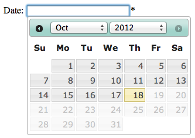

Adding data entry controls
--------------------------

So far, our tutorial page does not do anything particularly useful relating to 
inputting records. Let's start by replacing our code so far with a data input
control. Try replacing all your code between the `<body>` element and its 
closing `</body>` with the following:

.. code-block:: php

  <?php 
  require_once 'client_helpers/data_entry_helper.php';
  echo data_entry_helper::date_picker(array(
    'fieldname'=>'sample:date',
    'label'=>'Date'
  ));
  ?>

Now we are actually doing something useful, outputting the data_entry_helper
class' date_picker control. When we call a control such as this we generally
pass a single **associative array** as an input parameter, populating this with 
the options for the control. This is because there are many options for each 
Indicia client control and most of them can normally be left set to their 
default value. Therefore having a traditional list of parameters to the method 
would be extremely unwieldy and using an array of parameters becomes much easier 
to manage.

.. tip

  Associative arrays are simply arrays where you refer to each entry by an 
  association to a named key rather than a simple index. So in PHP you can have
  ``$a=array('key1'=>'value1','key2'=>'value2')`` or 
  ``$a=array('value1','value2')``. In the first case you can refer to 
  ``$a['key1']`` and in the second case you can refer to ``$a[0]`` - both will 
  contain ``'value1'``.

Our datepicker example code above illustrates a couple of handy options 
supported by most of the data entry related controls. The first is the 
**fieldname** option which defines the HTML **name** attribute of the control
that the date_picker function produces. If you view the source of your web page
you should see this is the case. When we get to as far as submitting our form
contents to the warehouse you will learn the fieldname is split into 2 parts
separated by the colon. These are

#. the name of the entity we are saving data to (singular form)
#. the name of the database field we want to save into

The second handy option in this example is the **label** which causes a HTML
label to be output preceding the actual control. 

There is one more thing to learn about at this stage. If you click in the 
date picker control on your web page and try inputting a date, you'll see it 
is just a free text box with no help given for the date format. Not very 
impressive as it stands, in fact we could probably have just written the HTML
for the control in a couple of lines of HTML and saved loading of the client
helpers etc. In fact, we'd probably be guilty of misnaming the control because
in no sense is this a date picker yet, as you can't pick dates only type them 
in. The control is not very impressive simply because we have only
output half of the job; most Indicia controls are supported by JavaScript which
provides the functionality that runs in the browser itself. In order to 
include the required JavaScript on the page you need to tell the Indicia 
client helper code where to put it, using a method called **dump_javascript**.
You can add the following line to the end of your block of PHP code:

.. code-block:: php

  echo data_entry_helper::dump_javascript();

This means that your whole code page should look like the following:

.. code-block:: php

  <!DOCTYPE html>
  <html>
  <head>
    <title>Indicia tutorial</title>
  </head>
  <body>
  <?php 
    require_once 'client_helpers/data_entry_helper.php';
    echo data_entry_helper::date_picker(array(
      'fieldname'=>'sample:date',
      'label'=>'Date'
    ));
    echo data_entry_helper::dump_javascript();
  ?>
  </body>
  </html> 

Now, save the code file and reload the page in your browser. This time, when 
you click in the date picker you will see a drop down date picker. Note that our
version of the date picker only allows dates in the past to be picked as records 
cannot be in the future.

That's quite a lot of functionality for not very much code and don't forget, 
there is also support for validation, saving and reloading values to the 
database all built into the control we've just added to the page.