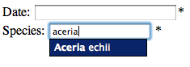

Ajax controls and authentication
--------------------------------

Next we're going to add a control for picking a species. This control uses
`AJAX <http://www.w3schools.com/ajax/default.asp>`_ to suggest possible species
name matches as the user types. Rather than download the entire species
list to the client browser, the species list stays on the warehouse and the 
JavaScript on the browser sends the search string to the server which returns
a list of possible matches. The web-services which return the list of possible
matches from the warehouse are secure as they are the same web-services which 
provide secure access to things like sensitive records. Therefore we need to 
know how to authenticate our AJAX requests.

The web-services which handle reading to and writing from the warehouse are 
called the **data services**. These require a form of authentication known as
**digest authentication** in order to identify which client website is making 
the request, letting the warehouse filter the response as appropriate. For 
example, a request for all occurrences sent from the Orthoptera website will 
return only those input via the Orthoptera website despite the fact that the 
warehouse's **occurrences** table is full of records from other client websites.
This is because when the request is sent, the request has authentication 
information attached to it which proves that the website is who it says it is.
You don't need to know the details of the authentication process for this 
tutorial but you can read the :doc:`../../web-services/authentication-overview`
and subsequent documents if you want to know more. Suffice to say that digest
information allows secure authentication even if the connection between the 
client and server is insecure, since the password is never passed across the 
connection in any reusable form.

We do, however, need to know how to write code which authenticates. Add the
following code to your PHP block in tutorial.php immediately after the line 
which requires the data_entry_helper.php file, replacing the ``<website ID>`` 
and ``<password>`` with the details you have for your own website's 
registration:

.. code-block:: php

  <?php
  ..
  $readAuth = data_entry_helper::get_read_auth(<website_id>, '<password>');
  ...
  ?>

This gives us authorisation to read information from the warehouse. We need to 
pass this information to the species autocomplete control. The code for the 
species autocomplete control is given below so insert this code after your
date picker's code, replacing ``<taxon_list_id>`` with the numeric ID of the 
species list you are planning to use on the warehouse:

.. code-block:: php

  <?php
  ...
  echo data_entry_helper::autocomplete(array(
    'label'=>'Species',
    'fieldname'=>'occurrence:taxa_taxon_list_id',
    'table'=>'taxa_taxon_list',
    'captionField'=>'taxon',
    'valueField'=>'id',
    'extraParams'=>$readAuth + array('taxon_list_id' => '<taxon_list_id>')
  )); 
  ...
  ?>

The first 2 options in the options array should be familiar now. After these
there are options which tell Indicia which entity to look up against, what the
name of the caption field is in the database to display in the drop-down (it 
will actually use the view ``list_taxa_taxon_lists`` by default), what the name
of the field is to use as the actual value to store, and finally any extra
parameters to provide with the AJAX requests sent to the warehouse, in this case
the ID of the species list and our read authentication information.

.. tip::

  Indicia 0.9 will introduce a species_autocomplete control which simplifies
  the options you need to provide for species searching significantly.

Save the file and reload your tutorial.php page in your web browser. See what
happens when you type the first few characters of one of the species in your
species list:

The control automatically sends these characters to the warehouse, which 
searches the database and returns the response for the control to display on 
screen.