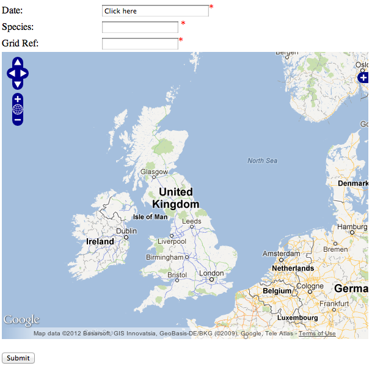

Conclusion
----------

Through this tutorial we've learnt how to

* write simple PHP to output some common data input controls.
* include default styling for the form.
* build a form submission and send this to the warehouse.
* handle the response from the warehouse.
* enable validation on the client-side.

Our finished form
^^^^^^^^^^^^^^^^^

