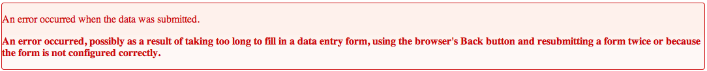

Posting the record to the database
----------------------------------

We've built a data entry form, but no means of saving the record to the database
as yet. Just like the code for building our form, Indicia provides simplified
ways of handling the input record, sending it to the database and handling the
response. First thing we obviously need is to turn our page into an HTML form
and add a submit button. Here's the code for the entire page showing the new
``<form>`` and ``<input>`` elements:

.. code-block:: php

  <!DOCTYPE html>
  <html>
  <head>
    <title>Indicia tutorial</title>
  </head>
  <body>
    <form method="POST">
  <?php 
    require_once 'client_helpers/data_entry_helper.php';
    $readAuth = data_entry_helper::get_read_auth(1, 'password');
    echo data_entry_helper::date_picker(array(
      'fieldname'=>'sample:date',
      'label'=>'Date'
    ));
    echo data_entry_helper::autocomplete(array(
      'label'=>'Species',
      'fieldname'=>'occurrence:taxa_taxon_list_id',
      'table'=>'taxa_taxon_list',
      'captionField'=>'taxon',
      'valueField'=>'id',
      'extraParams'=>$readAuth + array('taxon_list_id' => '1')
    ));
    echo data_entry_helper::sref_and_system(array(
      'label' => 'Grid Ref',
      'fieldname' => 'sample:entered_sref',
      'systems' => array('osgb'=>'British National Grid')
    ));
    echo data_entry_helper::map_panel(array(
      'presetLayers' => array('google_streets','google_satellite')
    ));
    data_entry_helper::link_default_stylesheet();
    echo data_entry_helper::dump_javascript();
  ?>
      <input type="submit" />
    </form>
  </body>
  </html>

Now, when we input some data and click Submit the form's content will be POSTed
back to the same page. We of course need to submit this to the warehouse so that
the record can be stored into the database. Add the following code to your PHP
page above the ``<form>`` element block:

.. code-block:: php

  <?php
  if ($_POST) {
    $submission = data_entry_helper::build_sample_occurrence_submission($_POST);
    $response = data_entry_helper::forward_post_to('save', $submission);
    echo data_entry_helper::dump_errors($response);
  }
  ?>

You must also move the line of code which calls ``require_once`` from the second
block of PHP to the top of this new block, otherwise when the PHP tries to 
access the data_entry_helper class it will not have been created yet. This code 
performs 3 tasks if, and only if, the form has posted data:

#. Converts the data posted by the form into a *submission*, which is a special
   array structure used for sending data to be saved into the warehouse. The
   submission we are building contains a sample and an occurrence within the 
   sample.
#. Forwards this submission to the data services' **save** method.
#. Outputs any resulting errors, or a success message if all is well.

Now, reload your web page, fill in a date, species name and grid reference then 
click the Submit button. If everything is correct, you will see an error:

We've forgotten to attach authentication information to our submission so the 
warehouse won't accept it. That's easily remedied. Remember that we included
a request to get read authentication in the form code? We can change this code
to request read and write authentication, then embed the write authentication in 
the form submission. Here's how:

#. Find the call to ``$readAuth = data_entry_helper::get_read_auth(...);`` and 
   change it to ``$auth = data_entry_helper::get_read_write_auth(...);``.
#. Search for any references in the code to ``$readAuth`` and change them to 
   ``$auth['read']`` since $auth now contains an array with both read and write
   information.
#. Include the contents of ``$auth['write']`` in your form. E.g. you could add
   a line of code ``echo $auth['write'];`` immediately after the line which sets
   the $auth variable. As long as it is inside the ``<form>`` element and after
   the line which sets ``$auth`` it should not matter exactly where it goes.

Before going any further, lets add a couple of hidden inputs to our form to 
set some values which are fixed in the records we capture for this survey. Add
the following HTML inside your ``<form>`` element, replacing <website_id> and 
<survey_id> with the ID of the survey you are saving into:

.. code-block:: php

  <input type="hidden" name="website_id" value="<website_id>"/>
  <input type="hidden" name="survey_id" value="<survey_id>"/>

Your code should now look like the following:

.. code-block:: php

  <!DOCTYPE html>
  <html>
  <head>
    <title>Indicia tutorial</title>
  </head>
  <body>
    <?php
    require_once 'client_helpers/data_entry_helper.php';
    if ($_POST) {
      $submission = data_entry_helper::build_sample_occurrence_submission($_POST);
      $response = data_entry_helper::forward_post_to('save', $submission);
      echo data_entry_helper::dump_errors($response);
    }
    ?>
    <form method="POST">
    <input type="hidden" name="website_id" value="1"/>
    <input type="hidden" name="survey_id" value="1"/>
  <?php   
    $auth = data_entry_helper::get_read_write_auth(1, 'password');
    echo $auth['write'];
    echo data_entry_helper::date_picker(array(
      'fieldname'=>'sample:date',
      'label'=>'Date'
    ));
    echo data_entry_helper::autocomplete(array(
      'label'=>'Species',
      'fieldname'=>'occurrence:taxa_taxon_list_id',
      'table'=>'taxa_taxon_list',
      'captionField'=>'taxon',
      'valueField'=>'id',
      'extraParams'=>$auth['read'] + array('taxon_list_id' => '1')
    ));
    echo data_entry_helper::sref_and_system(array(
      'label' => 'Grid Ref',
      'fieldname' => 'sample:entered_sref',
      'systems' => array('osgb'=>'British National Grid')
    ));
    echo data_entry_helper::map_panel(array(
      'presetLayers' => array('google_streets','google_satellite')
    ));
    data_entry_helper::link_default_stylesheet();
    echo data_entry_helper::dump_javascript();
  ?>
      <input type="submit" />
    </form>
  </body>
  </html>

Reload a fresh copy of the page in your web browser fill it in and try 
submitting a record.