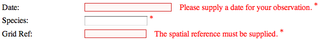

Validation
----------

Next, try submitting the record without filling in anything. You'll see a 
validation message alongside the date and grid reference controls, nicely 
coloured red since we've included the default stylesheet on the page. 

The species control does not show any validation errors since this is part of 
the occurrence record in the database rather than the sample - as the warehouse 
could not save the sample it did not get as far as trying the occurrence. 
Getting the form to validate required us to post the submission to the warehouse 
just to check something as simple as whether the required fields have been 
filled in or not which is hardly ideal. Missing things out is quite a common 
mistake when filling in web forms, therefore we'd expect lots of forms to be 
posted to the warehouse's web services only for the warehouse to send them back 
again for completion. As the system grows this is likely to start hindering 
performance; in other words its a bit of a waste of resources. As you might
expect, Indicia has built in support for validating the form input from within
the browser, so the form will not be sent to the warehouse until it is filled
in properly. We just have to turn it on. To do this, add the following line of
code, after the line which calls ``get_read_write_auth``:

.. code-block:: php

  <?php
    ...
    data_entry_helper::enable_validation('entry_form');
    ...
  ?>

Because this method requires the ID of the entry form as a parameter, we need
to add the id to the HTML ``<form>`` element so that it looks like 
``<form id="entry-form" method="POST" />``. Do this, save your file and reload 
the form in your web browser. This time, if you click the Submit button you
should see the validation messages appear immediately for all 3 required 
controls and if you watch carefully you will notice that there is no longer
a page reload, all the validation is done in the browser without sending 
anything anywhere. Much more efficient!