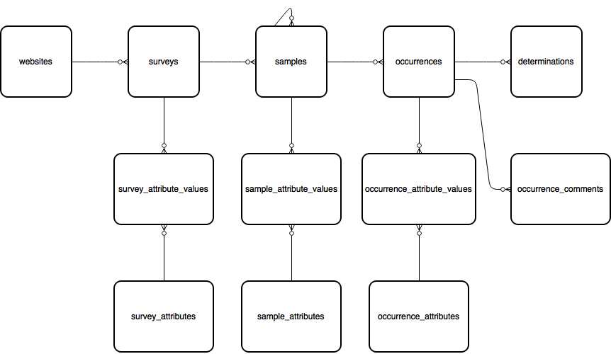
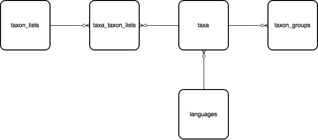
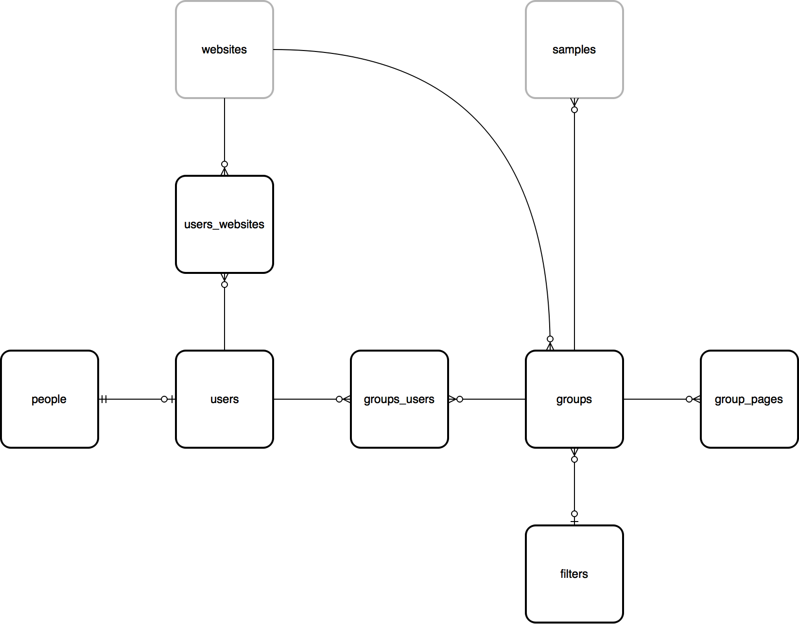
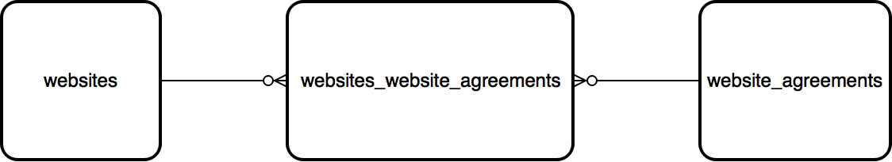

***********************
Data Model Introduction
***********************

Indicia's database is a traditional relational database based on PostgreSQL with spatial
extensions supported by PostGIS. The database tables and columns are documented in the
schema comments. Here's an introduction to some key ares of the data model to get you
started with querying the database.

websites > surveys > samples > occurrences
==========================================

The main spine of the data model captures species observations and is covered by the
websites,  surveys, samples, occurrences and determinations tables. The following diagram
shows the relationships between these tables as well as the associated custom attribute
tables described later on this page:

websites
--------

All occurrence data in the database are "owned" by the client website which they were
entered on. Each client website has an entry in the websites table which allows all the
records to be  tagged against the website ID which contributed them. By default each
website can only view or edit the occurrence data belonging to them, though it is also
possible to set up agreements between registered websites that allow the records to be
shared. For example,  this approach is used to allow multiple websites to share their
records to the iRecord verification portal in the UK.

surveys
-------

Within each website registered on the warehouse, data are divided up into survey datasets,
each described by a single row in the surveys table. Each survey dataset can have a
different set of attributes collected for the records it contains so it makes sense to
divide the records into multiple survey datasets based on their purpose and data structure
rather than to keep them all together in one. For example, a survey dataset for insect
data might collect an attribute for the count of each record, whereas one for plant
data might collect a DAFOR abundance value. The configuration of custom attributes
available is defined at the level of the survey dataset therefore it is often the case that
a survey dataset is created for each recording form you build.

samples
-------

A sample defines a set of data which were collected by the same recorder(s) on the same
date at the same place using the same method. Therefore you would expect to have a sample
record created for each grid reference you recorded at during a day of recording. Each
sample can contain any number of occurrences (records) and each sample belongs to a
survey dataset which defines the additional custom attributes available to record against
it.

Note that samples can be hierarchical by pointing the parent_id foreign key field at
another sample record. This allows more complex surveying methodologies to be captured,
for example a transect sample can capture metadata about the overall transect, then
sub-samples can capture the records at exact points along the transect.

Samples capture the entered map reference as both a plain text field (as entered by the
recorder) and a spatial object ready for drawing on a map. We'll cover spatial data in
detail in the next section.

.. tip::

  Since a sample date can span several days, or may not be precisely known (especially
  relevant for historic data), sample dates are stored in a 3 field "vague date format"
  borrowed from Recorder. The first 2 fields are a date_start and date_end field which
  define the complete range of dates covered by the vague date. They will be the same if
  a single exact date is provided and one or the other can be null (e.g. when specifying
  a date before 2009 the start date will be null). The 3rd date_type field is a code which
  describes what type of date is being given, e.g. an exact day, month, year or date range.
  You can use the `vague_date_to_string(date_start, date_end, date_type)` function to
  convert the date stored in the database into formatted text for display.

occurrences
-----------

Each occurrence of a species recorded in the database is stored as a single record in the
occurrences table. Occurrences always belong to samples, have a foreign key to the taxon
and may have additional custom attributes attached, e.g. for the abundance count.

The following example illustrates this section of the database schema by selecting some
simple details from the most recently added record in the database. Note it doesn't include
any taxonomic information - we'll cover that in a moment.

.. code-block:: sql

  select o.id,
    w.title as website_title,
    su.title as survey_title,
    s.entered_sref,
    vague_date_to_string(s.date_start, s.date_end, s.date_type) as "date"
  from websites w
  join surveys su on su.website_id=w.id and su.deleted=false
  join samples s on s.survey_id=su.id and s.deleted=false
  join occurrences o on o.sample_id=s.id and o.deleted=false
  where w.deleted=false
  order by o.id desc
  limit 1

A key aspect of thee occurrences table is the ability to easily track the status of a
record especially with respect to quality. This is achieved using 2 fields, record_status
and record_substatus. The record_status field provides the broad status of the record and
the optional record_substatus field provides a greater level of granularity. The
record_status has the following possibilities:

  * V = verified or accepted
  * C = data entry complete and pending check
  * R = rejected or not accepted

When the record_status is combined with the record_substatus the possibilities are as
follows:

  * V + null = verified or accepted
  * V + 1 = verified or accepted as correct (i.e. accepted as beyond reasonable doubt, e.g.
    if specimen or good photographic evidence available).
  * V + 2 = verified or accepted as considered correct (i.e. accepted but without
    photographic or voucher specimen evidence)
  * C + 3 = data entry complete, checked but not conclusive, marked as plausible.
  * C + null = data entry complete and pending check
  * R + 4 = rejected as considered incorrect
  * R + 5 = rejected as incorrect (i.e. evidence available to prove it is incorrect beyond
    reasonable doubt).
  * R + null = rejected or not accepted

Therefore a query to obtain all accepted records can simply filter on record_status=V and
ignore the substatus.

occurrence_comments
-------------------

The occurrence comments contains a log of all comments, including:

  * those made by recorders on each others records
  * queries made by experts
  * verification decisions made by experts
  * comments added by automatic record quality checks, e.g. flagging records outside the
    expected range or time of year.

determinations
--------------

Where there have been multiple opinions on the identification of a record, the
determinations table contains *previous* identification details.

taxon_lists > taxa_taxon_lists > taxa
=====================================

The second key part of the database is the taxonomy module which captures information
about the species and other taxa which you can record against.

taxon_lists
-----------

The database stores multiple lists of taxa. A list can be anything from a simple flat list
of a few species being recorded by a citizen science project to a full hierarchical
taxonomy for a country's species list.

taxa_taxon_lists
----------------

The taxa_taxon_lists table serves to join taxa to the lists they belong to.

taxa
----

The taxa table contains one row per taxon name. A single species concept, therefore, may
have several rows in the taxa table, with one for the currently accepted name, plus others
for synonyms and common names.

Here's an example which grabs the taxon names in a list with common names:

.. code-block:: sql

  select t.taxon, string_agg(distinct tc.taxon, ', ') as common
  from taxa_taxon_lists ttl
  join taxa t on t.id=ttl.taxon_id
  left join (taxa_taxon_lists ttlc
    join taxa tc on tc.id=ttlc.taxon_id and tc.deleted=false
    join languages lc on lc.id=tc.language_id and lc.iso<>'lat'
  ) on ttlc.taxon_meaning_id=ttl.taxon_meaning_id
  where ttl.deleted=false
  and ttl.taxon_list_id=1
  and ttl.preferred=true
  group by t.taxon

Don't worry if that query is looking a bit complex, later we'll see how the reporting cache
tables make querying both observational and taxonomic data much simpler.

In the taxonomy module, there are several different "key" fields which can be used to
refer to database records in different ways:

  * taxa_taxon_lists.id (taxa_taxon_list_id) is the primary key of every instance of a
    unique taxon name within a taxonomic checklist or hierarchy. Every accepted latin name,
    synonym and common name has a unique identifier. Generally when linking an occurrence
    to its identification we use the taxa_taxon_list_id because it gives a precise
    reference to the exact name used and the list it was selected from - reports can easily
    work out from this the currently accepted name or common name for output for example.
  * preferred_taxa_taxon_list_id is the taxa_taxon_list_id of the currently accepted name
    on the list. It can be used to quickly identify a group of all the given names for a
    taxon on a list since they will all share the same preferred_taxa_taxon_list_id.
  * The taxa_taxon_lists.taxon_meaning_id field contains an ID that is unique for each
    species concept so can be used to easily locate and translate between the  different
    names available for a taxon. This is very similar to the preferred_taxa_taxon_list_id
    except that taxon_meaning_id can be shared across lists (when the list creator chooses
    to do so). This means that if you select all the records which have the same taxon
    meaning ID you will get all the given combinations of taxon names and species
    checklists across all lists.
  * The taxa.external_key field is often used to store an externally recognised identifier
    for the taxon. In the UK it is used to store the preferred Taxon Version Key as used
    by the NBN.

taxon_groups
------------

The taxon_groups table provides a list of labels (sometimes called reporting categories)
which are often used in reporting to  help clarify taxon names in a user friendly way. Each
taxon belongs to a single taxon group and group names can be taxonomic but don't have to
be, for example a taxon group could  be called "aquatic insects" if desired.

languages
---------

A simple lookup list of languages used in the taxonomy and termlists parts of the database,
e.g. separates Latin names from English names. Includes the 3 letter iso language code
which can be used as a shortcut to the full language name.

Cache tables
============

The Indicia data model is normalised, which means that data are organised in such a way as
to reduce redundancy and improve integrity. The data required for a biological  record are
split across multiple tables with relationships between the records, as opposed to a more
flat "spreadsheet" approach where there a large number of columns in a single table. This
is generally  desirable in that each item of information needs to only be stored once
rather than repeated in several places, therefore ensuring consistency. However it can make
queries more complex with multiple joins required to bring in all the tables required for
the output of a query and in some cases the additional joins required can reduce the
performance of queries. For  example, to provide the basic "what, where, when and who" of a
set of biological records from the last week's input you need  something akin to the
following SQL:

.. code-block:: sql

  select
    t.taxon, tg.title as taxon_group,
    s.entered_sref, l.name as location_name,
    s.date_start, s.date_end, s.date_type,
    who.text_value as recorder
  from occurrences o
  join samples s on s.id=o.sample_id and s.deleted=false
  left join locations l on l.id = s.location_id and l.deleted=false
  join taxa_taxon_lists ttl on ttl.id=o.taxa_taxon_list_id
    and ttl.deleted=false
  join taxa t on t.id=ttl.taxon_id and t.deleted=false
  join taxon_groups tg on tg.id=t.taxon_group_id and tg.deleted=false
  left join (sample_attribute_values who
  join sample_attributes whoa on whoa.id=who.sample_attribute_id
    and whoa.deleted=false and whoa.system_function='full name'
  ) on who.sample_id=s.id and who.deleted=false
  where o.created_on>now() - '1 week'::interval
  and t.taxon_group_id=<taxon_group_id>

In order to make queries easier to write and also performant, Indicia includes a
set of tables which "flatten" the multiple tables of key parts of the data model into
a few tables which are easy to query and, more importantly, perform well when used to
generate report outputs. Here's an alternative version of the above query:

.. code-block:: sql

  select
    cttl.taxon, cttl.taxon_group,
    snf.public_entered_sref, o.location_name,
    o.date_start, o.date_end, o.date_type,
    snf.recorders
  from cache_occurrences_functional o
  join cache_samples_nonfunctional snf on snf.id=o.sample_id
  join cache_taxa_taxon_lists cttl on cttl.id=o.taxa_taxon_list_id
  where o.created_on>now() - '1 week'::interval
  and o.taxon_group_id=<taxon_group_id>

Not only are there less joins, but an important point is that the vast majority of fields
you might want to filter on are in the `cache_occurrences_functional` table. Filtering
in a single table then joining extra tables for addition of the information required for
output fields is much faster than filtering in different tables in PostgreSQL.

The cache_* tables available in the database are described below.

cache_occurrences_functional
----------------------------

This table contains all the fields which have a common functional use in building reports
that output occurrence data. This means it includes fields that are used for filtering,
sorting and grouping the report output rather than the labels which are typically output
in the report columns displayed to the user.

.. note::

  By keeping all the commonly filtered, sorted and grouped columns in a single table, the
  PostgreSQL query optimiser is able to effectively perform all the processing on a single
  table then join in other columns to obtain output values for display as a last step. This
  is much more efficient than filtering 2 separate tables then joining to obtain the
  intersection. For example, a query that shows all taxa in the 'insects - beetles' group
  for the Dorset vice county should first obtain the IDs matching the 'insects - beetles'
  taxon group and the Dorset location, then select data from cache_occurrences_functional
  filtering on taxon_group_id and location_id_vice_county within the same table. This is
  MUCH more efficient than joining to the taxon_groups and locations tables to filter
  within those tables.

cache_occurrences_nonfunctional
-------------------------------

Contains additional values for each record which are frequently useful to construct the
display output of a record but rarely used in filtering, grouping or sorting of the report
output.

cache_samples_functional
------------------------

Similar to the cache_occurrences_functional, contains the commonly filtered, sorted and
grouped values for a sample. Note that when querying occurrences this table is unnecessary
since all the values are duplicated in cache_occurrences_functional (for the performance
reasons described above). It is only necessary to use this table when querying a list
of samples.

cache_samples_nonfunctional
---------------------------

Contains additional values for each sample which are frequently useful to construct the
display output of a sample or the sample elements of a record but rarely used in filtering,
grouping or sorting of the report output.

cache_taxa_taxon_lists
----------------------

Contains values pertaining to a single taxon name, for example you can find the used name,
the preferred name for the taxon as well as the default common name, kingdom, order and
family.

cache_taxon_searchterms
-----------------------

A table containing all variants and codes that can be used to lookup a taxon in a single
indexed list.

The following example shows how the cache_* tables can be joined to include all the cached
data relevant to a record. Note that in most cases you won't need to include all the
tables here, just the cache_occurrences_functional table plus any others required in the
output:

.. code-block:: sql

  select
  o.id,
  onf.licence_code,
  snf.public_entered_sref,
  vague_date_to_string(o.date_start, o.date_end, o.date_type),
  cttl.taxon,
  cttl.preferred_taxon as accepted_name,
  cttl.default_common_name as common_name,
  cttl.family_taxon,
  cttl.order_taxon
  from cache_occurrences_functional o
  join cache_occurrences_nonfunctional onf on onf.id=o.id
  join cache_samples_nonfunctional snf on snf.id=o.sample_id
  join cache_taxa_taxon_lists cttl on cttl.id=o.taxa_taxon_list_id
  where o.taxon_group_id=1
  and o.website_id=2
  and o.survey_id=3

.. tip::

  Because of the way the indexing works on cache_occurrences_functional, if you want to
  filter on a survey_id to restrict the output to a single dataset, also include a filter
  on the website_id as shown in the query above. This allows a compound index to work so
  is much more efficient.

Custom attribute tables
=======================

Indicia is designed to allow flexible capture of wildlife records and to tolerate the fact
that wildlife surveys are often designed with specific attributes in the data, for example
it is possible to record everything from plant abundance on the DAFOR scale or to record
the chemical conditions of seawater in an oceanic sample. Clearly the database model cannot
be designed to cater for all the possible attributes in a traditional way. Instead, the
surveys, samples, occurrences, locations, taxa_taxon_lists and termlists_terms tables
allow allow extension with custom attributes. In the following example, you can replace
<table> with the singular name of the table you are adding a custom attribute to, e.g.
sample_attributes.

<table>_attributes
------------------

For each custom attribute, a record is created in the <table>_attributes table which
describes the global properties of the attribute, including its caption, data type and
validation rules.

<table>_attributes_websites
---------------------------

Each custom attribute is then linked to the website/survey dataset combinations it is being
used for by a record in <table>_attributes_websites. Note that this record can specify
additional validation rules to apply to the attribute within the context of this survey
dataset, for example it is normally appropriate to set an attribute to required in some
survey datasets but not others.

<table>_attribute_values
------------------------

Once a custom attribute has been created for a dataset, the captured values are stored in
the <table>_attribute_values table, which links the <table>_attributes attribute
definition to the actual record in <table>.

By means of illustration, the following query pulls out all the custom attribute values for
samples in a given survey dataset. Note the use of the coalesce() function to pull out the
first non-null value in the list of different fields used to store custom attribute values
of different data types. The int_value field is either used to store an integer number
value, or in the case of lookup attributes, points to the ID of the selected term in the
lookup:

.. code-block:: sql

  select
    s.id,
    string_agg(
      a.caption || ': ' ||
        coalesce(
          t.term,
          v.text_value,
          v.int_value::varchar,
          v.float_value::varchar,
          vague_date_to_string(v.date_start_value, v.date_end_value, v.date_type_value)
        ),
      '; ') as values
  from samples s
  join sample_attribute_values v on v.sample_id=s.id and v.deleted=false
  join sample_attributes a on a.id=v.sample_attribute_id and v.deleted=false
  left join cache_termlists_terms t on t.id=v.int_value and a.data_type='L'
  where s.survey_id=<survey_id>
  group by s.id

Some attributes will have the system_function field populated in the <table>_attributes
table. This attribute flags up attributes which have a standard meaning that the system
can recognise, for example there might be a variety of attributes which capture the
biotope associated with a sample and they can all be tagged as such. System function
attributes values for occurrences and samples are automatically added to the
cache_occurrences_nonfunctional and cache_samples_nonfunctional tables respectively with
fieldnames prefixed `attr_*`, for
example:

.. code-block:: sql

  select id, attr_biotope from cache_samples_nonfunctional

People, users and groups
========================

This module contains information about people (including those which are users of the
system in some way and those which aren't) and allows them to be grouped for any purpose,
e.g. to work together on an activity, share records and reports etc.

people
------

The people table is used to maintain a list of all known people, whether or not they are
actually users.

users
-----

The users table contains a record *in addition to the record in people* for all people
who actually log in to the Indicia warehouse or a client recording website or app. A
users table provides the id which gets tagged against all record metadata to imply
ownership. Therefore someone who does not log in to the system is represented by a people
record only, whereas someone who does log in is represented by a people record (containing
their name etc) and a users record (which provides login information).

.. note::

  Although the people table can be used to maintain a list of known people, where a record
  has attached metadata such as the name of the determiner we will often keep this as a
  free text value in a custom attribute rather than a record in the people table. We don't
  always know if one John Smith is the same person as another, so a free text label is more
  logically correct.

users_websites
--------------

This is a simple join table which links the users to the websites that they are associated
with. The information also includes a role which provides permissions information for the
warehouse, e.g. where a user has rights to log into the warehouse and update the survey
dataset definitions for that website.

groups
------

The groups table contains a single record for any named group of users and can be used for
a variety of purposes. A group might be created for a bioblitz event, for a local natural
history society or for a national recording scheme.

.. tip::

  The groups and associated tables are used to drive the Activities functionality on
  iRecord.

A group record defines various settings for the group including privacy settings and other
metadata.

groups_users
------------

The groups_users table joins users to the groups/activities they belong to and also flags
which group members can administer the group settings.

group_pages
-----------

Each group can maintain a list of pages on client websites which are used by the group
members and include reporting and data entry pages. Pages can be configured to be available
to all users or group administrators only, plus there is an option to define multiple
access levels of group membership where more fine-grained control is required.

filters
-------

Although not really part of the users, people and groups database module, the filters table
is used to contain the definition of parameters which are passed to reports displayed for a
group. For example, when displaying a list of occurrences, the filters record associated
with a group might define the polygon boundary of the site used by the group or perhaps
the taxonomic filter appropriate to the group.

Website agreements
==================

By default, when you use the Indicia reporting system to pull out occurrence records having
authenticated your request as coming from a website registered on the warehouse, the
reporting system will automatically filter the response to only include records belonging
to that website, as long as the report is "well-behaved" of course. This might not always
be the desired behaviour, for example on iRecord the reporting system includes the records
captured via a wide variety of apps and website portals as well as those entered directly
into iRecord itself. The website agreements module in the database provides a way to
declare agreements (like contracts) which websites can join and configure how they
contribute or receive records to and from other websites who have joined the same contract.
It is possible to set different permissions for different "tasks", e.g. a website may
contribute records to the iRecord portal for verification purposes but not general
reporting.

In general you don't need to write queries against the website agreement tables directly
since the reporting system automatically builds the correct list of website_ids to filter
against and inserts this into the report query for you.

Locations and sites
===================

locations
---------

When a polygon (e.g. a grid square or transect line) does not need to be re-used in the
database, it may be appropriate to simply store the polygon in the geom attribute of the
samples table. No other metadata relating to the polygon itself is collected in this
instance (other than the point-in-time attribute values captured with the sample). Once
a polygon needs to have some sort of persistent meaning in the database, for example
a site that may be revisited, or an administrative boundary, it should be stored in the
locations table.

Any persistent boundary stored in the database is added as a record in the locations table.
The location has traditional fields such as a name and centroid map reference. It also
has geometry fields for the centroid and boundary which are proper spatial objects
that use the PostGIS extensions for PostgreSQL. This means you can use the rich suite of
PostGIS functions in your queries.

Once a location has been added to the table, it may be used in several ways:

  * As a filter for generating report outputs.
  * Linked to a sample using a foreign key in samples.location_id. Note that a sample may
    lie inside a boundary of a location without the sample linking directly to the location
    - this means the relationship to the location would need to be implied by a spatial
    query rather than a traditional database relationship.
  * Any layer of locations which is frequently tagged against a record (e.g. vice counties
    or other region) can be indexed using the warehouse spatial_index_builder module. This
    module then runs spatial queries to link all the samples in the database to the
    locations in the indexed layer and stores these links in the database. For example
    the cache_occurrences.location_id_vice_county field gives a direct link to a record's
    vice county in the BRC warehouse configuration.

Locations support custom attributes so can be extended to support any metadata you require.
