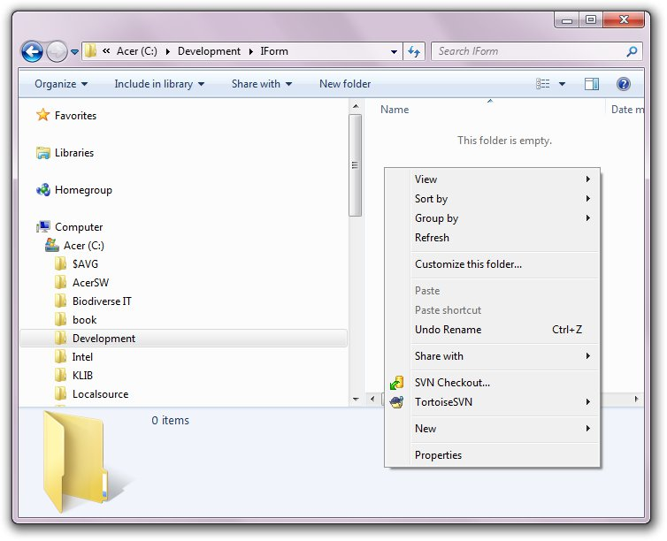
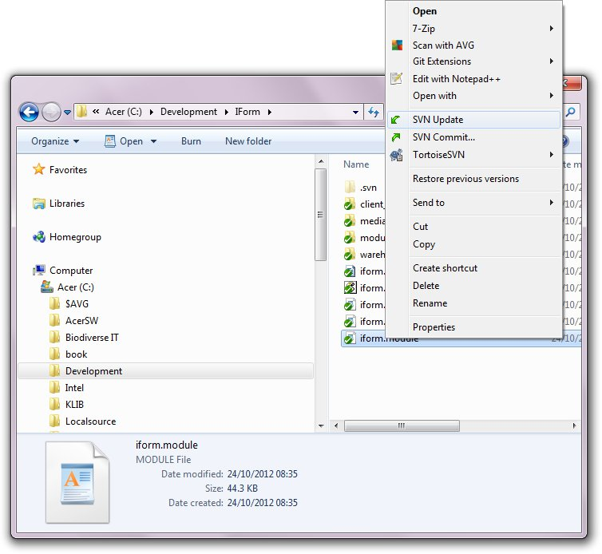
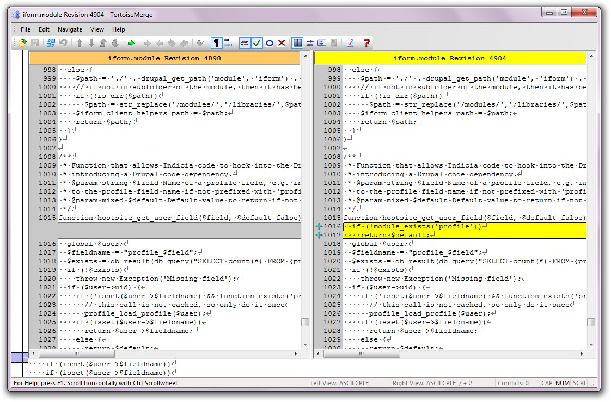

***********************************
Tutorial: Quick ToirtoiseSVN Primer
***********************************

If you have TortoiseSVN installed on your machine you can follow this quick 
tutorial to get an introduction to source control in Indicia. TortoiseSVN 
is one of the most popular Subversion clients for Windows and can be obtained
from http://tortoisesvn.net/downloads.html.

Checkout
========

Let's try checking out something from the Indicia source code to obtain a local
copy. Subversion works as a *Windows Shell Extension*, that is, it extends the
functionality of Windows Explorer by adding new menu items to the context menus
available for files and folders. To see this in action, first, create a folder
on your hard disk you'd like to check out files into. In my case I am going to 
check out files into ``c:\developement\iform``. Navigate to this folder and 
right click in the empty space on the right of Windows Explorer:

You will see a couple of additional menu items on the context menu. The first is
**SVN Checkout...**. TortoiseSVN always puts the most commonly used tasks at the
top level of the context menu and other items in the **TortoiseSVN** submenu. As
this is context sensitive, TortoiseSVN knows that when clicking on an empty,
unlinked folder, the most likely action is a checkout. So, select 
**SVN Checkout...**. You should see a popup dialog. Enter 
``http://indicia.googlecode.com/svn/drupal/modules/iform/trunk/iform`` into the
**URL of repository** field so your dialog looks like this:

.. image:: ../images/screenshots/tutorials/svn-checkout-dialog.jpg
  :width: 500px
  :alt: The TortoiseSVN checkout dialog

Click the OK button and TortoiseSVN should show you a log of the files it is 
checking out whilst it fetches them. That's it, you have now checked out a local
copy of the iForm module code.

.. tip::

  The `Source tab <https://code.google.com/p/indicia/source/checkout>`_ on the 
  Google Code site for Indicia gives you some tips on how to checkout the code
  including providing your password if you have write access to the repository.

One thing to take note of - Subversion has marked up each file with a green icon
indicating that this is a file linked to a repository which has not changed 
on your local copy. Try editing a the iform.module with a text editor, saving it 
and seeing what happens. Don't worry you are only editing your local copy of the 
file which will not affect the master repository!

Update
======

Updating in TortoiseSVN is simple. Just right click on the file or folder you'd
like to update and select **SVN Update** from the menu. 

View history
============

As we've not got commit privileges setup for this tutorial, lets take a quick 
look at a couple of other facilities, namely history and diffs. Right click on 
your copy of the **iform.module** file and select **TortoiseSVN > Show log** 
from the context menu. After a short pause you should see a comprehensive 
log of the history of the file. Each entry in the log is known as a 
**revision**. Select any 2 revisions in the log using the mouse, then right-
click and choose **Compare Revisions** from the context menu. TortoiseSVN will 
whirr away for a bit and then show you a differences view of the changes, e.g: 

Patches
=======

One last thing - what happens if we decide that the change we made to the 
iform.module file is actually worth contributing to the core? Assuming that we
are not yet part of the development team, a good way to do this is to create a 
patch. This is really easy with TortoiseSVN:

#. Right click the file or folder containing the changes and select 
   **TortoiseSVN > Create patch...** from the context menu. 
#. On the dialog that pops up, ensure the correct files are ticked then click
   **Ok**.
#. You are now presented with a File Save dialog, so save your patch somewhere.

Then, send your patch to one of the developer team for them to check. If they 
agree with the change, they can easily apply the patch to their own checked out
files, then use the diff viewer to check the changes before committing them to 
the repository.

