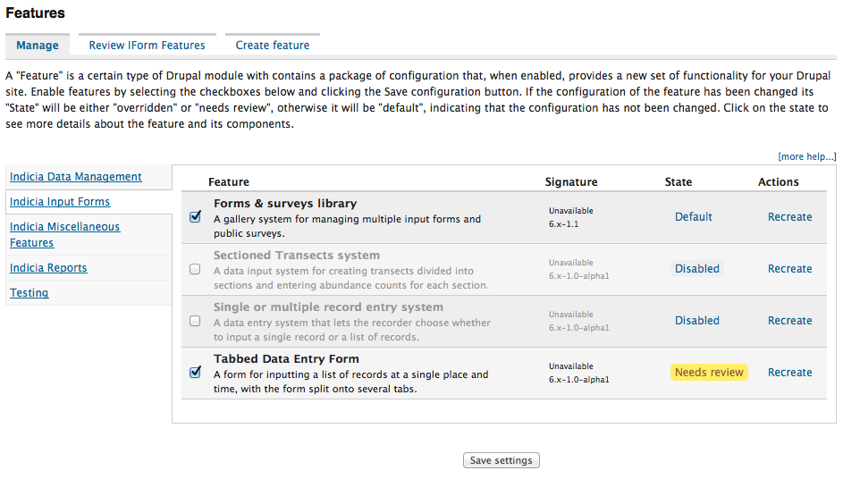

***************
Instant Indicia
***************

Instant Indicia deserves a special mention in our Indicia overview section in 
that it represents the quickest and simplest way to get started with Indicia.
Imagine a system which is provided as a number of ready-made pieces, where you 
can just tick off the ones you want and they will be added to your website more 
or less instantly. Whether it is an online recording form, a distribution map, 
or a discussion forum for getting help with identifications, you just need to 
tick a box to turn it on. With Instant Indicia that's what you get.
 
Specifically, Instant Indicia is an extension of the Drupal CMS that includes 
the following:

* Out of the box integration with Indicia.
* A number of additional modules useful for building biodiversity recording 
  sites.
* A number of ready-made building blocks (called features) that you can enable 
  in order to build the fundamental components of your site in minutes. These 
  include features such as recording forms and reports as well as home pages, 
  forums and other functionality. The following screenshot shows the process of selecting
  features to include is simply a case of browsing through categories and ticking the 
  features to install.
  

  
When combined with Drupal, Indicia allows development of biological recording 
websites **without needing to write any code**. Instant Indicia takes the idea of
Drupal integration one step further by providing a simple installation process
which results in a ready configured setup, ready for you to add recording forms,
reports and content to. But unlike many simplified solutions which limit what 
can be customised to a few simple choices, using Instant Indicia does not 
preclude you using any of the advanced configuration options available in the 
Drupal IForm module or even utilising the deep customisability of hand-written
code in PHP should you ever need to. 
  
  
