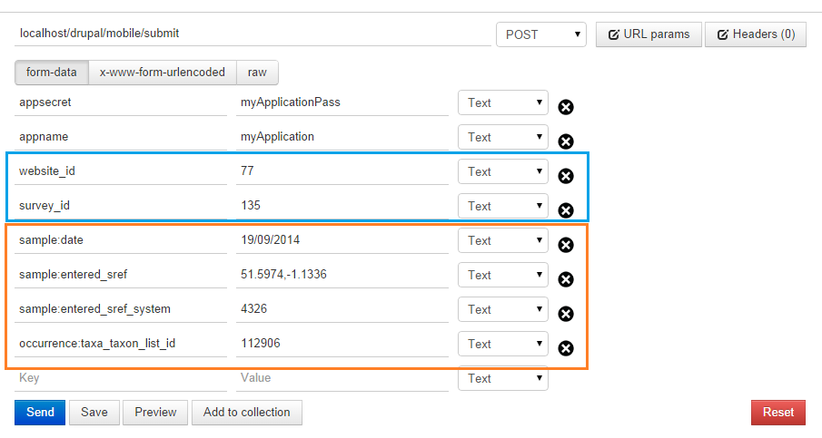
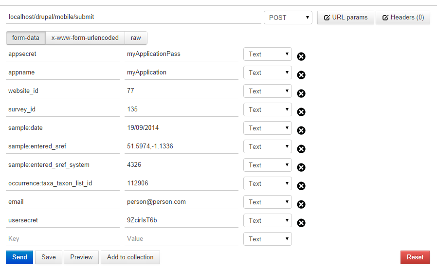
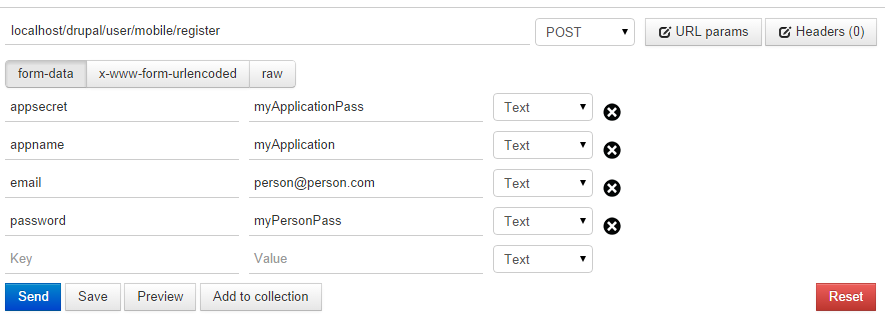
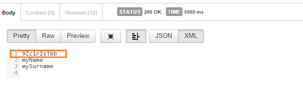

Examples
========

After an application account has been created on a website, we can test some of its
functionality. Bellow are some examples of some of the module's services.
For the sake of simplicity, for communication to the module we will use a free
Chrome extension called `POSTMan <http://www.getpostman.com/>`_,
but any similar product can be used (eg. Firefox's
`RESTClient <https://addons.mozilla.org/de/firefox/addon/restclient/>`_).

All communications with the module should be authenticated by providing your
application name and password:

- appname: myApplication
- appsecret: myApplicationPass

Note: In the examples the server base URL I am using is ``localhost/drupal``,
but please change it to match iRecord ``www.brc.ac.uk/irecord`` or your drupal site's base path.

.. _send-record-example:

Records
-------

The easiest way to send a record is anonymously, that way the record will not be
attached to any user in the drupal system, but the authentication step is avoided.

The minimum required information for sending a record its date, location and
location system and the taxon id on the warehouse. Furthermore, the record should
be attached to some website (e.g. iRecord) and one of the surveys defined on the
warehouse.

The ``'200 Success'`` response received from the module on record submit
to the warehouse. Otherwise if some of the data was incorrect, it would either not pass the
module's authentication (appsecret, appname) or the warehouse would refuse to
accept records with insuficcent or incorrect data (e.g. no sref provided or some
of the fields are not set in the survey).

Anonymous
^^^^^^^^^

Sending an anonymous record does not require to have a user account on the drupal
site, therefore the process is straightforward.

Warehouse information:

- website_id: 77
- survey_id: 135

Record data:

- sample:date : 19/09/2014
- sample:entered_sref :  51.5974,-1.1336
- sample:entered_sref_system : 4326
- occurrence:taxa_taxon_list_id : 112906

Authenticated
^^^^^^^^^^^^^

This is just like sending an anonymous record only that users email and usersecret (received
after login through the module) should be provided.

User details:

- email: person@person.com
- usersecret: 9ZcirIsT6b

Authentication
--------------

.. _user-login-example:

Login
^^^^^

If a user account has been setup on the website, we can try to authenticate with
the account.

User account:

- email: person@person.com
- password: myPersonPass

The successful login's response first line is the new generated password - usersecret,
which along with the users email could be used to identify the submitted record's
ownership.

.. _user-register-example:

Register
^^^^^^^^

.. todo:: Add registration example.

.. _reports-example:

Reports
-------

.. todo:: Add report example.
