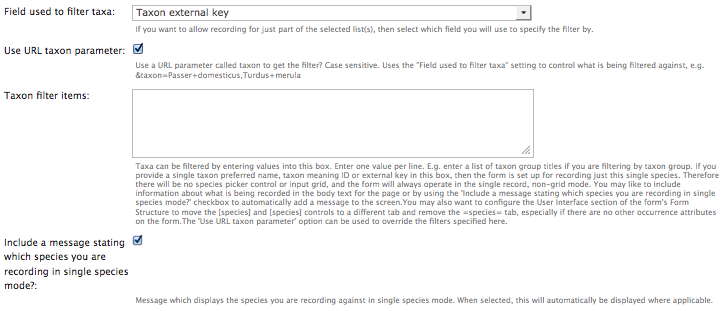
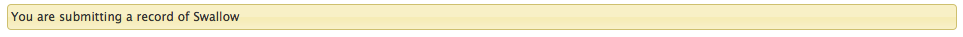

Setting up a Record this Species link
^^^^^^^^^^^^^^^^^^^^^^^^^^^^^^^^^^^^^

In this example configuration of the **Enter single record or list of records
(customisable)** form consider the case where we have an external website which has a list
of species account pages and we want to provide a link from each of those page to make it
as simple as possible to provide a record of the species. Through this technique we can
create a form which records a species where the species is defined by a parameter in the
URL used to load the form, so the user does not have to reselect the species they are
already looking at.

Before starting you should have a working form using this form which is linked to a
species list that includes all the species which the external species account library
includes. The species names should match, or there should be an ID for each species which
is held in Indicia's **external_key** field, such as a Taxon Version Key as used in the
UK. You want your form to be as you would want it to work should the user visit the form
without providing a valid species in the URL parameters, so for example you might want it
to work for entering a single record at a time where the user has to pick the species from
an autocomplete. 

.. tip::

  To set up your form for inputting a single record at a time, go to the **Species** 
  section of the **Edit** page, then set **Allow a single ad-hoc record or a list of 
  records** to **Only allow entry of one occurrence at a time**.

To configure your form follow these steps:

#. First, go to your form's **Edit** page if you are not their already and expand the
   **Species** configuration section.
#. Look down the list of configuration options until you find the setting **Field used to
   filter taxa**. Whatever option you provide here will define what the input parameter
   should be in the URL. For this example we will use **Taxon external key** as we have 
   configured the external key of each entry in our Indicia species list in preparation.
#. The next option, **Use URL taxon parameter**, is the key setting which must be ticked
   to enable the URL parameter behaviour we are trying to set up. So, tick the box.
#. **Taxon filter items** provides a default filter for the form, though this setting 
   will be overridden if the URL taxon parameter is provided. Leave it blank if you do not
   need a default filter.
#. **Include a message stating which species you are recording in single species mode** is
   an optional setting, but by ticking it a message will be added to the top of the form
   explaining to the user which species they are going to be recording. As the species
   input box is removed from the form when there is only 1 possible species to record, 
   this setting is useful to let the recorder know what they are recording.
   
.. tip::
  
  If you use the **Preferred name of taxa** option for **Field used to filter taxa** and
  your species names have spaces, replace the spaces with + in the URL parameter to make
  a valid URL.
   
So, our settings for this section are as follows:

  
Save the form and you will see the form in it's default state. Now modify the URL you are
visiting by adding a parameter ``taxon=<external key>`` filling in one of your external 
keys and reload the page. You should see that the option to select a species has 
disappeared and a message is shown instead so there is no need for the recorder to pick
the species.

  
If you have keys in the external list of species which are not recognised by your Indicia
species list, then the form will still function but will revert to the default state. In 
this case a message is posted in the Drupal **Reports > Recent log entries** report with
the **Type** set to "missing sp." so you can filter to find cases where the species lists
need updating.