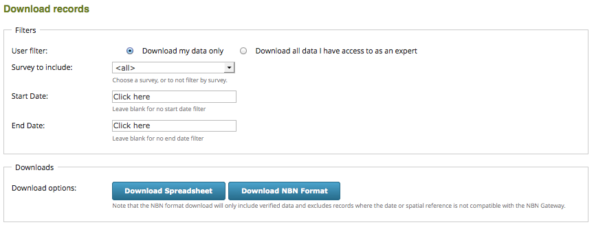

Easy Download
=============

The Easy Download form provides a simple way to download records in CSV or `NBN Exchange
<http://www.nbn.org.uk/Share-Data/Providing-Data/NBN-Data-Exchange-format.aspx>`_ format.
The records available are either those belonging to the logged in user or those which the
user is an expert for defined in their account profile. Note that this is designed to
integrate with the :doc:`../../instant-indicia/features/easy-login` method rather than
other methods of identifying who the recorder for a record is.

The download form provides a start and end date to define the range of records downloaded
as well as a survey selection drop down, although it can also be configured to always 
download records from a single survey.

Configuration options
---------------------

The following configuration options are useful when setting up an **Easy Download** page:

* **View access control** and **Permission name for view access control** - as described
  under :doc:`generic-settings`.
* **Permission required for downloading other people's data if you have expertise** - this
  defines a Drupal permission that, if the user has it, enables the option to download
  other people's data.
* **Allow my data download** - use this to enable downloading of the user's own records.
* **Survey for download** - select a specific survey to enable download for, or leave
  to allow the user to select.
* **CSV Download format report** - a report used to obtain the data for CSV download. 
  Normally you should leave the default report selected. *If you select another report
  then you will need to ensure it has compatible input parameters*. Note that you can 
  add custom attributes to the report using the **CSV Additional parameters** setting.
* **CSV Additional parameters** - default parameters for the download report. Note that
  **smpattrs** and **occattrs** can be configured to a comma separated list of attribute
  IDs to download for sample and occurrence custom attributes respectively. The 
  **quality** option allows you to set the minimum quality required for records to be 
  included in the download. Choose from:
  
    * !R = anything not rejected
    * !D = anything not rejected or dubious
    * L = records not rejected or dubious and that are at least likely as set by the 
      recorder (or certainty is not recorded)
    * C = records that not rejected or dubious and that are marked certain by the recorder
    * V = only verified records.
    
* **NBN Download format report** - as for the above, but defines the report used for NBN
  exchange format downloads. Should normally be left to its default setting.
* **NBN Additional parameters** - as described above but for NBN download format report
  parameters. Note that the default behaviour is to download only verified records in 
  NBN format though this can of course be overridden.

A usage scenario
----------------

To provide a download page for the coordinators of a specific survey, you might:

#. Set up an Easy Download page.
#. Set the **View access control** option and set the permission name to **<survey name> 
   download** where survey name is the name of the specific survey.
#. Set the **Survey for download** option to the specific survey.
#. Uncheck the **Allow my data download** option.
#. Set the **smpattrs** and **occattrs** options in the additional parameters sent to each
   report to a comma separated list of the sample attribute IDs and occurrence attribute
   IDs respectively.
#. Add the page to an appropriate place in the menu system, noting that users who do not
   have access to the form will not see the menu item.
#. Set up a role called **<survey name> coordinator** and put the coordinators of the
   survey into this role.
