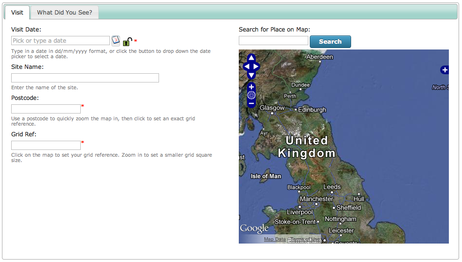

Tutorial - CSS Overrides
========================

.. only:: advanced

  We're now going to build on the previous tutorials by fixing the two column layout 
  problems using some custom CSS.

.. only:: not advanced

  .. sidebar:: Prerequisites
  
    Before starting this tutorial, you should have installed Instant Indicia and followed 
    these tutorials
    
    * :doc:`dynamic-form`.
    * :doc:`form-structure`.
    
Custom Stylesheets
------------------
    
The two column layout on the form we have built so far is far from perfect, because the 
styling applied to the labels and controls does not take account of the restricted width
of the first column. Indicia allows us to apply custom style sheets to any Indicia 
generated page which allows us to fix this. This is not a tutorial on CSS, so we'll 
assume that the following CSS is correct and look at ways of adding this to our page.

.. code-block:: css

  .columns {
      overflow: hidden;
  }
  .columns .column {
      float: left;
      min-height: 1px;
      position: relative;
  }
  .columns.two > .column {
      padding: 0 2%;
      width: 48%;
  }
  .columns.two > .column:first-child {
      padding-left: 0;
  }
  .columns.two > .column:last-child {
      padding-right: 0;
  }
   
  .two .column label {
      display: block;
      width: auto;
  }
  .two .column textarea {
      width: 100%;
  }
  .two .column .helpText {
      margin-left: 0;
  }
  .two .column .hierarchy-select {
      display: block;
      font-family: tahoma,sans-serif;
      font-size: 9px;
  }
  .two .column .page-notice {
      margin-top: 0.5em;
  }
  .two .column p.inline-error {
    display: inline-block;
    margin: 0;
  }

There are a few possibilities on how we can add this CSS to our page. We could of course
add this CSS to our site theme's stylesheet, but that may not be appropriate if we only
want this styling to apply to a single page. A better option is to use the CSS file
loading features built into the IForm module for Drupal. To do this:

#. Work out your Indicia page's **node ID**. This is Drupal's unique identifier for this
   piece of content; remember that as far as Drupal is concerned our Indicia form is just
   another piece of content. To work out the node ID, I find the easiest approach is to 
   look at the address of the page's Edit tab in the browser's address bar. This will 
   contain ``node/.../edit`` where the ... is the node ID. 
#. Now, create a new text file in the Drupal site's file system, under the following path:
   ``sites/all/modules/iform/client_helpers/prebuilt_forms/css``. If that path does not 
   exist, then look for ``sites/all/libraries/iform/client_helpers/prebuilt_forms/css``
   since the module code can also run from within the libraries folder. My node ID is 2, 
   so I need to name the file ``node.2.css``, because the file is automatically loaded
   as long as the name follows the ``node.nid.php`` convention. 
#. Paste your CSS into this text file and save it.

Now reload your data entry page in Drupal and check that the layout of the first tab has
been fixed:

.. tip::

  If you find yourself wanting to reuse the same piece of CSS on several different Indicia
  pages, take a look at the **Additional CSS files to include** option on the Edit tab, 
  under the **Other IForm Parameters** section.

