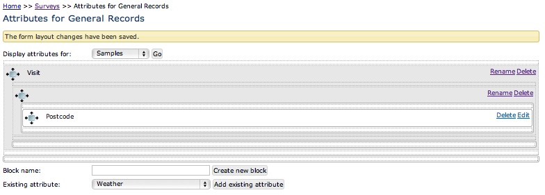
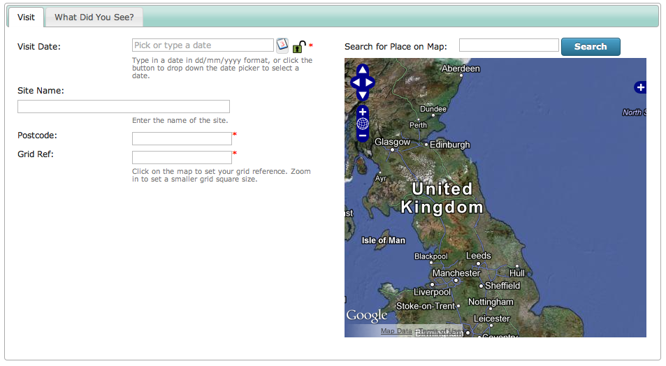

Tutorial - Custom Attributes in depth
=====================================

.. only:: not advanced

  .. sidebar:: Prerequisites
  
    Before starting this tutorial, you should have installed Instant Indicia and followed 
    these tutorials
    
    * :doc:`dynamic-form`.
    * :doc:`form-structure`.
    
There are other tutorials regarding adding custom attributes, in this one we are going to 
take a look at adding some from scratch, with custom validation and configuration. Lets
start by adding a custom attribute to capture the postcode of the site we are recording
at. First, log in to your warehouse if you are not already logged in. Since the postcode
will apply to all the records on the for, this is an attribute of the *sample* rather than
an attribute of the *occurrence*. So, click on the **Custom Attributes > Sample 
Attributes** menu item to access the list of existing attributes.

.. note::

  In many cases, there will be a suitable custom attribute already created on the 
  warehouse for you to use, in fact there is already a postcode attribute provided with 
  Indicia. But in this tutorial we'll add a new one from scratch as it nicely illustrates
  the process.
  
Attribute basic settings
------------------------
  
Click the **New sample attribute** button. Set the **Caption** to "Postcode" (remember 
this is only the default caption, as we can override the label output in the form 
configuration). Set the **Data Type** to "Text". When you do this, note that the panel
of **Validation Rules** will reconfigure itself to show controls which are appropriate to
the data type of custom attribute you are creating. Since the postcode is something which
could be said to be an attribute of the site, we can tick the **Applies to location** box.

.. tip::

  **Applies to location** is merely a hint to the system that this attribute is something
  recorded about the site as opposed to something specific to this sample. An example of 
  the former might be an altitude measurement, whereas something specific to the sample 
  might be a temperature measurement. At the moment you could use this flag in custom 
  reports to build information about the site, but in future Indicia will support site 
  based recording where the attributes which have this flag ticked will default to the
  values recorded the last time this site was visited.
  
Validation rules
----------------

As you can see, there are a few different options for adding validation rules to your
custom attribute. Most are self explanatory, so we'll focus on the least obvious, but most
powerful option, the **Regular Expression**.

.. tip::

  When you define a custom attribute, it is best practice to only define validation rules
  that should apply to the attribute in every single survey in which it is used. You might
  want the postcode to be required, but making it required at this point means that other
  surveys which want an optional postcode input cannot use your attribute. On the other
  hand, adding a format check to ensure that the postcode is valid would be useful in all
  cases, so it is good practice to define this rule at this point. We'll see how to make
  the attribute mandatory for each specific survey later.
  
A regular expression is a tool used in many programming environments for pattern matching
in pieces of text. It can be a bit bewildering at first, but by allowing regular 
expression validation Indicia allows extremely powerful validation of the content of a 
field. Regular expressions can be used to extract characters matching a pattern from a
piece of text, for example you could extract all the text in brackets from a paragraph. A
more useful aspect of regular expressions from our point of view is that they can be used
to answer a question, *does this piece of text match this pattern*. For a very simple 
example, we could configure a regular expression to check that a form input matches one
of the possible codes in the DAFOR abundance scale, D, A, F, O or R, using the following::

  /^[DAFOR]$/
  
The square brackets define a sequence of characters which we will accept any one of. The ^
character anchors the regular expression to the start of the text, and the $ anchors it to
the end. Without these, our pattern matcher would accept text containing any of these
characters, such as "The Fox". Don't worry too much about learning how to write your own
regular expressions, since a good way to write a regular expression is to search the web. 
Fortunately there are lots of developers doing the same thing, so lots of useful help is 
out there! I searched for a postcode regular expression and found the following::

  /^([A-PR-UWYZ0-9][A-HK-Y0-9][AEHMNPRTVXY0-9]?[ABEHMNPRVWXY0-9]? {1,2}[0-9][ABD-HJLN-UW-Z]
  {2}|GIR 0AA)$/
  
I'm not going to claim that all makes sense! So, on your sample attribute's edit page, 
tick the **Regular Expression** checkbox and paste this text into the box alongside it, 
making sure you don't introduce any carriage returns.

Before saving your attribute, one last task is to add the attribute to our survey. All the
surveys you have access to are listed at the bottom of the page, so tick the option for 
the survey you are working on. Your page should look something like this:

.. image:: ../../../../images/screenshots/warehouse/setup-postcode-attribute.png
     :width: 300pt
     :alt: Adding a postcode attribute to the warehouse

Finally, save the attribute. 

Adding the attribute to our data entry form
-------------------------------------------

Return to your Instant Indicia website and reload your data entry form page. *The new 
postcode control won't appear*, but why? There are 2 reasons for this. 

* **Caching** - things which don't change frequently such as custom attributes are 
  normally stored in a cache on your Drupal website, to improve page loading performance.
  This saves a lot of requests going back and forth to the server to repeatedly obtain
  information which does not change. But even if we were to clear the Indicia cache using
  the **Site configuration > Iform > IForm admin tasks** tool on the website, the 
  attribute would still not appear for the reasons given below:
* **Form Structure** - in the previous tutorial, we removed all the default settings from 
  the Form Structure and built our own from scratch. Some of the things we removed 
  included tags which told the form where to put any custom attributes. 
* **Attribute setup** - we haven't defined which tab our attribute should appear on.

We can define which tab we want our attribute to appear on using the warehouse. So, back
to the warehouse and find your survey in the list of surveys under **Lookup Lists > 
Surveys**. Click the **setup attributes** link in the right of the row. This takes you 
to a designer which lets you:

* add other existing custom attributes to your survey.
* create **blocks** which group the attributes together. Blocks can be then used to define
  tabs or fieldsets in your form output. 
* access the survey specific settings for your custom attributes.

We want our postcode attribute to appear on the Visit tab, so follow these steps:

#. Type "Visit" into the **Block name** box and click **Create new block**. 
#. Since the dynamic form expects 2 levels of blocks to work properly, create a second 
   block called "Postcode".
#. Now for a trick of the trade. The warehouse requires a block to have a title when you
   create it, but afterwards you are free to rename the block to be blank. Since we
   don't actually want a fieldset with Postcode as the title, because the control is 
   already labelled, use the **rename** link to rename our Postcode block to have no 
   title.
#. Use the crosshair icon in the untitled block to drag the block inside the Visit block.
   When you are dragging, the potential placeholders you can drop into will go orange. 
   They go yellow when you are hovering in the correct place to drop the block. The 
   placeholder you want to drop into is just below the crosshair of the Visit block.
#. Use the same drag and drop approach to drag the Postcode attribute into the placeholder
   inside the untitled block.
#. Click the **Save** button inside the yellow message below the blocks.

Your page should now look like the following:

  
Note that the outer blocks map to tabs on the user input form and the inner blocks map to
fieldsets. If the form was configured as a wizard, then the outer blocks would in fact map
to wizard pages. If the form was configured as a single page form, then the outer and 
inner blocks would map to nested fieldsets. The tabs actually output on our form will be 
a merge of the tabs defined in the Form Structure configuration, with the tabs defined 
in the survey attribute blocks on the warehouse.

Before leaving this page, click the **edit** link for the Postcode attribute. This takes
us to a configuration page for the attribute which allows us to change settings that only
apply to this specific survey, not to all other users of the same attribute. So if you 
need to make changes that don't affect other surveys using the same attribute, this is the
place to do it. For our survey, we want to force input of the postcode, so tick the 
**required** option. We can also set the **default control type** to **postcode_textbox**.

Save the attribute then return to your Drupal website. Before going any further, remember
to clear your Indicia cache using the tool at **Site configuration > Iform > IForm admin
tasks**. Now reload your recording form. There is one last task to undertake before the
custom attribute will appear, but only because we removed the default Form Structure in
the previous task and built it from scratch, so the default tags marking where custom
attributes should go have been removed. To remedy this, go to the Edit tab for your form
and scroll down to the Form Structure. Add the following to a new line beneath the
``=Visit=` tab's tag, placing it just above the ``[spatial reference]`` might be as good
a place as any::

  [*]
  
The square brackets sign placed either side of something in the form structure tells us
this is to do with controls. The * symbol means *output any additional controls for this
tab that have not already been shown elsewhere*. Save your form and check that the control
has now appeared:

The ``[*]`` tag used in this way is a bit of a blunt tool, in that we are just dumping out
all the attributes with their default settings. What if we want to configure each
attribute individually? Simply using the @ symbol and option name on each following line
will not work, since the ``[*]`` tag is potentially outputting multiple attributes. We 
can apply a setting to a specific attribute's control though, by:

#. Find the ID of the attribute as defined on the warehouse. This can be read from the 
   grid on the warehouse's **Custom Attributes > Sample Attributes** screen.
#. Add the configuration to the Form Structure on the Edit tab of your Drupal form, using
   the following syntax::

     @smpAttr:nn|option=value
     
   So, in my case, the postcode attribute I've created is ID 27. We could set the label
   using a tag on the line after the ``[*]`` as follows::
   
     @smpAttr:27|label=Post/Zip Code
     
The postcode box, by default, acts as a replacement for the grid reference input box, but
on our form we want both controls to be visible so that the recorder can set an exact grid
reference by clicking on the map, just using the postcode as a way to quickly zoom the map
in. In the current state things won't work very well because the postcode textbox is
putting a hidden field onto the form to capture the spatial reference of the postcode,
which will clash with the spatial reference input control since they are intended to go in
the same database field. There is an option for the postcode_textbox control called
``hiddenFields`` which can be used to disable this functionality. So, I've updated my Form
Structure to add the following on the line after the ``[*]``, do the same to yours but
using the appropriate attribute ID::

  @smpAttr:27|hiddenFields=false
  
Further documentation for the postcode_textbox options can be found in the `Client Helpers
API documentation <http://www.biodiverseit.co.uk/indicia/dev/docs/classes/data_entry_helper.html#method_postcode_textbox>`_.

One last thing on this topic - the ``[*]`` tag in our Form Structure text outputs all the
custom attributes which have been assigned to the current block. What if we wanted to 
output one of the attribute controls in a different place to the others? Now that we know
the ID of our attribute, we can construct a special control tag to insert into our Form
Structure text, here's the example for my attribute but your ID will be different::

  [smpAttr:27]
  
Using these principles, I'm going to reorganise my Form Structure a little, so that custom
attributes appear at the bottom of the first column, apart from the postcode box which
will appears alongside the Grid Ref input as now. I've also updated the help texts a
little to reflect this::

  =Visit=
  [date]
  @label=Visit Date
  @lockable=true
  @showButton=true
  @helpText=Type in a date in dd/mm/yyyy format, or click the button to drop down the date 
  picker to select a date.
  [location name]
  @helpText=Enter the name of the site.
  [smpAttr:27]
  @hiddenFields=false
  @helpText=Use a postcode to quickly zoom the map in, then click to set an exact grid 
  reference.
  [spatial reference]
  @label=Grid Ref
  @helpText=Click on the map to set your grid reference. Zoom in to set a smaller grid 
  square size.
  [*]
  |
  [place search]
  [map]
  =Species=
  [species]
  @resizeWidth=1500
  @resizeHeight=1500
  =*=
  
Don't forget to check that you aren't introducing extra carriage returns if you copy and
paste this into your form structure!