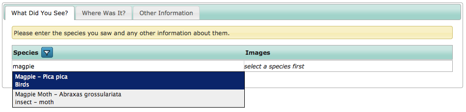

Tutorial - Dynamic Forms in depth
=================================

.. only:: not advanced

  Before starting, make sure you have:
  
  * a warehouse which you have registered a website on that you can experiment with.
  * a species list loaded onto the website for you to use, preferably with multiple taxon
    groups.
  * a fresh copy of Instant Indicia, updated with the latest code.
  * enabled :doc:`the Easy Login feature <../../features/easy-login>` on your Instant 
    Indicia copy.
    
Creating a survey
-----------------
  
Although Instant Indicia provides out-of-the-box features for setting up a simple tabbed
data entry form, since this is the advanced course we are going to take a look at adding
forms by using the IForm module directly. This gives us a whole bunch of configuration 
possibilities as well as allowing us to set up as many forms as we require on our websites.
Before we add the form, let's visit the warehouse and create a survey to capture our 
records. Here's a brief refresher on how to do this:

#. Log into the warehouse with at least admin rights to the website registration you are
   using.
#. Go to **Lookup Lists > Surveys** on the menu.
#. Click the **New Survey** button.
#. Fill in the **Title**, for example "General Records".
#. Fill in a survey description if desired, then set the **Website** to the one you are 
   using.
#. Click **Save**.

Adding a data entry form
------------------------

Now, log into your Drupal website if you are not already logged in. Let's add a form. 
Adding an Indicia page to Drupal using the IForm module is just like adding any other 
Drupal content, except Indicia pages generally have quite a few configuration options for
you to tweak the page's behaviour. 

#. On the admin menu, select **Content management > Create content > Indicia pages**.
#. Set the **Page title** to "Enter a list of records".
#. If you require introductory text at the top of the page then you can enter it in the
   **Page introductory text** box. Otherwise expand the **Menu settings** section and 
   input "Enter a list of records", so that the page will appear on the menu with the 
   same menu title as the actual page title. 
#. Now scroll down to the **Form Selection** box on the form. This is where all the
   Indicia goodness begins as it allows us to pick from one of a library of ready made
   pieces of functionality, called :doc:`prebuilt forms <../../../iform/prebuilt-forms/index>`.
   We want a general purpose way of inputting records, so as good a place to start as any
   is to set the **Page Category** to "Data Entry Forms" and **Select
   Form** to "Enter single record or list of records (customisable)", that is, a form 
   designed for inputting a single sample, containing a list of any number of occurrence 
   records.
   
   .. image:: ../../../../images/screenshots/prebuilt-forms/picking-dynamic-form.png
     :width: 700px
     :alt: Choosing the **Sample with occurrences form**.
     
   .. tip::
   
     The Enter single record or list of records (customisable) form is one of several 
     Indicia forms that are described as *dynamic*. This means that they are highly 
     configurable and can automatically add controls to the input form to reflect the 
     custom attributes you have attached to your survey.
 
#. Once you have selected the correct form, click the **Load Settings Form** button to 
   send a request to the server for the configuration required to set this type of form 
   up. The additional configuration options will appear on the page below the button. 
   These are grouped into sections in boxes which you can expand by clicking on the title
   of the box. We'll start by doing the minimum required to get our form running:
   
   * In the **Other IForm Parameters** section, select the **Survey** you plan to submit
     records to.
   * In the **Base Map Layers** section, tick the **Google Hybrid** layer.
   * In the **Species** section, set the **Extra Species List** to the species list you
     are recording against.
     
   Now, save the form. You should have a pretty simple tabbed form letting you input a 
   list of species on the first tab:
   
   .. image:: ../../../../images/screenshots/prebuilt-forms/dynamic-sample-occurrences-minimal-1.png
     :width: 700px
     :alt: Inputting a simple species list.

   You can pick a grid ref on the second tab...
   
   .. image:: ../../../../images/screenshots/prebuilt-forms/dynamic-sample-occurrences-minimal-2.png
     :width: 700px
     :alt: Selecting a grid reference.
   
   ... and input the date and comment on the third tab:
   
   .. image:: ../../../../images/screenshots/prebuilt-forms/dynamic-sample-occurrences-minimal-3.png
     :width: 700px
     :alt: Inputting a date.

Basic Form configuration
------------------------

There are a huge number of configuration options for the Sample with Occurrences Form and
they are all described in the hints below each option in the edit form. Rather than go 
through them all, in this tutorial we'll take a look at a few useful options to get a feel
for the configuration process.

At the top of the page, you should see a **View** tab and an **Edit** tab. Drupal adds 
these to the page automatically if your user account has permissions to edit the current
page, so your recorders will not normally see the tabs. Click the Edit tab then find and
expand the **Species** section of the configuration form. Set the following options:

* **User can filter the Extra Species List** - tick this option to enable a filter button 
  in the column header of the species grid. This allows the user to control the species
  which are available in the search when adding records to the input grid. For example,
  they might want to search within a specific taxon group, or to only search the taxon
  groups they have set in their recording preferences.
* **Cache lookups** - this option enables searching within a special table called 
  **cache_taxon_searchterms**. Firstly, because all the information required for the 
  search is in a single database table, the search can be much faster. Secondly, searches
  against this table automatically include any searchable taxon codes you might have 
  added to your species list (such as Bradley Fletcher numbers for moth species). Thirdly,
  searches against cache_taxon_searchterms automatically tolerate spacing or punctuation
  differences between the searched taxon name and the taxon name stored in the database.
  For example, searching for "7 spot" will still find "7-spot ladybird". 
* **Include both names in species controls and added rows** - this option enables the 
  display of the common name when picking a latin name, or the latin name when picking a
  common name. Along with the following option, it is a useful tool to preventing 
  problems with ambiguous species names.
* **Include taxon group name in species autocomplete and added rows** - this option 
  displays the taxon group name when picking a species, further helping to clarify any 
  species name ambiguity. When you are creating a form for inputting records in a single
  species group, you may as well disable this option.
* **Occurrence Images** - tick this box to allow photos to be uploaded.

.. only:: advanced
  
  .. tip::
  
    Since the cache tables are not updated immediately on editing a species on the 
    warehouse, you need to ensure that any species in your warehouse are populated into
    the cache. You can do this by visiting the path ``index.php/scheduled_tasks`` within
    your warehouse. This task can be automated on a schedule, for more information see
    `the Scheduled Tasks documentation 
    <http://indicia-docs.readthedocs.org/en/latest/administrating/warehouse/scheduled-tasks.html>`_.

.. only:: not advanced
  
  .. tip::
  
    Since the cache tables are not updated immediately on editing a species on the 
    warehouse, you need to ensure that any species in your warehouse are populated into
    the cache. You can do this by visiting the path ``index.php/scheduled_tasks`` within
    your warehouse. This task can be automated on a schedule, for more information see
    :doc:`../../../../administrating/warehouse/scheduled-tasks`.
    
Once you've applied these settings, save the form. The changes you've applied can all
be found on the first tab, in particular note how the name "Magpie" is no longer 
ambiguous:

     
Also, note the new filter button in the header of the species column, plus the fact that
once we have input a species name we can upload photos to go with the record. The options
we've looked at so far only scratch the surface of what can be done, but even so, are 
limited to the configuration options that the programmer of the Sample and Occurrences 
Form envisaged would be useful. In the next section we'll take a look at the most powerful 
of all the options available, the **Form Structure** which provides deep configuration
possibilities even the programmer did not envisage.