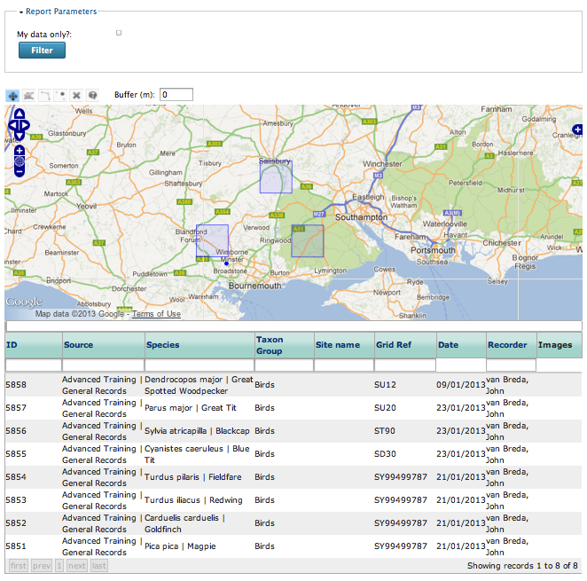
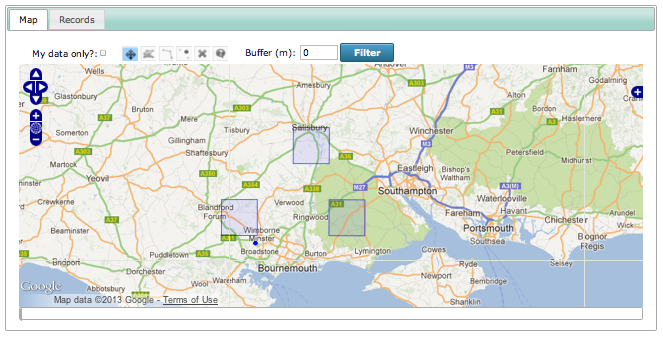
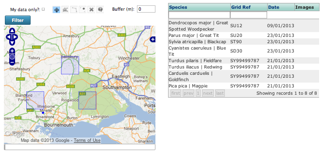

Tutorial - Dynamic Reports
==========================

In this next tutorial we are going to look at ways of adding a page for exploring
records. As this is an advanced tutorial we'll be building a page with a map plus grid
of records and putting them on 2 separate tabs. There are a few possible approaches to
building such a page, but the one that combines simplicity with the most flexibility is
to use the **Dynamic Report Explorer** prebuilt form. This form takes a similar approach
to the **Form Structure** configuration options of the **Sample and Occurrences Form**
but instead of laying out form components, you are laying out report components.

Setting up a website agreement
------------------------------

**Website agreements** are a feature of Indicia that allow websites to report on records
from other records. For example, iRecord acts as a centralised portal allowing reporting
on records which were input via a number of different websites. It also allows
verification of records from other sites - the websites which will participate in this
arrangement are configured using a website agreement.

.. only:: advanced

  If you want to know more about website agreements you can `read the documentation here
  <http://indicia-docs.readthedocs.org/en/latest/administrating/warehouse/website-agreements.html>`_.
  
.. only:: not advanced

  For more information on website agreements, see 
  :doc:`../../../../administrating/warehouse/website-agreements`.
  
Although in many cases setting up a website agreement is not necessary, since we are about
to use some of the reports originally designed for iRecord which depend on website 
agreements, we will need to set one up before proceeding. Here are the steps:

#. Log into the warehouse with full admin rights if you are not already logged in.
#. Select **Admin > Website Agreements** from the menu.
#. Click the **New website agreement** button.
#. Since we are only creating an agreement for the single website we are working on, there
   is no need to set anything on the website agreement's edit page other than the 
   **Agreement title**. Normally you would define what kinds of tasks the agreement allows
   records to flow between websites for. So, set the title and save the agreement.
#. Now, we need to add your website into the agreement. Select **Admin > Websites** from 
   the menu then click the **edit** link for your website registration. Select the 
   **Agreements** tab.
#. Click the **Join website agreement** button.
#. On the **New Websites Website Agreement** page, set the **Agreement to participate in**
   to "My Website". Normally you would need to specify which parts of the agreement your
   website wants to opt into, but that is not necessary for our purposes. For example,
   the iRecord agreement allows participating websites to provide records to iRecord's
   reporting pages or verification pages, but it is up to each website which of these they
   want to opt into. Press **Save**.

.. tip::

  If you haven't already done so, now would be a good time to add a handful of records to 
  the database using one of the forms you have built previously. Also, since the 
  reports we are going to use depend on the cached version of the tables, if your 
  warehouse does not have the ``scheduled_tasks`` process automated then you will need
  to visit the link yourself to force the tables to populate. On my development machine 
  this link is ``http://localhost/indicia/index.php/scheduled_tasks``.

Adding the Dynamic Report Explorer page
---------------------------------------

#. Select **Content management > Create content > Indicia pages** from the admin menu of
   your Instant Indicia website.
#. Set the **Page title** to "Explore Records".
#. Expand the **Menu settings** section and set the **Menu link title** to "Explore 
   Records" to add it to the menu. You can reorganise the exact layout of the menu
   after saving the form if you like.
#. In the **Form Selection** section, set the **Form Category** to **Reporting** and the
   **Select Form** drop down to **Dynamic Report Explorer**.
#. Click the **Load Settings Form** button.
#. Let's just do the minimum to get the form working for now. Expand the **Base Map 
   Layers** section and tick the **Google Streets** and **Google Satellite** base layer
   boxes.
#. Click the **Save** button at the bottom.

Ok, we should have a working report page, even if there are a few tweaks we'd like to 
make:

     
Configuring the Dynamic Report Explorer page
--------------------------------------------

The report page already has lots of functionality:

* Map of the records
* Grid of the records
* Filtering by typing into the box at the top of each grid column
* Sorting and pagination in the grid
* Filtering by drawing polygons or lines on the map
* Choice of background layers selectable using the blue + button in the top right of the
  map.
  
There are a whole bunch of things we can do to improve this page though, so lets start
working through a few of them. First, we'll merge the filter panel into the map toolbar to
save space:

#. Edit your report page, then find the **User Interface** section and expand it. 
#. In the **Form Structure** box, find the ``[params]`` control and add the following
   on the next line::
   
     @paramsInMapToolbar=true
     
#. Save the page.

That should have tidied the top of the page up a little.

.. tip:: 

  The ``[params]`` control is output by the ``report_helper::report_grid`` method, with
  the **ParamsOnly** option set to true. Therefore the options you can override for this
  control are defined at http://www.biodiverseit.co.uk/indicia/dev/docs/classes/report_helper.html#method_report_grid.
  
Next, lets convert our user interface into a tabbed layout:

#. Edit your report page, then find the **User Interface** section and expand it. 
#. Set the **Interface Style Option** to "Tabs" then save the changes.

Now we have the user interface organised onto 2 separate tabs. 

.. tip::

  A really nice feature is that the grid content will only load on the 2nd tab when the
  tab is first viewed, so you can add lots of tabs with different reports without
  affecting the initial page load time.
  
More info on the Form Structure
-------------------------------

The **Form Structure** box on the **Edit** tab contains the following content::

  [params]
  @dataSource=library/occurrences/explore_list
  @paramsInMapToolbar=true
  =Map=
  [map]
  @dataSource=library/occurrences/explore_list
  =Records=
  [report_grid]
  @dataSource=library/occurrences/explore_list
  
As before, we can add tabs using ``=tab name=`` and we can add reports using the ``[report
grid]`` control tag; note that you will always want to specify the ``@dataSource`` 
property to define which report to load. If you do add different reports, that's fine
as long as each report you add uses the same set of parameters as the report you've 
used for the ``[params]`` control tag, so that you only have to fill in one set of 
parameters for all reports. At the moment you will need to look in the XML file for 
each report on a copy of the warehouse to check the parameters, though in future we hope 
that Indicia will be able to do this for you.

Let's see if we can change our page layout to a two column layout, rather than a tabbed
layout:

#. Click the **Edit** tab on your page and find the **User Interface** configuration 
   section.
#. Set the **Interface Style Option** back to "All One Page".
#. Paste the following into your **Form Structure**. This removes the tabs and puts a two
   column splitter (|) between the map and report::
   
     [params]
     @dataSource=library/occurrences/explore_list
     @paramsInMapToolbar=true
     [map]
     @dataSource=library/occurrences/explore_list
     |
     [report_grid]
     @dataSource=library/occurrences/explore_list
     
#. **Save** the page.

That all works, except our grid no longer fits very well in the column space. We could 
use some custom CSS to change the size of font in the grid, but a better approach might
be to only show a selection of the columns available. Here's how:

On your copy of the warehouse, find the ``reports/library/occurrences/explore_list.xml``
file and open it in a text editor. Don't worry if this does not make sense, you only
need to look for the list of column definitions in the report:

.. code-block: xml

  <columns>
    <column name='occurrence_id' display='ID' sql='o.id' datatype='integer' template="&lt;div class='status-{record_status} certainty-{certainty}'&gt;{occurrence_id}&lt;/div&gt;" />
    <column name='source' display='Source' sql="w.title || ' | ' || o.survey_title" datatype="text" />
    <column name='sample_id' visible='false' sql='o.sample_id' datatype='integer' />
    <column name='taxon' display='Species' 
      template="&lt;div class='zero-{zero_abundance}'&gt;{taxon}&lt;/div&gt;"
      sql="CASE WHEN o.preferred_taxon=o.default_common_name then o.preferred_taxon ELSE o.preferred_taxon || COALESCE(' | ' || o.default_common_name, '') END" datatype='text' />
    <column name='taxon_group' display='Taxon Group' sql='o.taxon_group' datatype='text' />
    <column name='taxa_taxon_list_id' visible='false' sql='o.taxa_taxon_list_id' datatype='integer' />   
    <column name='location_name' display='Site name' sql='o.location_name' datatype='text' />
    <column name='entered_sref' display='Grid Ref' sql="regexp_replace(o.public_entered_sref, ',[^ ]', ', ', 'g')" datatype='text' />
    <column name='date_start' sql='o.date_start' visible='false' />
    <column name='date_end' sql='o.date_end' visible='false' />
    <column name='date_type' sql='o.date_type' visible='false' />
    <column name='date' display='Date' />
    <column name='recorder' display='Recorder' sql="CASE w.id WHEN iwwa.from_website_id THEN '' ELSE w.title || '-&gt; ' END || CASE WHEN LENGTH(o.recorders)>30 THEN 'Recorder' ELSE o.recorders END" 
        datatype="text" />
    <column name='zero_abundance' display='Zero Abundance' sql='o.zero_abundance' visible="false" />
    <column name='record_status' display='State' sql='o.record_status' visible="false" />
    <column name='belongs_to_user' display='Belongs to User' sql="CASE CAST(o.created_by_id AS character varying) WHEN '#currentUser#' THEN true ELSE false END" visible="false" />
    <column name='certainty' sql="o.certainty" visible='false' />
    <column name='fo' visible='false' feature_style="fillOpacity" sql='round(length(o.public_entered_sref) / 24.0, 2)' />
    <column name='sc' visible='false' feature_style="strokeColor" sql="case o.record_status when 'C' then 
      case o.certainty when 'C' then 'green' when 'L' then 'orange' when 'U' then 'red' else 'blue' end
    when 'V' then 'green'
    when 'D' then 'orange'
    when 'R' then 'red'
    else 'black' end" />
    <column name='fc' visible='false' feature_style="fillColor" sql="case o.record_status when 'V' then 'green' when 'D' then 'orange' when 'R' then 'red' else 'blue' end" />
    <column name='geom' visible='false' mappable="true" sql='st_astext(o.public_geom)' />
    <column name='images' display='Images' sql='o.images' img='true' />
  </columns>
  
Each of the **name** attributes tells us the name of a column we can add to the grid. 
By checking the **display** attribute we can map each output column to the title of the
column in the grid. So, lets built a grid which shows only the following columns:

* taxon
* entered_sref
* date
* images

That means we need to remove the following columns (we only need to remove the ones that
don't already have the ``visible`` attribute set to "false"):

* occurrence_id
* source
* taxon_group
* location_name
* recorder

To do this:

#. Click the **Edit** tab on your page and find the **Report Settings** configuration 
   section.
#. Find the **Columns Configuration List** setting. 
#. Click the **Add Columns List to Column Configuration List** link. This adds a list of
   column definitions for the first grid on the report output. If you have more grids then
   you can add more columns lists. 
#. Click the **Add Column to 0** to add a column to list 0 (which is the list of columns
   attached to the first grid, since computers like to start counting at zero). 
#. Click the **fieldname** and **visible** links in the **Add property** area. Your
   configuration should now look like this:
   
  .. image:: ../../../../images/screenshots/prebuilt-forms/dynamic-reports-columns-config.png
     :width: 700px
     :alt: Configuring columns output for a report.
     
#. Now, fill in the **fieldname** input box with the first column we want to remove, 
   which is "occurrence_id". You can leave the **visible** checkbox unchecked, which will
   hide the column.
#. Repeat steps 4-6 for each of the columns we want to hide.
#. Now save the page and check that the grid columns visible have been correctly updated:

     
A Challenge
-----------

If you have time, see if you can put what we have learnt into practice to add a 2nd tab
to our page layout with a repeat of the records grid, but this time showing all the 
available columns. You could call this a "Details" tab.
   

