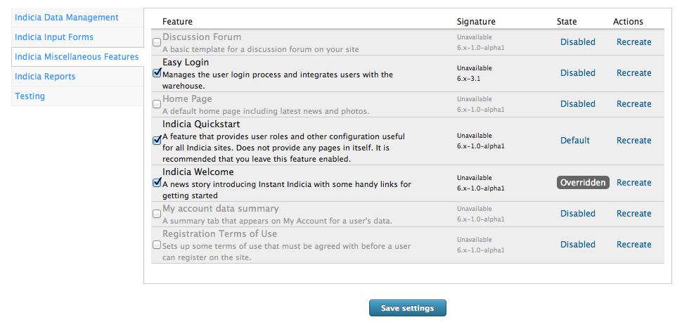
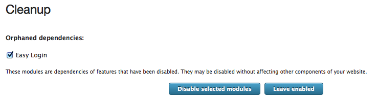
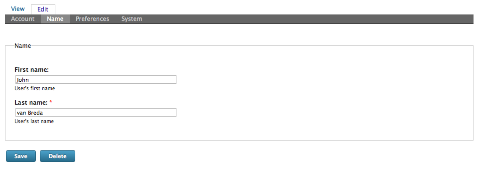
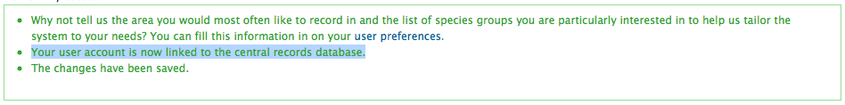
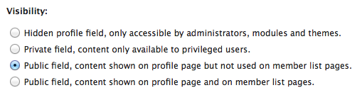

Tutorial - setting up and configuring the Easy Login feature
============================================================

.. only:: not advanced
  
  Before undertaking these steps, you might like to read up on :doc:`options for how to 
  associate users with records <../../../iform/user-identification>` and 
  :doc:`the Easy Login feature <../../features/easy-login>` if you have not done so 
  already.
  
Enabling Easy Login
-------------------

To enable Easy Login on your Instant Indicia website, login as someone with admin rights
then select **Site building > Features** from the admin menu. On the list of feature
categories on the left, select **Indicia Miscellaneous Features**. Now tick the box for
the **Easy Login** feature and click **Save Settings**.

  
When you enable any feature in Instant Indicia, the Drupal module responsible for managing
features scans for modules that are no longer required. If it thinks it finds any it will
display an **Orphaned Dependencies** message, asking if you would like to disable these
modules.

In our experience this message is not reliable, in fact there is an issue in the issue
queue for the Drupal module saying just that. 

.. danger::

  Unless you are sure that a module can be disabled, click the **Leave enabled** button.
  
A quick test
------------

Next we need to check that Easy Login is working. Easy Login cannot associate your user
account with a user account on the warehouse unless it knows at least your surname, since
this is a mandatory field on the warehouse. So, click on the **My Account** link in the 
top right of the page, then click on the Name tab. Fill in the **First name** and **Last
name** then press **Save**.

  
Having saved your account, you should see a handful of messages at the top of the page:

The first is a suggestion to fill in your recording preferences on your account. The 
second message, "Your user account is now linked to the central records database" is the
one we are interested in at the moment - this tells us that the Easy Login module has 
sent your user details to the warehouse and either returned the ID of an existing 
warehouse user, or has created a new user. If you have enough privileges you can check
that this has worked by looking at the **System** tab of the user account in Drupal - this
shows the ID of the linked account on the warehouse. 

Note that if you enable Easy Login on an existing site, then when user logs in for the
first time subsequently, they won't have a last name set for their account, but this is
needed to synchronise their user account with the warehouse. So, Indicia will display a
message after they log in asking them to set their last name in their profile:

  
Configuration
-------------

Easy Login pretty much works out of the box, but can be configured to change the 
options available in the user's preferences. You might:

* have a recording site for a specific taxon group.
* have a recording site specific to a locality.

In these circumstances, it would not be appropriate to ask each recorder to fill in their
preferred taxonomic groups and recording locality, as suggested by this message receieved
when we saved our user account: "Why not tell us the area you would most often like to
record in and the list of species groups you are particularly interested in to help us
tailor the system to your needs? You can fill this information in on your user
preferences." The message is also displayed after login if these pieces of information are
not filled in, so we definitely need a way to turn them off. Since each of the above user
account preferences are Drupal Profile fields, their visibility on the website can be
configured using Drupal's standard Profile configuration:

* Select **User management > Profiles** from the Drupal admin menu.
* Click the **edit** link alongside the field you want to show or hide.
* Look down the page for the **Visibility** section. Set this to **Hidden profile 
  field...** to hide and effectively disable the field, or **Public field, content shown 
  on profile page but not used on member list pages** to show and effectively enable the
  field.

One of the options provided by Easy Login is hidden by default and must be set to public
for it to be of use. This is an option relating to **Record privacy** which provides a
tick box allowing the user to opt out of letting their records be shared with other
websites. Its hidden by default simply because we think that free and open access to
records is a good thing, unless there are genuine sensitivity issues. However, accepting
that there are other valid viewpoints, this option can be made public if you need it for
your website. If you make this tick box public then you might also like to tick the
**Visible in user registration form** option which allows recorders to set the option
during the registration process.

.. tip::

  Easy Login also adds a couple of configuration options to the **Site configuration >
  IForm > Settings** admin menu item's page. These are near the bottom and allow you to
  control which location types are available for selection when a user chooses their
  favourite recording locality and also which location types are available for selection
  for the regions in which a data collator can download data. You might set the former
  to "Vice County" and the latter to "LRC Boundary" for example.
