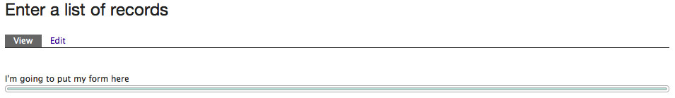
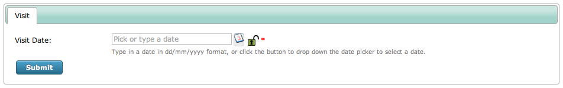
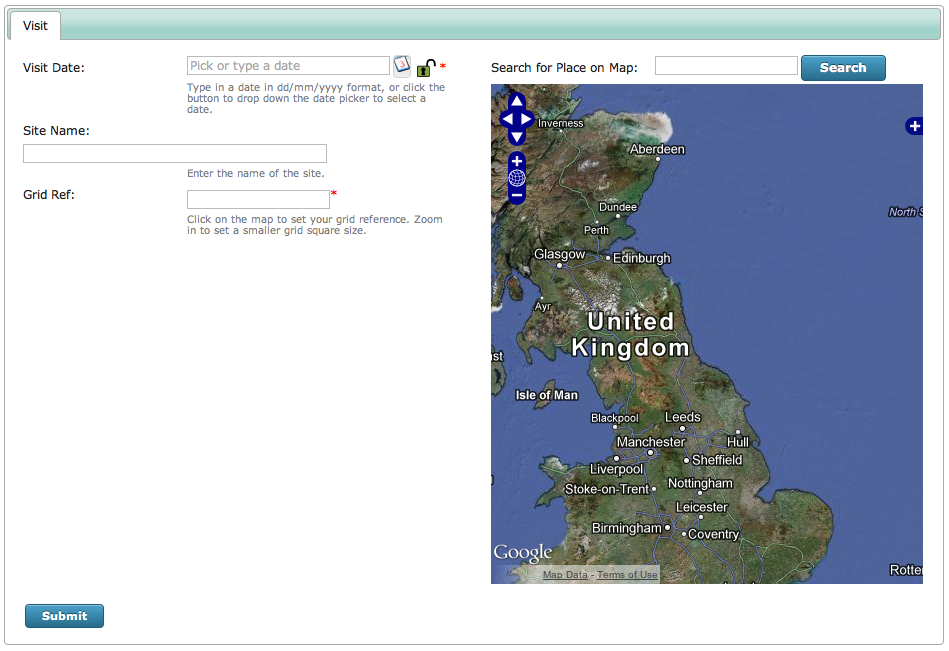

Tutorial - Advanced Configuration using the Form Structure
==========================================================

The **Form Structure** configuration option is found on the **Edit** tab of a Sample and
Occurrences Form, under the **User Interface** section. It is unique among the 
configuration settings available in that it is not a simple tickbox or option to select
and it is also the most powerful configuration tool available on the Edit tab, so it 
deserves a tutorial all to itself. Its purpose is to describe the sequence which tabs, 
wizard pages and controls are to be output, as well as to provide access to *all* the 
configuration options available to programmers using Indicia's Client Helpers PHP API.

To illustrate that this configuration option is where literally everything else kicks off
from, edit your form now, and delete the content of the Form Structure box. Since it is a
required field, type in a short message and save the form. You should see something like
the following:

The message you have typed in will appear, since anything you put into the form structure
which Indicia cannot recognise is simply output as is, a useful tip for adding custom
HTML into your forms. There is a green bar following the message in this example, because
the form is configured to show the output on tabs, so this is the empty tab header. 

So, let's build a form from the ground up to see how it works. We'll add a "Visit" tab to
capture date, site name and grid reference, then we'll add another "Species" tab to 
allow input of the list of species. Find and edit your Form Structure box and paste in the
following text, replacing the existing message::

  =Visit=
  [date]

Now, save the page and you will find that we've added a Visit tab, with a date picker
for input of the visit date.

.. tip::

  The help text displayed on the Edit form under the Form Structure box gives a handy
  description of the format required as well as the different controls you can put on the
  form.

Since this is an advanced tutorial, we're not satisfied with simply putting a default date
control onto the page. Let's take a look at the configuration options available. The 
``[date]`` control we've added to the page outputs a **date_picker** control, so there are
a few configuration options which are available for any Indicia control, e.g.:

* **label** - the control's label.
* **helpText** - the hint messsage displayed below the control.
* **helpText** - can the control's value be locked, for future data entry?

Plus there are some options specific to a date picker, for example:

* **default** - set a default value for the control, e.g. this might be a appropriate when
  creating a form for a bioblitz on a set date.
* **showButton** - if set to true, then instead of dropping down the picker panel when 
  you click in the control, there is a button to the right of the control to drop down
  the panel. This makes typing in dates by hand easier.
  
We can set options in the Form Structure box, by putting a line of the form 
"@option=value" on the line after the [date] control definition. You can add multiple 
options by putting them on separate lines. So, to illustrate this edit your page, then 
change the Form Structure to the following::

  =Visit=
  [date]
  @label=Visit Date
  @lockable=true
  @showButton=true
  @helpText=Type in a date in dd/mm/yyyy format, or click the button to drop down the
  date picker to select a date.
  
Make sure when you do this that you don't inadvertently introduce a carriage return into
the helpText text - it should all be one line of text (even if it word wraps to the next
line). Now save your form and check out the result:

.. tip::

  For a complete list of the options that apply to all controls, see `the Client Helpers
  API Documentation <http://www.biodiverseit.co.uk/indicia/dev/docs/classes/data_entry_helper.html>`_.
  You can also view the complete list of options that apply to date_picker controls, in
  `the date_picker documentation 
  <http://www.biodiverseit.co.uk/indicia/dev/docs/classes/data_entry_helper.html#method_date_picker>`_.
  
Let's continue with our Visit tab, by adding a grid reference, site name and map to the
controls. By reading the help beneath the Form Structure box on the Edit page, I can see
that the following controls can be used for each of these respectively: 
``[spatial reference]``, ``[location name]`` and ``[map]``. So, add the following to the 
bottom of your Form Structure and save the page::

  [location name]
  [spatial reference]
  [map]

Things are starting to come together now for our Visit tab, but for consistency it would 
be nice to change the label for the ``[spatial reference]`` control to "Grid Ref", plus add
some help text to the ``[location name]`` and ``[spatial reference]`` controls. You should
be able to apply the principles we have learnt to do this yourself now.

One more thing before we move on to the Species tab. It might be nice to split the Visit
tab into 2 columns, with the map shown to the right of the controls. We could insert our
own HTML tags into the Form Structure box to split the controls into 2 boxes, then add CSS
to the page to put the boxes side by side. However, the Form Structure box has a shortcut
for doing this, which is simply to put a pipe character (|) into the text on a line of its
own. We could also add a ``[place search]`` control to appear just above the map. So, my
Form Structure setting now looks like::

  =Visit=
  [date]
  @label=Visit Date
  @lockable=true
  @showButton=true
  @helpText=Type in a date in dd/mm/yyyy format, or click the button to drop down the date 
  picker to select a date.
  [location name]
  @helpText=Enter the name of the site.
  [spatial reference]
  @label=Grid Ref
  @helpText=Click on the map to set your grid reference. Zoom in to set a smaller grid 
  square size.
  |
  [place search]
  [map]
  
As before, make sure you don't inadvertently introduce carriage returns into the helpText
settings if you copy and paste! After saving the form your page will show the following,
which shows the 2 column shortcut has worked, even though the styling of our first column
needs to be fixed a bit due to the reduced width:

     
We'll take a look at fixing this problem in a later tutorial on styling. For now, let's
add another tab to capture the species records. Add the following to the end of your
Form Structure block::

  ==Species==
  [species]
  
Now save and view your form. You will need to input a date and click on the map before you
can get to the second tab, since these controls' values are required. So, this has added
our species input grid onto the form with it's default behaviour, defined by the other 
configuration options we'd previously set. The ``[species]`` control is a bit special, in 
that it will output a grid for input when in multiple records entry mode, or a single
species name search box when in single record entry mode. The one configuration option
I like to define for all my ``[species]`` controls is to set the image upload control up
so that it resizes photos before they are uploaded - this dramatically improves the speed
of upload on browsers which support it. To do this, edit your page and add the following 
lines under the ``[species]`` control::

  @resizeWidth=1500
  @resizeHeight=1500

That sets the maximum size in any dimension to 1500 pixels. 

So, in this tutorial we've built a form from the ground up using the Form Structure 
configuration option. In the following tutorials we are going to take a look at adding
custom attributes to our data entry form, then how we can take control of the output 
HTML using custom templating and CSS overrides.