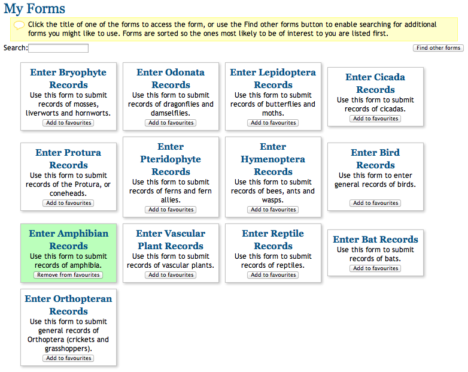
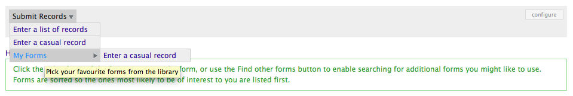

Tutorial - the Forms and Surveys Library
========================================

Enabling the feature
--------------------

.. only:: advanced

  The Forms and Surveys Library is a feature provided by Instant Indicia that allows you
  to provide a large selection of data entry forms, whilst letting recorders pick and
  choose the ones that they regularly use and need quick access to. You can `read full 
  documentation on what the module can do here 
  <http://indicia-docs.readthedocs.org/en/latest/site-building/instant-indicia/features/forms-and-surveys-library.html>`_. 
  This is the **My Forms** page on iRecord and also shown running here on the Luxembourg 
  Natural History Museum's data portal:

.. only:: not advanced

  The :doc:`../../features/forms-and-surveys-library` is a feature provided by Instant
  Indicia that allows you to provide a large selection of data entry forms, whilst
  letting recorders pick and choose the ones that they regularly use and need quick
  access to. This is the **My Forms** page on iRecord and also shown running here on the
  Luxembourg Natural History Museum's data portal:

     
The My Forms page automatically matches the available forms against the recorder's 
preferred recording locality and taxon groups, so if a recorder is interested in beetles,
then ladybird recording forms will show before bird recording forms. 

Turning on the Forms and Surveys Library is as simple as other Instant Indicia features:

#. Select **Site building > Features > Manage** from the admin menu. 
#. On the **Features** page, select the **Indicia Input Forms** category, then tick the 
   box beside the **Forms & surveys library** feature.
#. Click the **Save settings** button.

This adds a new path to your Drupal website, called ``forms_and_surveys_library``, which 
displays the page allowing the recorder to select their favourite forms. It also adds
functionality to your website so that if you add a menu item titled My Forms, then 
all the recorder's favourited forms will have a shortcut added as a sub-menu item. 
Therefore the easiest way forward is to add a My Forms menu item pointing to the 
``forms_and_surveys_library`` path:

#. Select **Site building > Menus > List menus** from the admin menu.
#. Click on the **Primary Links** menu's link.
#. Click **Add Item**.
#. Set the **Path** to "forms_and_surveys_library".
#. Set the **Menu link title** to "My Forms".
#. Set the **Description** to "Pick your favourite forms from the library".
#. Set the **Parent item** to "-- Submit Records".
#. Click **Save** then check that the menu item has been created.

Adding forms to the library
---------------------------

Although everything is now working, we've not yet told Indicia that we want any of our
existing forms to actually appear in the library (since appearance in the library is
optional). To add our "Enter a list of Records" form to the library:

#. Go to the Edit tab for the form.
#. Near the bottom you will find a new section that has been added by the Forms and 
   Surveys Library feature called **Forms and surveys library settings**. Expand this 
   section and tick the **Include in library** checkbox.
#. You can overwrite the **Library title**, or leave the default. This is the title which
   will be shown on the **My Forms** page.
#. Fill in the **Library description** which will appear in the panel shown on the **My
   Forms** page. You could set it to something like "Submit a list of records of any 
   species".
#. If the form was specific to a locality or species group, then you can fill in the 
   respective boxes. In this case though our form is general purpose so there is no need
   to fill these options in. This helps the **My Forms** page to sort the available forms
   with the ones the recorder is most likely to be interested in near the top.
#. Save this page then repeat these steps to add your other form(s) to the library.
#. Now, select **Submit Records > My Forms** from the menu to check the forms are 
   available. Try adding a form to your favourites, then reload the page and take a look 
   at your **Submit Records > My Forms** menu item to check that a shortcut to the form
   has been added to the menu.
   

   
.. tip::

  If the form you are adding to the library is going to be associated with some publicity
  material and you want people to be able to follow a link directly to a registration 
  page for using this form, then you can set the **Registration path** to a path within
  your Drupal site. This automatically creates a registration page at the path you set,
  which is set up so that after registration the data input form becomes the user's home
  page. If you do this then you will also want to fill in the **Registration intro**. This
  is a great tool for events such as bioblitzes and other public participation surveys.

So, this is a great way to build a site with lots of data input forms, supporting surveys
for different taxonomic groups and locations.