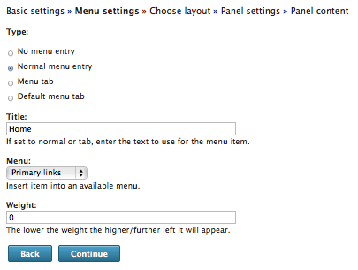
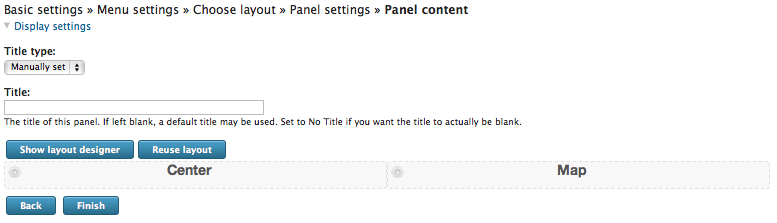
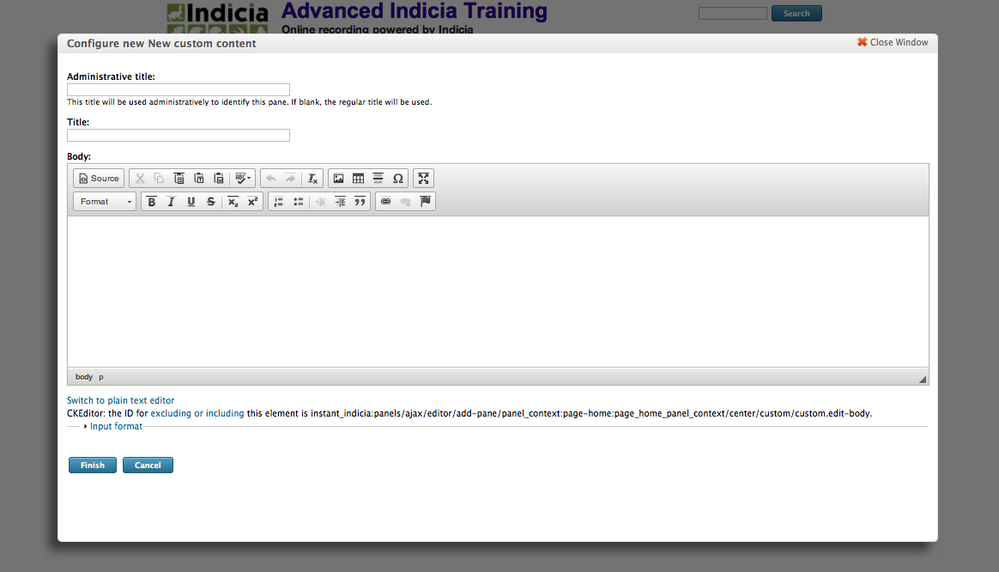
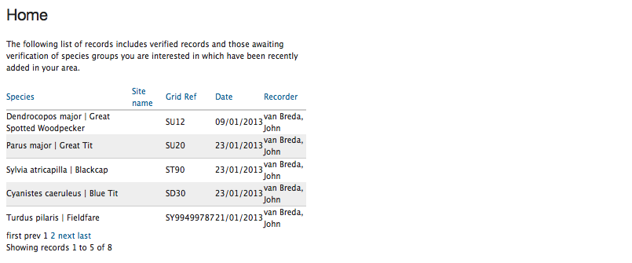
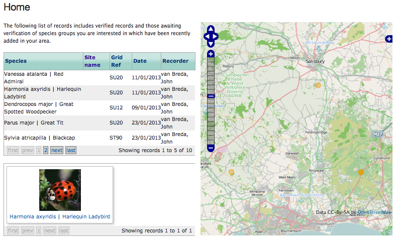

Tutorial - Building a Custom Home Page
======================================

There are many choices for how to go about building your site's home page in Drupal. 
Assuming that your home page should contain a mashup of Indicia content, then you could
consider using the **Dynamic Report Explorer** prebuilt form. The technique we are going 
to learn here was used on the iRecord home page and it nicely illustrates how you can 
build a page with custom PHP scripts to generate the output. It centres on using the
Drupal **Panels** module to build the page layout and is a really useful technique for
building completely flexible page layouts mixing Indicia content, Drupal content and any
other module output you like.

Enabling the Panels Module
--------------------------

As Panels is provided with Instant Indicia, you do not need to download it. Simply visit 
the **Site building > Modules > List** page on your Drupal site and then find the 
following modules in the list and tick their checkboxes:

* **Chaos tools** (which is a dependency of Panels)
* **Page Manager** (which allows us to create a custom page using Panels)
* **Panels**

Click the **Save configuration** button at the bottom.

Adding a custom page
--------------------

#. Select **Site building > Pages > Add custom page** from the Drupal site's admin menu.
#. Set the **Administrative title** to "Home page".
#. Set the **Machine name** to "home".
#. Set the **Path** to "home"
#. Tick the **Make this your site home page** box.
#. Tick the **Visible menu item** option. 
#. Click the **Continue** button to move to the next step.

Adding the menu item
--------------------

On the next configuration page, tick the **Normal menu entry** option, then set the 
**Title** to "Home" and the **Menu** to "Primary Links". Your page should look like this:

Click the **Continue** button.

Choosing a Builder
------------------

On the next configuration page, you get to choose which layout engine will be used to
create the page layout. There are options for 1, 2 and 3 column layouts plus a "builder"
which lets us build any layout.

So, tick the radio button above the icon for the **Builders > Flexible** layout engine
and click the **Continue** button.

On the **Panel settings** configuration page you can just click the **Continue** button
again to proceed to the **Panel content** page.

Setting up Panel Content
------------------------

First, lets's create 2 regions on our layout which we can insert content into. 

#. Click the **Show layout designer** button. 
#. Click on the **Row** link and select the **Add region to right** option.
#. Set the **Region title** to "Map" then click **Save**.
#. Click the **Region** link above the, now confusingly named, "Center" region and click 
   on "Region Settings". Change the **Region title** to "Left" then click "Save".
#. Click the **Hide layout designer** button. Your page layout should look like this:

     
Now, click the cog icon in the left of the Left region and select **Add content**. Click
the **New custom content** on the left of the popup window. You should find you have a
content editor popup window:

We want to insert some custom PHP into the content. Since the default is for Drupal to 
accept HTML, we need to click the **Input format** link, then select the **PHP Code**
option. You can also click the **Switch to plain text editor** link to remove all the
unnecessary formatting tools. Since we are not here to learn PHP, paste the following 
piece of ready-made code into the **Body** input box then click **Finish**. 

.. code-block:: php

  

    The following list of records includes verified records and those awaiting verification of 
    species groups you are interested in which have been recently added in your area.

  <?php
  iform_load_helpers(array('report_helper')); 
  global $auth;
  if (!isset($auth))
    $auth = report_helper::get_read_auth(variable_get('indicia_website_id',''), 
        variable_get('indicia_password','')); 
  global $user; 
  if (!isset($user->profile_taxon_groups)) 
    profile_load_profile($user); 
  $profile_location = empty($user->profile_location) ? 0 : $user->profile_location; 
  $profile_taxon_groups= empty($user->profile_taxon_groups) ? 
      array() : @unserialize($user->profile_taxon_groups); 
  $profile_taxon_groups = implode(',', $profile_taxon_groups); 
  $ownGroups = empty($profile_taxon_groups) ? 0 : 1; 
  $ownLocation = $profile_location===0 ? 0 : 1; 
  
  echo report_helper::report_grid(array( 
    'id'=>'latest-records', 
    'readAuth' => $auth, 
    'dataSource'=>'library/occurrences/explore_list_using_spatial_index_builder', 
    'itemsPerPage' => 5, 
    'rowId'=>'occurrence_id',
    'columns'=>array(
      array('fieldname'=>'taxon',
          'template'=>'
{taxon}
',
          'display'=>'Species'),
      array('fieldname'=>'location_name', 'display'=>'Site name'),
      array('fieldname'=>'entered_sref', 'display'=>'Grid Ref'),
      array('fieldname'=>'date', 'display'=>'Date'),
      array('fieldname'=>'recorder', 'display'=>'Recorder'),
      array('fieldname'=>'certainty', 'visible'=>false),
      array('fieldname'=>'geom', 'visible'=>false, 'mappable'=>true)
    ), 
    'includeAllColumns' => false, 
    'sendOutputToMap'=>true, 
    'rowClass'=>'certainty{certainty}',
    'extraParams' => array( 
      'survey_id'=>'', 
      'taxon_group_id'=>'', 
      'smpattrs'=>'', 
      'occattrs'=>'', 
      'searchArea'=>'', 
      'idlist'=>'', 
      'currentUser'=>variable_get('indicia_user_id', 0), 
      'ownData'=>0, 
      'location_id'=>$profile_location, 
      'ownLocality'=>$ownLocation, 
      'taxon_groups'=>$profile_taxon_groups, 
      'ownGroups'=>$ownGroups ) 
  ));
  ?>
  
Click on the **Finish** button on the next view as well, then finally, click **Update and 
Save** to save your new home page. If you check your home page now, you will find that
things are working but with no styling:

     
To add Indicia's default styling to the page there is a method which the code must call,
``add_default_stylesheet`` but since we are also going to add a map to the page as well 
in a moment, we will do the map and grid styling in one go.

Now, return to the **Edit content** view of your panels page by:

#. Select **Site building > Pages > List** from the admin menu.
#. Click the **edit** link for your home page.
#. Click the **Edit content** link in the bottom right of the panel summary view.

Now, use the cog icon to add content as you did before, this time adding the following
code to the Map region:

.. code-block:: php

  <?php
    iform_load_helpers(array('map_helper'));
    echo map_helper::map_panel(array(
      'presetLayers' => array('osm','google_satellite','google_hybrid'),
      'editLayer' => false,
      'initial_lat'=>52,
      'initial_long'=>-2,
      'initial_zoom'=>5,
      'width'=>'100%',
      'height'=>510,
      'standardControls'=>array('layerSwitcher','panZoomBar')
    ), array('theme' => map_helper::$js_path . 'theme/default/style.css'));
   map_helper::add_resource('defaultStylesheet');
   handle_resources();
  ?>
  
After updating and saving your page, check that the map has appeared OK on your page. Note
that because we set the **sendOutputToMap** option to true in the grid code we added 
earlier, the records we see in the grid will automatically appear on the map.

Finally, let's add a box for the latest photos to the page, under the grid of records. To
do this, return to your panel page's **Edit content** view as before. This time click the
cog in the Left region to add a new piece of custom content, using the following PHP code
snippet and following the steps as before:

.. code-block:: php

  <?php
    iform_load_helpers(array('report_helper'));
    global $auth;
    if (!isset($auth))
      $auth = report_helper::get_read_auth(variable_get('indicia_website_id',''), 
          variable_get('indicia_password','')); 
    global $user;
    if (!isset($user->profile_taxon_groups))
      profile_load_profile($user);
    $profile_location = empty($user->profile_location) ? 0 : $user->profile_location;
    $profile_taxon_groups= empty($user->profile_taxon_groups) ? 
        array() : @unserialize($user->profile_taxon_groups);
    $profile_taxon_groups = implode(',', $profile_taxon_groups);
    $ownGroups = empty($profile_taxon_groups) ? 0 : 1;
    $ownLocation = $profile_location===0 ? 0 : 1;
    echo report_helper::report_grid(array(
      'id'=>'latest-photos',
      'readAuth' => $auth,
      'dataSource'=>'library/occurrence_images/explore_list_using_spatial_index_builder',
      'itemsPerPage' => 3,
      'columns' => array(
        array(
          'fieldname' => 'path',
          'template' => '
'.
              '<a class="fancybox" href="{imageFolder}{path}"> {taxon}</a>
'
        ),
      ),
      'includeAllColumns' => false,
      'headers' => false,
      'galleryColCount' => 3,
      'extraParams' => array(
        'survey_id'=>'',
        'taxon_group_id'=>'',
        'smpattrs'=>'',
        'occattrs'=>'',
        'searchArea'=>'',
        'idlist'=>'',
        'currentUser'=>variable_get('indicia_user_id', 0),
        'ownData'=>0,
        'location_id'=>$profile_location,
        'ownLocality'=>$ownLocation,
        'taxon_groups'=>$profile_taxon_groups,
        'ownGroups'=>$ownGroups
      )
    ));
  ?>

Hopefully, we've now successfully built a page with a mashup of Indicia data:

     
Don't forget that because Panels is standard Drupal functionality, you are not restricted
to Indicia data. You can include lists of other website content, links to stories, even
weather widgets if you install the appropriate Drupal modules. 
