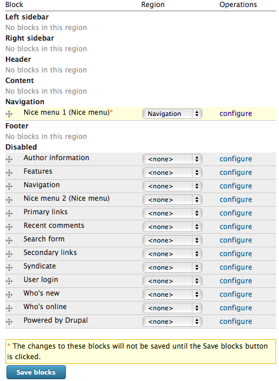

Tutorial - implementing Nice Menus
==================================

As our site grows, simply showing the menu items in a strip across the middle is not 
enough to cope with all the pages. There are various options for navigation in a larger 
website, but here we are going to look at how to implement drop-down menus in Drupal.
Drop down menus can be implemented by adding a module called Nice Menus.

Installing the Nice Menus module
--------------------------------

We're not going to dwell to much on the options for Nice Menus since there is plenty of 
documentation available elsewhere, so we'll just go through the steps required to install
and utilise this module on our Instant Indicia website.

#. First, download the latest recommended release of the Nice Menus module for Drupal 6, 
   from http://drupal.org/project/nice_menus. I chose the zip file for version 6.x-2.1.
#. Unzip the file and place the resulting nice_menus folder inside the 
   ``sites/all/modules`` folder within your Instant Indicia installation.
#. Whilst you are doing the modules, also download the latest recommended release for 
   Drupal 6 of the **Special Menu Items** module from 
   http://drupal.org/project/special_menu_items. Unzip and copy the module folder over as
   before. This module allows for menu items that don't actually link anywhere, such as
   menu titles.
#. Visit the **Site building > Modules** page using the admin menu in your Drupal website 
   and find the 2 new modules. Tick the boxes to enable them and click the **Save 
   configuration** button at the bottom of the page.
   
Enabling Nice Menus
-------------------

The Nice Menus module does not replace the default menu display, but it does provide 
**blocks** which can be added to any or all pages. To put a Nice Menu onto our website for
the main "Primary Links" menu:

#. Select **Site building > Blocks > List** on the admin menu.
#. Find "Nice menu 1" in the list of blocks, this is one of the two blocks that Nice Menus
   creates for you by default. Click the **configure** link.
#. Change the following settings:

   * **Block title** to "<none>" since we don't want a title displayed over our menu.
   * **Menu Name** to "Primary links"
   * **Menu Parent** to "<Primary Links>" (it will be near the bottom)
   * **Menu Style** to "down" so that the menu flows left to right and sub-menus drop 
      down.
       
Now, save the block settings. On the block list page, beside your Nice Menu 1 block there
is a drop down allowing you to choose which section of the page you want to put the block
into, so choose "Navigate". The page should look like this:

     
Finally, click the **Save blocks** button.

Organising the menu
-------------------

Although Nice Menus is capable of displaying a drop down menu hierarchy, our menu is still
only 1 level deep so we won't see the benefits of the changes yet. To change our menu:

#. Select the **Site building > Menus > List menus** option from the admin menu.
#. Click on the link for the **Primary links** menu, which is the main menu used for 
   navigating our website. 
#. Click the **Add item** link, to add a new menu item for the menu heading. We are going
   to add a menu heading called "Submit Records" and put our existing forms beneath it.
#. Set the **Path** to "nolink", which is a special value allowed by **Special Menu 
   Items** to indicate a menu item that does not actually go anywhere.
#. Set the **Menu link title** to "Submit Records".
#. Set the **Description** to "Submit records of your wildlife".
#. Click the **Save** button to add the new item.
#. Now, use the drag crosshairs to move the 2 data entry forms' menu items beneath the
   Submit Records item, and indent them to the right indicating the hierarchical 
   structure of the menu. Your page should now look like the following:
   
   .. image:: ../../../../images/screenshots/drupal/submit-records-menu.png
     :width: 700px
     :alt: Organising the Submit Records menu
     
   Click **Save configuration** button then check that you now have a drop down menu 
   working.