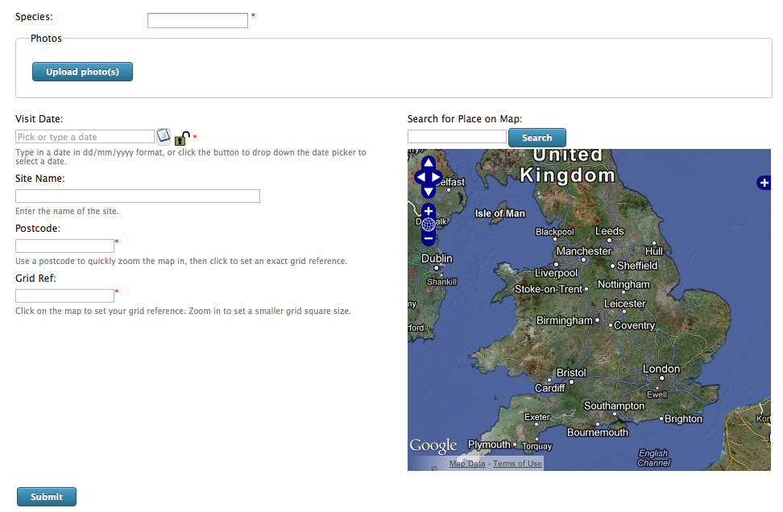

Tutorial - Cloning Pages
========================

By now you should have a pretty good idea of how to build data input forms using Indicia 
and Drupal. A common requirement is to provide multiple forms on your website, for 
different data entry needs, sites or regions and taxonomic groups. For example, you might
want to offer a form specific to recording plants with a DAFOR abundance scale attribute.
Or you might want a version of the multiple records form we have created so far which 
allows entry of a single casual record rather than a list of records. In these cases, 
being able to clone the configuration of a page is quite useful.

Installing the Node Clone module
--------------------------------

There is nothing out the box in Drupal which meets these needs, but there is a module
called Node Clone which does exactly what we want. So, visit 
http://drupal.org/project/node_clone and download the zip file for the latest 
recommended release for Drupal 6, currently 6.x-1.3. Unzip this download and copy the
resulting **node_clone** folder to ``sites/all/modules`` inside your Drupal installation's
file system. Now, click the **Site Building > Modules** menu item in your website's admin
menu. Search down the page for the **Clone Module** tickbox, tick it, then scroll to the 
bottom of the page and click **Save configuration**.

Creating a casual record form
-----------------------------

As a quick demo of node cloning, reload your data entry form. You will see a new tab
has appeared alongside **View** and **Edit**, called **Clone**. Simply click it to clone
the page, then change the following settings:

* Expand the **Menu settings** and set the menu title to "Enter a casual record", so that 
  the form can be found on the menu.
* Set the **Page title** to "Enter a casual record".
* In the **Species** section of the configuration, further down the page, select "Only
  allow entry of one occurrence at a time** in the **Allow a single ad-hoc record or a 
  list of records** configuration option.
* Under the **User Interface** section, change **Interface Style Option** to "All one 
  page".
* In the **Form Structure** configuration in the **User Interface** section, add a new
  control called ``[species attributes]``. When in grid mode, the custom attributes 
  associated with the occurrence record are automatically added to the grid, but for 
  single entry mode you need to tell Indicia where on the form they should be output. A
  good place to put this control tag would be after the [species] control and its 
  configuration options.
* You don't have to do this, but you may find that by editing the **Form Structure**
  to swap the Visit and Species tab order (plus all their contents) the form looks 
  more logical.

Save the page to create the new input form. The first thing you will notice is that the
two column layout has gone wrong again, so let's fix that. We could create a new 
``node.n.css`` file copying the one we created previously for each new page we create that
has a two column layout, but that would mean lots of CSS files. A better technique
follows:

#. Browse to the ``iform/client_helpers/prebuilt_forms/css`` folder in the file system 
   where you saved the multiple record input form's custom CSS file earlier, and locate
   the file.
#. Rename the file to ``two-col.css``. 
#. We have broken the file name convention, which means Indicia cannot autoload this CSS
   file for us, but don't worry, we can tell Indicia which CSS files to load explicitly.
   So, edit your casual record input form. In the **Other IForm Parameters** section, 
   put the following into the **Additional CSS files to include**::
   
     {prebuiltformcss}/two-col.css
     
   The ``{prebuiltformcss}`` is a marker to tell Indicia to insert the path to the CSS
   folder into the file path. 
#. Repeat the last step for your multiple records entry form.

Your "Enter a casual record" form should now look like this:

Creating specialist entry forms
-------------------------------

Creating other data entry forms is a matter of repeating this process, with the following
notes.

#. If you are going to need different custom attributes for a form, then you need to 
   create a different survey and attach the custom attributes to the survey in the 
   warehouse. Then, when you clone your form, you will need to select the new survey in 
   the **Other IForm Parameters** section of the configuration.
#. If you want to create a form for inputting records from a certain taxon group or for a
   selection of taxa, rather than creating a new species list you can filter the species
   list to control the species available for selection. As an example, consider the 
   scenario where you have a complete taxonomic species list for your country, which is
   divided into different taxon groups. Clone a form, then in the **Species** section of 
   the form configuration set the **Field used to filter taxa** to "Taxon group title".
   Then, specify the taxon groups you want to restrict the form to in the **Taxon filter 
   items**, one per line. You can of course filter the species available using one of the
   other filter fields.
#. If you create a single record entry form that filters to allow only the recording of a 
   single species, then the species input control will be hidden. This is great for single
   target species pubic participation surveys.
   
If you have time, try creating a new form or two using these tips to put into practice
what you have learnt, though this is not necessary to continue with the tutorials.