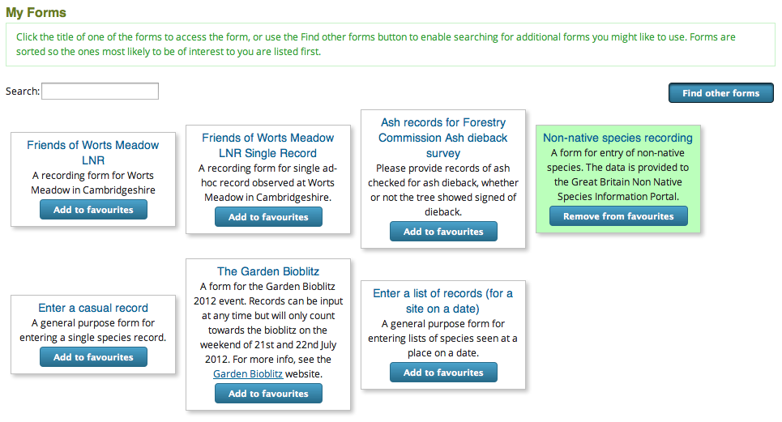
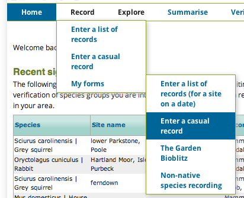

Forms and Surveys Library
-------------------------

The forms and surveys library enables a library of forms on an Instant Indicia site which
users can build their own list of "favourites" from for easy access. Once enabled via the
**Site building > Features > Manage** page, the feature provides the following:

#. Additional options on the edit page for any Indicia page, which appear inside a new 
   form section called *Forms and surveys library settings*. These options are:

   * **Include in library** - a tickbox which makes any Indicia page available in the
     library. Once ticked the following options become available.
   * **Library title** - the title given to the form when shown on the library browser 
     page described below.
   * **Library description** - the description given to the form when shown in the library
     browser.
   * **Locations** - a list of localities which this Indicia page is associated with, if 
     any. For example, a form might be associated with a vice county. This allows users 
     who have registered an interest in that vice county to find this Indicia page more 
     easily.
   * **Species groups** - a list of species groups which this Indicia page is associated
     with, if any. For example, a bee recording form might be associated with *insects - 
     hymenoptera* enabling users who have registered an interest in this group to find the
     form more easily.
   * **Registration path** - optional, provide a path within the Drupal website to a 
     registration page for the Indicia page's survey. This allows you to provide a 
     personalised registration page for surveys hosted on the site. When a user 
     registers on the site via this form, the Indicia page automatically gets added to 
     their list of favourite forms and is made their default home page.
   * **Registration intro** - only used if the Registration path is filled in. Defines
     introductory text to be displayed at the top of the registration page. Because this
     is a *Filtered HTML* field, it can contain images and other HTML content if 
     enabled for the site.
     
#. A **library browser** web page which lists the available forms and lets the user pick
   their favourites. This page sorts the available forms so the ones that best match the 
   user's preferred location and species groups appear near the top of the list. 
   

   
The library browser page is available via the path ``forms_and_surveys_library``. You
might like to add a menu item to your site's menu pointing to this path, called "My
Forms". If you do this then any favourite Indicia pages will be dynamically added to the
My Forms menu item as a sub-menu.

   
   
.. note:: 

  To use the library browser page, your site users will need to have the ``online
  recording`` permission.