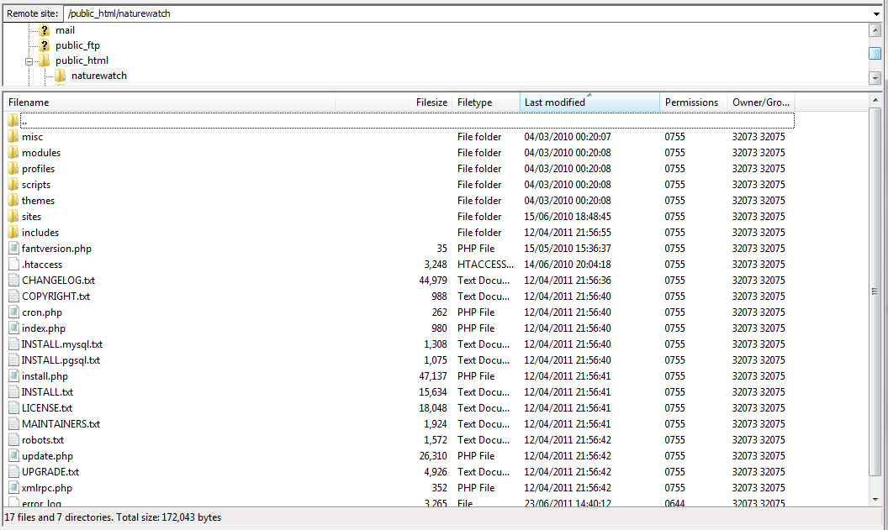
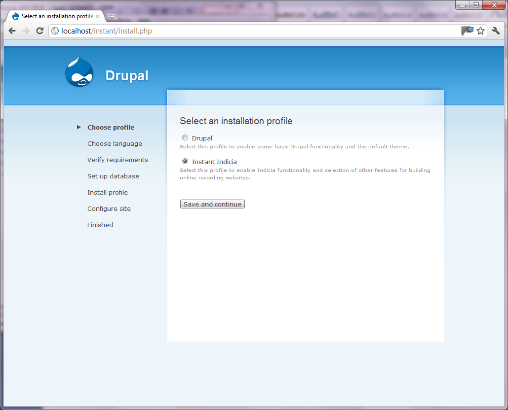
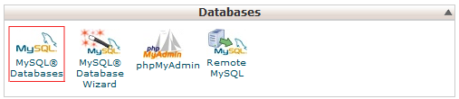
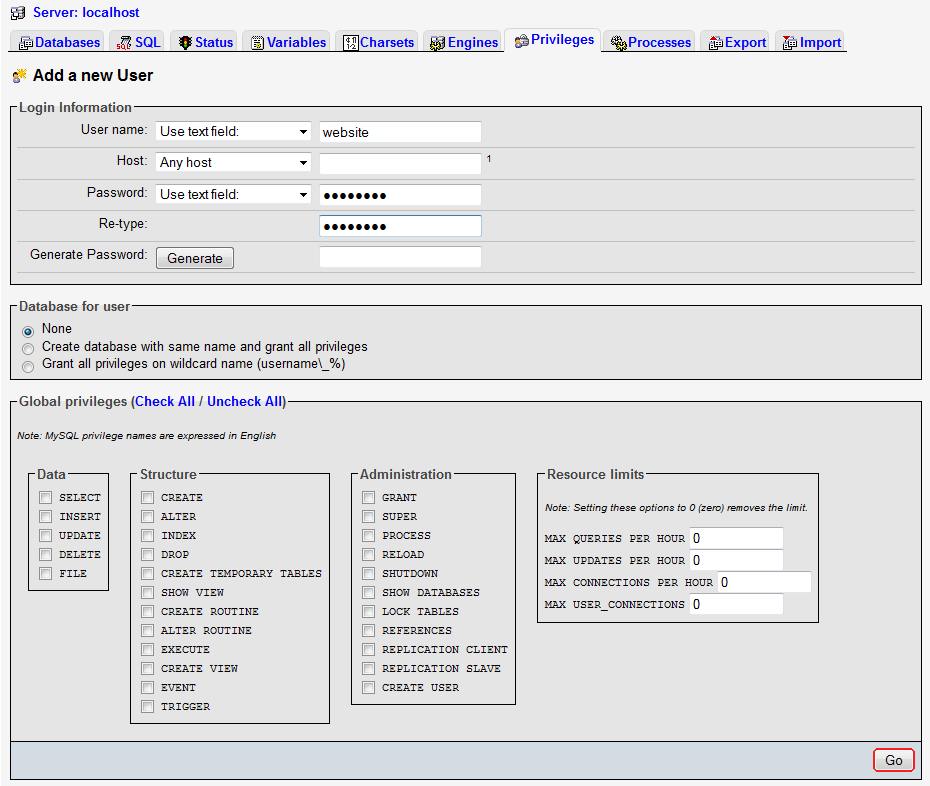
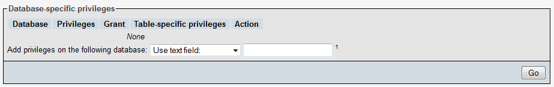
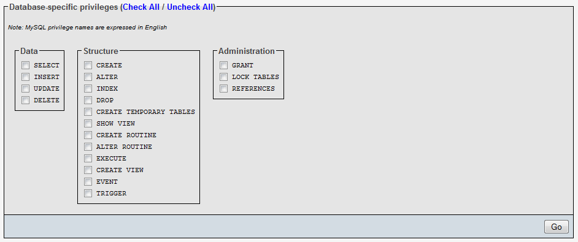
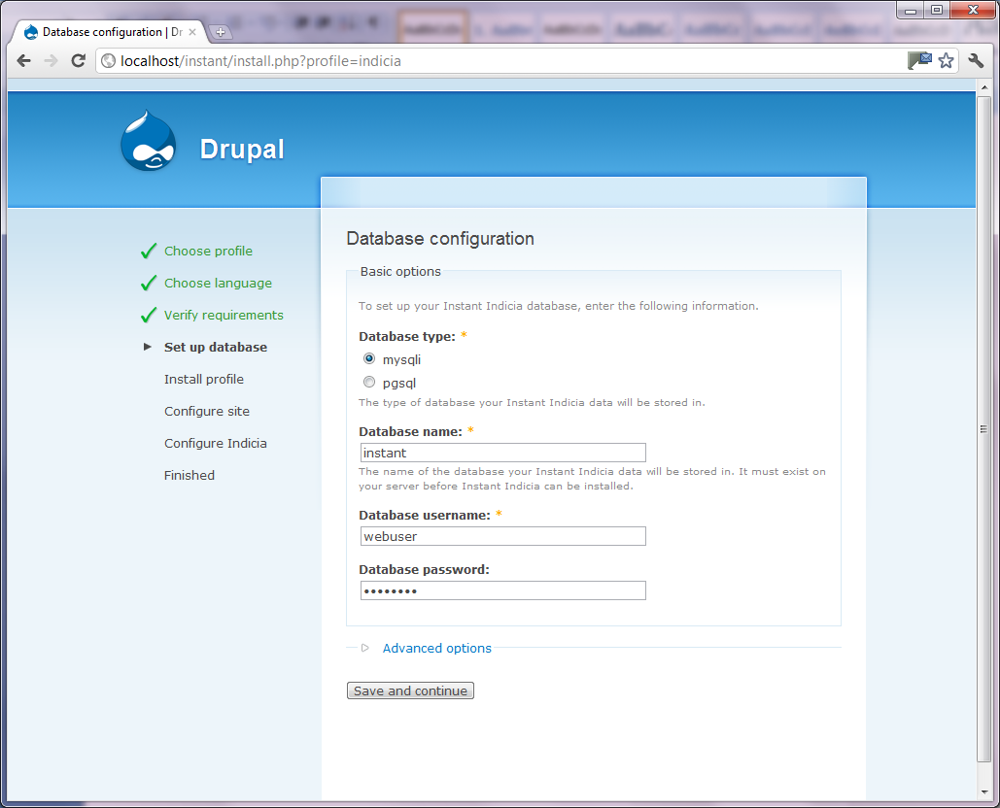
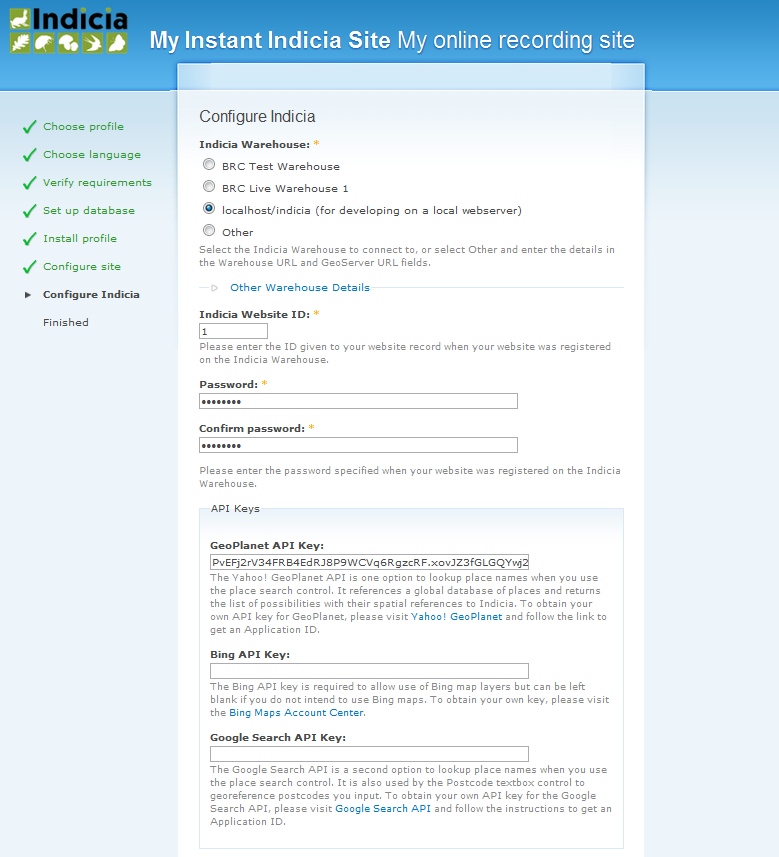
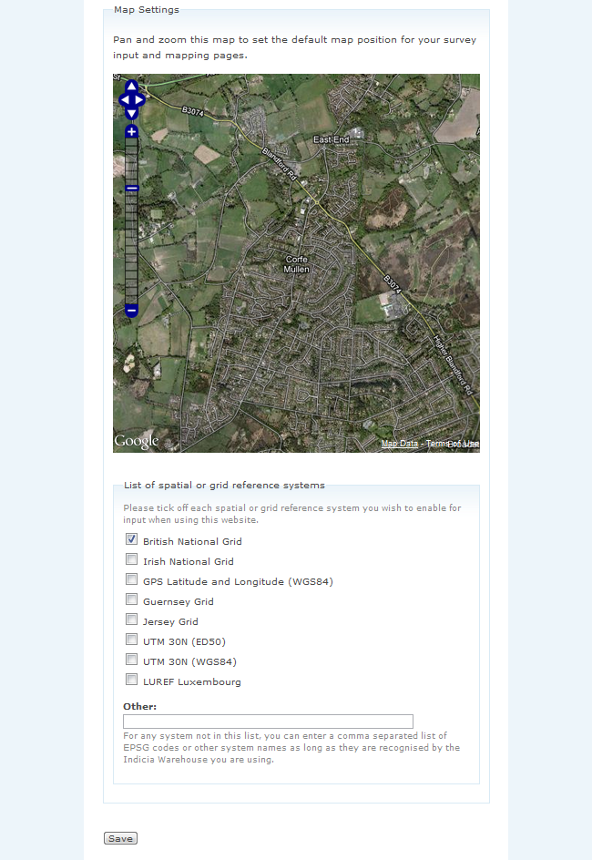
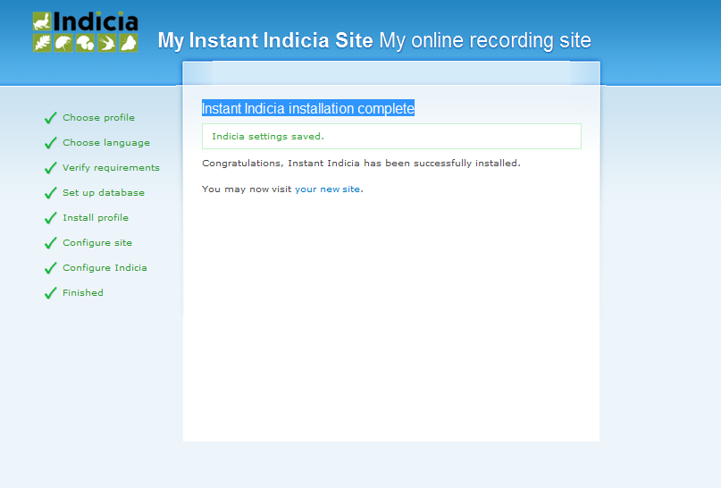

Installation of Instant Indicia
===============================

.. warning::

  Instant Indicia was based on Drupal 6. We strongly recommend that if you are starting 
  to build a new online recording website that you use Drupal 7 and the IForm module since 
  Drupal 6 is no longer the preferred version of Drupal.

Prerequisites
-------------

Before you install Instant Indicia, as well as the warehouse you need to make sure you
have the following prerequisites in place:

* Support for PHP 5.3 or higher
* The MySQL 5 database server is installed
* A tool allowing you to access the MySQL database server such as PhpMyAdmin, MySQL Query 
  Browser or CPanel
* The cUrl extension for PHP is enabled
* Although not a fixed limit, it is recommended that the PHP memory limit be set to 64MB 
  or higher

If you are using a web hosting package or a web server managed by someone else and are
in any doubt about these prerequisites then please contact your web host who should be
able to confirm if your server supports them. 

If you are installing Instant Indicia on a local machine for test or development
purposes, then there are many tutorials on the web on how to install PHP and a
webserver such as Apache. PHP version 5.3 or higher is required. The following guide 
explains installation of PHP, Apache and MySQL on Windows:
http://www.php-mysql-tutorial.com/install-apache-php-mysql.php. An easier alternative
is to install a ready made 'stack' with a set of predefined components all packaged
into one install kit. Rather than install each component individually, you might like
to consider installing a *stack*, that is a single installation which packages all the
things you need for the web server. Here are a few examples for your consideration:

**Windows**

* `WampServer <http://www.wampserver.com/en/>`_

**Mac**

* `MAMP <http://www.mamp.info/en/index.html>`_

**Any operating system**

* `XAMPP <http://www.apachefriends.org/en/xampp.html>`_

These are handy packages consisting of an Apache web server, MySQL plus the typical tools
you might want to install onto a web server.Whichever you choose, please make sure you
install a version which includes PHP 5.2.x or (preferably) PHP 5.3.x, as PHP 5.4 is not
yet supported.

This tutorial assumes you will be using the web applications PhpMyAdmin or have access to
CPanel for your database management tasks. CPanel is supplied with many hosted web
accounts to provide various utilities for managing your website including creation of
databases. If you are using a different tool for database management then the steps should
be the same but using the different user interface provided by your tool. You might be
wondering why a database is needed at all when the Indicia data is stored on the separate
warehouse. This is because your website’s pages and other settings are also stored in a
database quite separate to the warehouse (which is only concerned with the actual
biological records and other associated data). For example, when you create a page to add
to your website to act as a home page, this is stored as a record in the MySQL
database. When you add a record of a species to the system, this record is created and
held in the warehouse.

Installation procedure
----------------------

Installing Instant Indicia involves almost exactly the same process as installing Drupal
6, with a few extra bits for the Indicia specific stuff. It may be handy to have more
information on installing Drupal in general which can be found at
http://drupal.org/videocasts/installing-6. There is also a video on installing Instant
Indicia available at http://www.youtube.com/watch?v=yTWHimXBagA. 

Copy Files
^^^^^^^^^^

The first step is to copy the Instant Indicia files into the folder on your website where
you would like to run your website from. This could be the htdocs folder supplied with an
installation of XAMPP, the public html folder of your hosted website, or possibly a
sub-folder within one of these locations. If the folder is on a remote server you may need
to use an FTP program such as `FileZilla <http://filezilla-project.org/>`_ to upload the
files. You can download the latest copy of Instant Indicia from the `Indicia Downloads
page <http://code.google.com/p/indicia/downloads/list>`_ then unzip the file to obtain the
full set of files required (including the Drupal files). Once copied, your file structure
might look something like this example, where I am setting up Instant Indicia in a
subfolder of a website called **naturewatch**:

  
Once the files have been uploaded to the correct location, accessing the folder using your
web browser should display a page allowing you to select whether to install a basic
installation of Drupal or the Instant Indicia version. Here are some examples of how you
can work out the URL to access:

* If installing on a local machine that is running as a local webserver and you copied
  the files into the root folder of your webserver’s websites directory (htdocs if
  running Apache) then you can access http://localhost.

* If installing on a local machine that is running as a local webserver and you copied
  the files into a subfolder of your webserver’s websites directory (htdocs if running
  Apache) then you can access http://localhost/subfolder replacing subfolder with the
  name of your folder.

* If installing on a remote machine using FTP into the root folder (normally called 
  public_html) then you can access the page using just your domain name (e.g. 
  http://www.mysite.com).

* If installing on a remote machine using FTP into a subfolder then you can access the 
  page using your domain name and the subfolder (e.g. http://www.mysite.com/subfolder).
  

For now, we’ll leave this part of the installation as there a couple of other tasks to
undertake before proceeding.

Create a settings file
^^^^^^^^^^^^^^^^^^^^^^

Using the same tool you used to upload the files (e.g. FileZilla, Windows Explorer or the
Mac Finder), find the folder at sites/default. Inside this folder there is a file called
default.settings.php. Create a copy of this file and rename it to settings.php, leaving
the original file in place. This is the standard way to create a file for Drupal 6 to
store its various installation settings. 

For more information on this see http://drupal.org/documentation/install/settings-file.

Create a database
^^^^^^^^^^^^^^^^^

The last step in preparing to install Instant Indicia is to create a MySQL database. The
MySQL that has been installed on your web server is a database server, that is, it is an
application designed for storing and retrieving data. The database server stores data in
discreet buckets called databases, with each database being created for a specific
purpose. Thus, it is possible to have a single database server provide storage facilities
for multiple applications by having a separate database for each application. So, we need
a database to store our Instant Indicia site’s information in. The following paragraphs
explain the database setup process, but if you want more information this can be found in
the `Drupal installation documentation <http://drupal.org/documentation/install/create-database>`_.

Using CPanel
""""""""""""
If you are using a hosted web account with CPanel then you will probably not have the
password required to create databases in MySQL yourself using PhpMyAdmin, but there is a
tool provided within CPanel for creating databases. Look for the Databases section and
click the link called MySQL Databases to access it. 

  
The CPanel MySQL databases tool provides you with a box to type in the name of your
database and a Create Database button, it is as easy as that. Note that CPanel may enforce
a prefix for your database name to allow it to keep your database separate from those
created for other websites on a shared web server.

Using PhpMyAdmin
""""""""""""""""

If you are using PhpMyAdmin and have the required password for administering MySQL, then
follow these steps to create the database:

#. Using your web browser, access the phpmyadmin site and log in. This will typically be
   at the location http://www.mysite.com/phpmyadmin, or http://localhost/phpmyadmin if
   developing locally.

#. Or, if you are already logged in, click on the Home button in the toolbar near the top
   left, then select the Databases tab. The Databases tab should show a box allowing you
   to input the name to create a new database. If this box is missing then it is likely
   that your MySQL database is part of a shared server so you do not have access rights to
   manage permissions in this way. The instructions for using CPanel should be used
   instead.

#. In the Create new database box, enter the name of the database you want to create. Name
   it something that helps you remember it is for the site you are building. Press Create
   when ready.

.. image:: ../../images/screenshots/tutorials/ii-install-phpmyadmin-create-db.png
  :width: 700px
  :alt: Creating a database using PhpMyAdmin
  
Create a user
^^^^^^^^^^^^^

The database you have created will currently only be accessible to the MySQL
administration user account (normally called root). When something needs to connect to
MySQL to get to the database, it has to login to MySQL using a username and password. This
applies whether it is a person (such as you) or a process (such as the Instant Indicia
website) that is connecting to the database. Rather than let the website login to MySQL
using the super-user root account which would make things less secure, we will create a
user account for the website to use when accessing MySQL. This user account will only have
access rights to the database you created so cannot damage other parts of the server if it
is hacked.

Using CPanel
""""""""""""

To create a user account for your website to access MySQL using CPanel, go to the MySQL
Databases section of CPanel as described for creating the database. Further down the page
is a section called MySQL Users, with an option to add a new user by specifying a username
and password. Just fill these boxes in and click the Create User button. If this is a live
database, then it is very important to make the password a strong password containing a
combination of letter, numbers and punctuation. There is a Generate Password button for
creating passwords which generates a random, strong password ideal for this purpose though
remember to take a note of the password if you use this facility. Once you have created
the user, you need to grant that user access to the database you created earlier. At the
bottom of the same page in CPanel, there is an Add User to Database section. Just select
the user, select the database and click the Add button and you are done.

Using PhpMyAdmin
""""""""""""""""

To create a user account for your website to access MySQL using PhpMyAdmin:

#. In PhpMyAdmin, click on the Home button then select the Privileges tab. If there is no
   Privileges tab then it is likely that your MySQL database is part of a shared server so
   you do not have access rights to manage permissions in this way. The instructions for
   using CPanel should be used instead.
  
#. Click the Add a new user link.
  
#. Enter a user name, e.g. website.
  
#. The Host option can be set to Local.
  
#. Enter a password and retype it. If this is a live database, then it is very important
   to make this a strong password containing a combination of letter, numbers and
   punctuation. There is a Generate button for creating passwords which generates a
   random, strong password ideal for this purpose, though remember to take a note of the
   password if you use this facility.
  
   Do not tick any boxes in the Global privileges section – you want the user to be only
   able to use your new website database.
  
#. Click the Go button, highlighted in red below.

  
That will create the user but leave you on the details view of that user. Several new
sections will have appeared on the page, including one called Database specific 
privileges:

  
Simply select your new database in the drop down and PhpMyAdmin will take you to a view of
the database privileges for that user on that database:

Tick every box in this section or click the Check All link to give your user account full
access to this database. This is important because it lets Drupal and the various modules
we will install create the database structure they require. Finally click the Go button.

Install Instant Indicia
^^^^^^^^^^^^^^^^^^^^^^^

The hard stuff is all done now, as you have a web-server ready to install Instant Indicia
on. Using your web browser, navigate to the folder where your website will be running
from. For example if your domain name is *www.mynaturesite.com* and you copied the Instant
Indicia installation files into a subfolder of the public HTML folder called mainsite,
then the address you need to navigate to is http://www.mynaturesite.com/mainsite, or if
you are using localhost then the link will be http://localhost/mainsite.

You will see the following page, which lets you choose from a default installation of
Drupal, or to use the Instant Indicia profile. On the left of the page you can see that
you are on the first of several steps required for installation. Select the Instant
Indicia profile and click Save and continue.

Because the Instant Indicia installation is currently only available in English, the
installer will skip the Choose language step and proceed to verify that your server meets
the requirements of Drupal. At this point you may see some messages informing you how to
meet the requirements that are not met, but if everything has been setup as described so
far the installer should proceed to the Set up database step.

If at this step you see messages relating to file permissions then you will need to
correct these problems before continuing, for example there will be errors in the
following circumstances:

* Drupal’s installer does not have permissions to write settings to the settings.php file.
* Drupal’s installer does not have permissions to create a folder at sites/default/files.

When installing onto a Linux, Unix or Mac server, note that file permissions will depend
on the ownership of the file and you may need to use the chown command line tool to change
the file ownership. More information on setting the correct file permissions for a Drupal
installation can be found at http://drupal.org/documentation/install/settings-file.

  
This step lets you tell Drupal how to connect to your MySQL database that you created
earlier. The Database type should be mysql because that is the name of the library Drupal
will use to connect to MySQL. The second option, pgsql, allows Drupal to be set up using
the alternative PostgreSQL database but not all modules are compatible with PostgreSQL so
we will stick to MySQL.

Provide the name of the database, plus the username and password you created earlier for
connecting to the database with.

There is an advanced options section which you generally do not need to touch. There is
some more information on this section in the `Drupal documentation on running the
installation script <http://drupal.org/documentation/install/run-script>`_. Click the Save
and continue button when you are ready. Drupal will chug away for a few seconds whilst it
sets up the database before proceeding to the next step.

Once the database is created, you will see the Configure site page. This page lets you set
up various things like the site title and admin account which are required for all Drupal
installations:

.. image:: ../../images/screenshots/tutorials/ii-install-setup-site.png
  :width: 700px
  :alt: Setting up the site settings for Instant Indicia
  
At the top of the site you may see a note about setting the settings.php file to read
only. Drupal will attempt to do make this change itself but if it does not have the
capability to do so (which depends on the setup of the particular web server) it will
request that you do this yourself. It’s not essential to do this for a development setup
but does improve security a little on a live system.

The fields you need to fill in on this page are mostly self explanatory – the site name
and slogan are displayed in the site banner and the site email address is used when the
site sends out automatic emails such as those sent during the user registration process.
The next section lets you define the username, password and email for an admin account
that has full access to all functionality in Drupal. It goes without saying that if this
is a live setup that the admin account’s password must be strong – the user interface will
inform you of how strong your password is when you type it in.

The final section on this page – Server settings – can normally be left in its default
state as Drupal will choose the best settings for your server. Click the Save and continue
button when you are ready and Drupal will proceed to the Configure Indicia page where you
set up Indicia specific settings.

  
The first thing to do here is to provide Indicia with some information about the warehouse
you are going to connect to. There are several pre-configured warehouses available to pick
from including one for localhost (if the warehouse is setup on your current machine in a
folder called indicia) as well as the warehouses provided by the Biological Records Centre
in the UK (BRC). To use the BRC warehouses you will need to obtain permission, which can
be done by asking on the Indicia forum at http://forums.nbn.org.uk/viewforum.php?id=25).
If you have to setup for a different warehouse then choose the Other option and enter the
path to the indicia site excluding the index.php part but including the trailing slash,
e.g. “http://www.mysite.com/indicia/”. The second box in this section lets you configure a
connection to the GeoServer URL. This is a non-essential extension to the functionality
provided by Indicia so can be left blank for the purposes of this tutorial.

Further down the page you will be asked to input the website ID and password. This
provides a mechanism for your installation of Instant Indicia to authenticate onto and
communicate with the Indicia warehouse. The default installation of the warehouse comes
with a demonstration website registration which can be used for installation purposes, so
fill in the following:

* Website ID = 1
* Password = password

The next section of the configuration page lets you specify several API keys. These are
effectively passwords that let your Instant Indicia site access various web services. For
example when a map is displayed on the screen the map imagery displayed comes from a web
service such as the Google Maps or Bing Maps services. When a user searches for a place
name, the place name is looked up using a Google place search web service or the Yahoo!
GeoPlanet web service. Using these web services is generally free as long as your site
does not charge for access, though it is your responsibility to check the terms &
conditions of the relevant services. For the purposes of this tutorial you should at least
follow the link to obtain an API Key for Yahoo! GeoPlanet and fill that one in. The other
API Keys can be left blank or filled in as desired.

Finally on this page is a map settings section:

  
This lets you set a default zoom and centre point for maps displayed by your site, though
these settings can be overridden on a page by page basis. You can leave the map where it
is if you are happy with the default settings, or drag it to a different centre point and
zoom scale. 

.. tip::

  When using the map, hold the Shift key and drag a box to quickly zoom in to a specific 
  region.

Beneath this there is a list of grid and spatial reference systems that you can tick to
enable support for on your site. If you only want British National Grid references to be
input then leave this as it is, otherwise you can opt to include support for the other
reference systems listed.

If you need to change any of these settings in future, then don’t worry as there is a
configuration page provided which lets you do that. When you are done, press the Save
button to complete the installation and you will see the following page.

