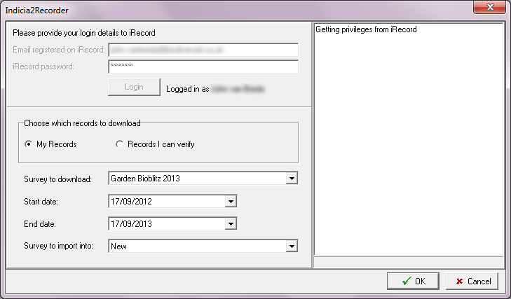

Using the Indicia2Recorder addin for Recorder 6
===============================================

The Indicia2Recorder addin is an extension to Recorder 6 which allows download of the
records you have access to from an Indicia powered online recording website. Because the 
addin depends on modules existing on the website which are currently only available for
Drupal 6, this means that the addin can only download Indicia records via a Drupal 6 
website such as iRecord at present.

If you already have the addin installed and configured, then jump straight to the section
on usage further down the page.

Installation
------------

Download the addin file from the `Indicia Google Code Downloads page
<http://code.google.com/p/indicia/downloads/list>`_ and unzip it into a temporary folder,
then install it into Recorder 6 as normal. This adds a new **Indicia2Recorder** menu item
to the Recorder 6 Tools menu.

If you are the administrator of the Drupal/Indicia website and are setting it up for 
Indicia2Recorder for the first time, then you will need to ensure that the Indicia Mobile
Auth and Indicia Remote Download modules are installed. You should also visit the 
configuration page for Indicia Mobil Auth via the menu at **Site configuration > IForm >
Mobile Auth Settings** in order to configure an shared secret (app secret) which you will
need later.

Configuration
-------------

Because the Indicia2Recorder addin uses a secure connection to the Indicia website where 
the records are stored, it needs to be configured to know how to authenticate onto the 
website. There are 2 possible ways of creating this configuration:

  * Use an existing connection configuration file.
  * If you are the administrator of the website then you can create your own connection
    configuration file.
    
Existing connection configuration files
^^^^^^^^^^^^^^^^^^^^^^^^^^^^^^^^^^^^^^^

You will need to obtain a file called **indiciaConnection.txt** for the website you are
connecting to. This may be available from the website administrator. For iRecord, there is
a connection file available from the `Indicia Google Code Downloads page
<http://code.google.com/p/indicia/downloads/list>`_.

Save this file to your Public Documents folder or personal My Documents folder in a 
sub-folder called Indicia2Recorder.

Creating your own configuration connection file
^^^^^^^^^^^^^^^^^^^^^^^^^^^^^^^^^^^^^^^^^^^^^^^

You can create a configuration file only if you have access to the following information:

  * The URL of the website you are connecting to, e.g. http://www.brc.ac.uk/irecord
  * The Shared App Secret configured on this website using the Indicia Mobile Auth module
  * The Site ID that will be used by Recorder 6 to identify records belonging to the 
    remote site.
    
The configuration file stores these encrypted connection settings. When the configuration 
file cannot be found, then the addin will assist you in creating a new one as follows:

  #. Start Recorder 6 and access the addin via **Tools > Indicia2Recorder** on the menu.
  #. The addin will detect that the configuration file is not present and will ask you
     **There is no configuration file available to define connection settings for the 
     remote site. If you are an administrator wanting to create a connection file then 
     please answer the following questions.**
  
  #. Click OK and a popup will appear asking you to fill in the site URL. Fill in the full
     domain name of the site including ``http://`` but excluding any trailing slashes or
     specific page details. If the website is operating in a sub-folder, include that 
     subfolder in the URL. For example, you might specify ``http://www.mysite.com`` or
     ``http://www.brc.ac.uk/irecord``.
     
  #. Click OK and a further popup will appear asking you to fill in the Shared App Secret
     of the website. This setting is defined on the Indicia Mobile Auth settings page
     (under Site configuration > IForm > Mobile Auth Settings) in a field called **Shared
     Secret**. Fill this in then click OK.
     
  #. A further popup will appear asking you to fill in the Site ID for records to be 
     created in Recorder. You should obtain a new Site ID for your remote site in the same
     way that you can obtain Recorder 6 site IDs, from Recorder resellers. It should be
     an 8 character string consisting of uppercase characters and digits only.
     
  #. Click OK and a final popup appears asking for the name of the site. This will be
     used to create appropriate labels on the addin's dialog. Click OK when you are done
     and the configuration file will be created.
     
.. tip::

  If you want to change the settings in your connection configuration, just delete the 
  existing file from the disk (Public Documents or My Documents, the file you want is 
  ``Indicia2Recorder\indiciaConnection.txt``. Now restart the addin and it will guide you
  through creating the file again.
  
Configuring the import of custom attributes
^^^^^^^^^^^^^^^^^^^^^^^^^^^^^^^^^^^^^^^^^^^
     
Usage
-----

To use the addin, you will first need a login to iRecord. A standard login will allow you 
to download your own records only, but if you are an LRC or verifier then you will be able
to download records within your area or iRecord expertise settings respectively. Currently
sensitive records are excluded from the download.

You will need to create a survey in Recorder 6 in which to store your records. To do this,
use the **Tools > Termlists** screen to create a survey type term called Indicia:

  #. Click on **Tools** then select the **Termlists** menu item.
  #. In the **Select List** box, choose Survey Type.
  #. Check if Indicia appears in the list of terms. If not, then continue with the 
     following steps.
  #. Click the **Add** button.
  #. In the **Short Name** box, type Indicia.
  #. Click **Save**.
  
Once you have the survey type setup, you can create a survey and set the Survey Type to
Indicia, ready to import records into.

In Recorder 6, start the addin by selecting **Tools > Indicia2Recorder** from the menu.

The first step required is for you to fill in your email address that you registered on 
the Indicia website with and your account password, then click **Login**. The addin will 
then connect to the Indicia website and check your access rights. It can then populate the
various options for what you are able to download below.

Once logged in, you simply need to select whether to include your own, your verification
or your LRC records (if available), the survey on the Indicia website you want to import
records from, the date range, and the target survey then click **OK**. The addin will do
the rest.

Click the **Cancel** button to close the dialog when you are finished.

