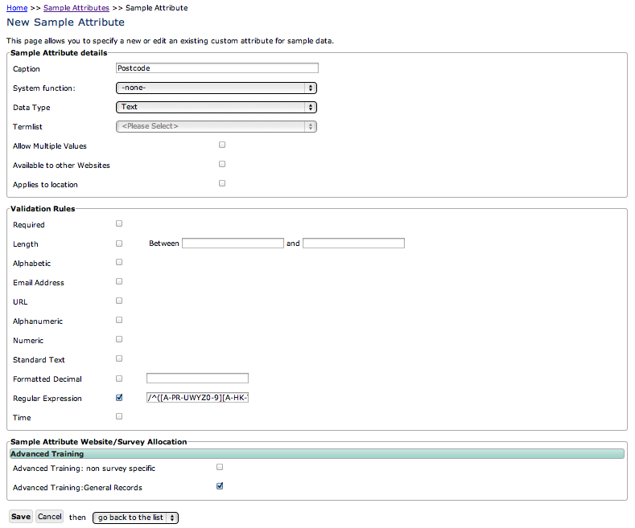

Adding a custom attribute
=========================
    
There are other tutorials regarding adding custom attributes, in this one we are going to 
take a look at adding some from scratch, with custom validation and configuration. Lets
start by adding a custom attribute to capture the postcode of the site we are recording
at. First, log in to your warehouse if you are not already logged in. Since the postcode
will apply to all the records on the for, this is an attribute of the *sample* rather than
an attribute of the *occurrence*. So, click on the **Custom Attributes > Sample 
Attributes** menu item to access the list of existing attributes.

.. note::

  In many cases, there will be a suitable custom attribute already created on the 
  warehouse for you to use, in fact there is already a postcode attribute provided with 
  Indicia. But in this tutorial we'll add a new one from scratch as it nicely illustrates
  the process.
  
Attribute basic settings
------------------------
  
Click the **New sample attribute** button. Set the **Caption** to "Postcode" (remember 
this is only the default caption, as we can override the label output in the form 
configuration). Set the **Data Type** to "Text". When you do this, note that the panel
of **Validation Rules** will reconfigure itself to show controls which are appropriate to
the data type of custom attribute you are creating. Since the postcode is something which
could be said to be an attribute of the site, we can tick the **Applies to location** box.

.. tip::

  **Applies to location** is merely a hint to the system that this attribute is something
  recorded about the site as opposed to something specific to this sample. An example of 
  the former might be an altitude measurement, whereas something specific to the sample 
  might be a temperature measurement. At the moment you could use this flag in custom 
  reports to build information about the site, but in future Indicia will support site 
  based recording where the attributes which have this flag ticked will default to the
  values recorded the last time this site was visited.
  
.. tip::
  When adding an attribute using the Lookup datatype you can link the attribute to a pre-
  existing termlist in order to create a drop-down list of terms to pick from. For simple
  lists of terms you can do this in one step - click the **Create a new termlist** option
  which appears when you pick the Lookup data type. You can then enter the list of terms
  into the box which appears, one per line. A termlist will then be created for you with 
  the same name as the attribute.
  
Validation rules
----------------

As you can see, there are a few different options for adding validation rules to your
custom attribute. Most are self explanatory, so we'll focus on the least obvious, but most
powerful option, the **Regular Expression**.

.. tip::

  When you define a custom attribute, it is best practice to only define validation rules
  that should apply to the attribute in every single survey in which it is used. You might
  want the postcode to be required, but making it required at this point means that other
  surveys which want an optional postcode input cannot use your attribute. On the other
  hand, adding a format check to ensure that the postcode is valid would be useful in all
  cases, so it is good practice to define this rule at this point. We'll see how to make
  the attribute mandatory for each specific survey later.
  
A regular expression is a tool used in many programming environments for pattern matching
in pieces of text. It can be a bit bewildering at first, but by allowing regular 
expression validation Indicia allows extremely powerful validation of the content of a 
field. Regular expressions can be used to extract characters matching a pattern from a
piece of text, for example you could extract all the text in brackets from a paragraph. A
more useful aspect of regular expressions from our point of view is that they can be used
to answer a question, *does this piece of text match this pattern*. For a very simple 
example, we could configure a regular expression to check that a form input matches one
of the possible codes in the DAFOR abundance scale, D, A, F, O or R, using the following::

  /^[DAFOR]$/
  
The square brackets define a sequence of characters which we will accept any one of. The ^
character anchors the regular expression to the start of the text, and the $ anchors it to
the end. Without these, our pattern matcher would accept text containing any of these
characters, such as "The Fox". Don't worry too much about learning how to write your own
regular expressions, since a good way to write a regular expression is to search the web. 
Fortunately there are lots of developers doing the same thing, so lots of useful help is 
out there! I searched for a postcode regular expression and found the following::

  /^([A-PR-UWYZ0-9][A-HK-Y0-9][AEHMNPRTVXY0-9]?[ABEHMNPRVWXY0-9]? {1,2}[0-9][ABD-HJLN-UW-Z]
  {2}|GIR 0AA)$/
  
I'm not going to claim that all makes sense! So, on your sample attribute's edit page, 
tick the **Regular Expression** checkbox and paste this text into the box alongside it, 
making sure you don't introduce any carriage returns.

Before saving your attribute, one last task is to add the attribute to our survey. All the
surveys you have access to are listed at the bottom of the page, so tick the option for 
the survey you are working on. Your page should look something like this:

Finally, save the attribute. 

If you are using the Drupal IForm module, then many of the forms Indicia provides for you
to add to the page will automatically show a control allowing a value for this attribute 
to be input. However note that the control will only appear after you clear the Indicia 
cache on the Drupal website.