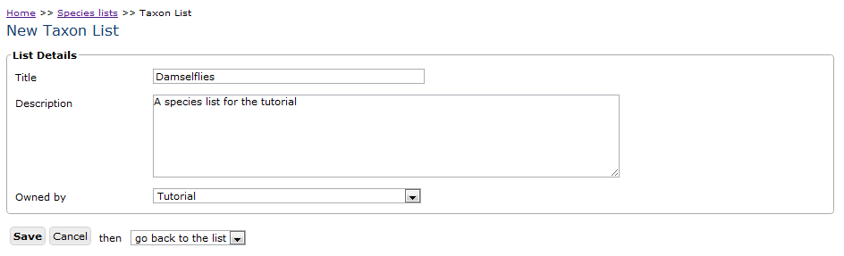
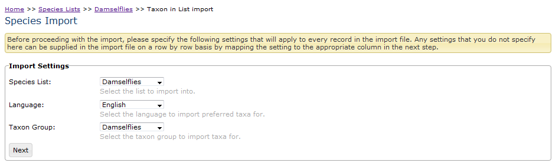
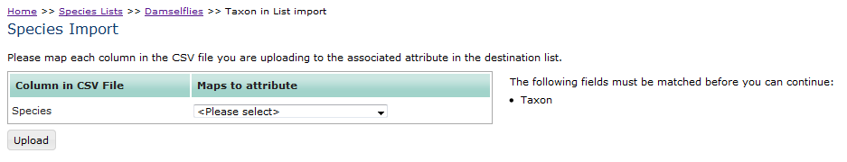
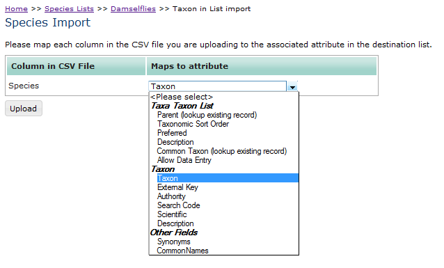
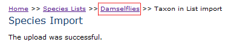

Setting up a list of species to record against
==============================================

Indicia does not stipulate that you use any particular list of species when recording. You
might want to setup a form for professional ecologists using a complete species dictionary
on the one hand, or you might want to setup a form for primary schoolchildren to record at
a higher level (e.g. tickboxes for Frog, Bird, Hedgehog ). It is up to you to setup the
species list you want to record against. Also note that Indicia does not force you to
record only species, as you can record higher level taxa such as families if you deem it
appropriate. Therefore the “list of species” might be more correctly termed “list of
taxa”.

Indicia does provide tools for importing species lists from CSV (comma separated values)
files as well as a module for importing species information from the NBN Species
Dictionary web services in the UK. CSV is a format for files containing tables of data
represented as simple text with commas separating the values. If you are using the
warehouse provided by the Biological Records Centre in the UK then you will find a species
list called UK Master Species List which is available for you to record against, which
uses the NBN Species Dictionary as its basis. In Indicia, there is currently basic support
for creating taxonomic hierarchies as well as flat lists. To facilitate reporting and data
entry, all taxon records in the system have an associated **taxon group** which provides a
descriptive label for the group which the species or taxon falls into. For example, by
setting up taxon groups called birds and flowering plants, it is possible to distinguish
between the bird called redshank and the plant called redshank both during data input and
reporting.

For this tutorial we will assume you want to setup your own species list to record against
and we will look at the process of inputting species directly as well as importing a
species list from a file. The species list will be a list of common names of some
damselflies::

  Banded Demoiselle, Beautiful Demoiselle, Dainty Damselfly, Small Red Damselfly, Northern
  Damselfly, Irish Damselfly, Southern Damselfly, Azure Damselfly, Variable Damselfly,
  Common Blue Damselfly, Red-eyed Damselfly, Blue-tailed Damselfly, Scarce Blue-tailed
  Damselfly, Large Red Damselfly
  
.. tip::

  There is a :doc:`page of instructions on importing the complete UK Species Index 
  <../../administrating/warehouse/importing-uksi>` available. 
  
Before you can import or input a species record, you need to prepare the list of taxon
groups you need for your list of species. There are options to import the list from CSV
files or using a module to import from the list of reporting categories used by the NBN
Species Dictionary. In our case we only need one taxon group called Damselflies so we will
create it by hand.

#. Select **Lookup Lists > Taxon Groups** from the menu in the warehouse to view the list
   of existing taxon groups.
#. If your warehouse already has some taxon groups populated into it, it is a good idea to
   first check that the taxon group does not already exist using the Filter For box at the
   top. Enter “damsel” into the box then click the **Filter** button. If Damselflies is
   already in the list then it will appear in the grid and you can skip the next 2 steps.
   If not proceed with the following steps to create it.
#. Click the **New taxon group** button.
#. A taxon group needs only to have a title filled in. If the group is being imported from
   an external system then the External Key field allows you to keep a unique identifier
   from that system against the taxon group – we can ignore this for now. So, fill in the
   title Damselflies and click the **Save** button.
   
Next, you need to create a species list to import the species names into. Hopefully by
now the steps required to do this should be becoming familiar as they are similar to
creating websites, surveys, taxon groups and so forth. Note that an Indicia species
list has a concept of ownership – it is either owned by the warehouse and available for
use by all websites, or it can be owned by a registered website and only available for
use by that website.

#. Select **Lookup Lists > Species Lists** from the menu in the warehouse then click the 
   **New species list** button.

#. Fill in the title of the list as Damselflies and provide an optional description.

#. In the **Owned by** drop-down, select the website registration you are using if it is 
   not already selected then click **Save**.
   

  
This takes you back to the list of species lists page, from where you can click the
**edit** link to begin working on the list. You will find the edit link in the **Actions**
column, to the right of the table listing the species lists.

The Edit page for a list has several tabs depending on the optional modules that are
installed on your warehouse. At the very least there is a General tab with the main list
details on it, plus a Taxa tab and a Child Lists tab where you can define lists that are
subsets of their parents. For now we are interested in populating the Taxa tab.

 
So, click on the tab and you will see that it displays another grid, this time of the taxa
in the list and initially empty. Notice at the bottom that there is a New taxon button as
well as a CSV file upload facility; the former for single species input and the latter for
bulk upload.

Inputting a single species
--------------------------

Start by clicking the New taxon button and fill in the following details::

  Taxon name = Banded Demoiselle
  
Click the **Save** button. You will see that Indicia’s validation has detected that you 
also need to fill in at least the language and taxon group:

.. image:: ../../images/screenshots/warehouse/species_validation.png
  :width: 700px
  :alt: Validation messages when saving a species.
  
So, fill in the following additional bits of information::

  Language = English
  Taxon Group = Damselflies

There are a few other fields available but these are the basic essentials that are 
required. Press the **Save** button.

.. note::

  If you were setting up a more formal species list with latin and common names, 
  then you might fill in the details as below::

    Taxon name   Calopteryx splendens
    Authority    (Harris, 1780)
    Language     Latin
    Common Names Banded Demoiselle|eng
                 Banded Agrion|eng
    Taxon Group  Damselflies

  Because you can specify as many common names as you like in any languages, you need to
  provide the language for each name by putting a pipe (|) character after each common
  name followed by the code for the language (which can be found by following the **Admin 
  > Languages** menu item).
  
After pressing **Save**, you will return to the Damselflies list and should see your new
species entry in the list on the Taxa tab, ready to record against. All very exciting, but
in the real world we need a way of getting long lists of species names into the system.
The primary way of doing this is to use the CSV upload facilities of Indicia.

Uploading a list of species
---------------------------

The first thing to do when uploading a list of items into Indicia is to prepare the upload
file in a format which Indicia can understand. Because it is designed to run on a web
server which does not understand proprietary spreadsheet file formats it is not possible
to upload spreadsheet files directly into Indicia. However if you are using Microsoft
Excel, OpenOffice Calc or any other reasonable spreadsheet tool you will find that it is
possible to save a file as ``*.CSV`` format. This is a text based file format which the
web server can easily read. The file should have column titles on the first row. To create
our file for upload, simply copy the following into a text editor such as Notepad on
Windows or TextEdit on a Mac::

  Species
  Beautiful Demoiselle
  Dainty Damselfly
  Small Red Damselfly Northern Damselfly
  Irish Damselfly
  Southern Damselfly
  Azure Damselfly
  Variable Damselfly
  Common Blue Damselfly
  Red-eyed Damselfly
  Blue-tailed Damselfly
  Scarce Blue-tailed Damselfly
  Large Red Damselfly
  
Make sure there are no blank lines at the end of your file. Now, save this file to a
suitable location on your hard disk with a file extension ``*.csv``. If you are using
Notepad to do this, then make sure you change the **Save as type** drop down to All Files
(*.*). Otherwise Notepad will create a file called ``*.csv.txt`` which is quite confusing!

Return to the list’s Taxa tab in your web browser if you are not already there and select
the file you have just saved in the CSV upload facility at the bottom of the tab. Click
Upload when done.

In order for a species to be created, we noted earlier that the very least we need is to
specify the species name, language and taxon group. Our upload file only contains a list
of names. Fortunately Indicia lets you specify certain appropriate fields on a global
basis at the start of the import – you can set a value for each of these which applies to
every single row that is uploaded. The exact fields available for setting in this way will
depend on the type of data you are uploading; for species upload the species list,
language and taxon group are all available. So, the first step of the Import process lets
you select values for these fields to apply to every single row. Set the species list to
Damselflies, the language to English and the Taxon Group to Damselflies:

  
.. note::

  If you left any of these fields unset, then you can still import data by including a
  value for them on each and every row of the import file. This lets you do things like
  import a list of species names of mixed languages or from different taxon groups.
  
Click **Next** when you have set these fields. The following page allows you to map
columns in your import CSV file to attributes in the database. Notice on the right hand
side there is a message listing any attributes you must map to before you can proceed.

  
Our import file has a single column called Species. In the drop down box next to this, you
can choose from the various database fields that the Species column can be mapped to
during import.

  
The list of database attributes you can select from is broken down by database table – in 
our case we want to map to the Taxon field (which stores the taxon/species name), part of 
the definition of a Taxon. Once you have selected the mapping, the message on the right 
hand side will disappear and you can press the Upload button.

With any luck you will get a message that the upload was successful. Otherwise, the 
Indicia uploader will upload the rows from your CSV file which it could accept, and keeps 
a copy of the others in a separate file along with the error message that occurred. For 
example, if you tried to import a taxon without a taxon name, then a validation error 
would occur and this row of the CSV file would be copied to the separate errors file. In 
this instance you are told that the errors occurred and given the chance to download the 
errors, correct them and re-upload just the rows which failed. This cycle is then repeated
until all the records have been uploaded.

Having successfully completed the import, you should see the following message:

  
You can then use the breadcrumb trail at the top of the page shown below to return to the
Damselflies species list details page.

.. note::

  A breadcrumb trail is typically shown at the top of a web page to show the hierarchy of
  pages you have come to in order to get to the current page. Each page in the hierarchy
  is represented as a link back to that page for quick navigation. For example:: 

    Home >> Species lists >> UK Hymenoptera >> Bombus terrestris

Then, click on the Taxa tab and check that the species have imported successfully.

.. tip::
  
  You might like to use the External key field (in the Taxon fields) to import an 
  externally recognised unique key for each species, such as the preferred NBN Taxon 
  Version Key. This makes integrating your data with external services that use the same 
  keys much easier. You can also use the Other Fields > Parent External Key field to 
  provide a hierarchical link in the data you are importing (e.g. to link species to their
  genus), but make sure that the import file is sorted in the correct order so that parent
  taxa are imported before their children, otherwise this link cannot be made.
